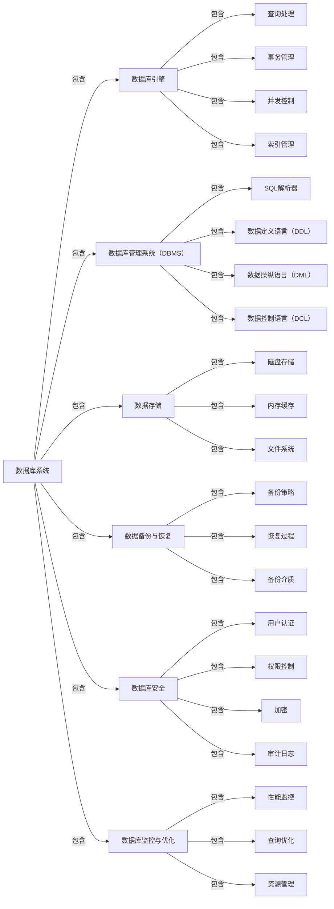
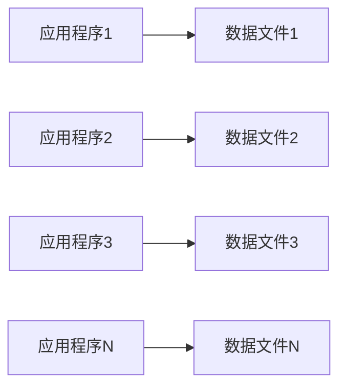
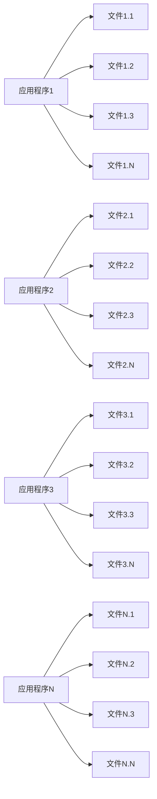
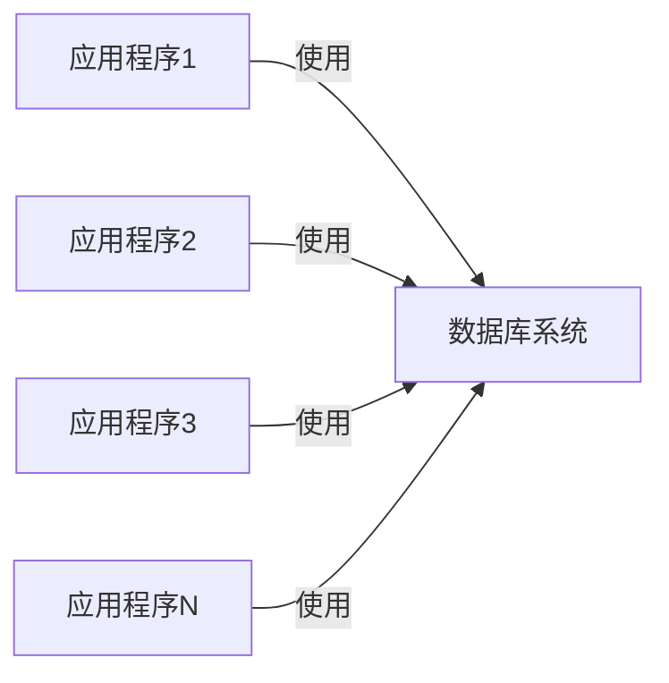
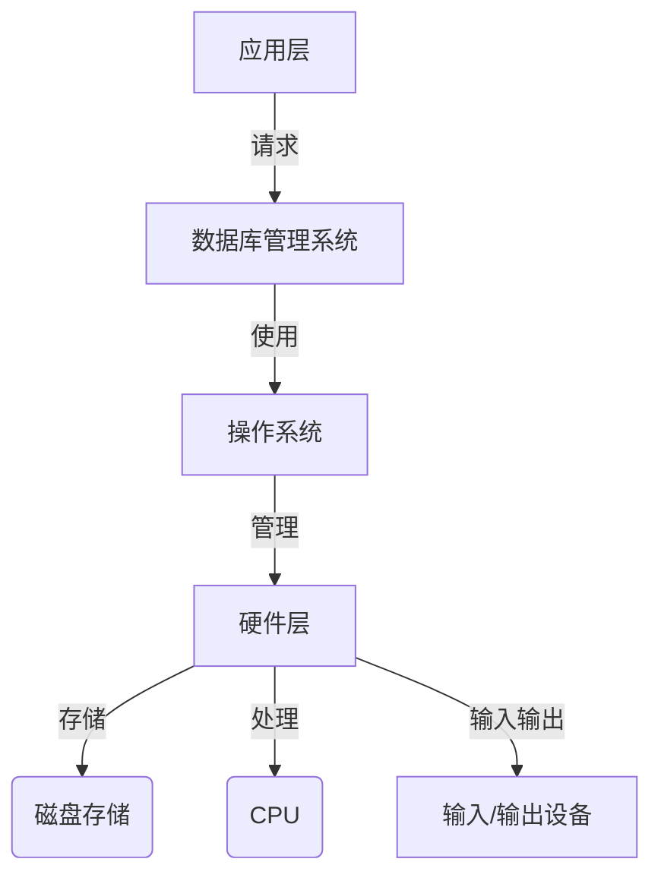
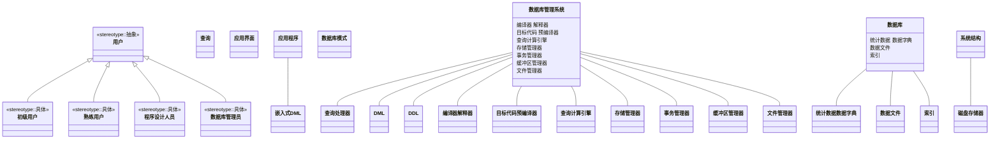
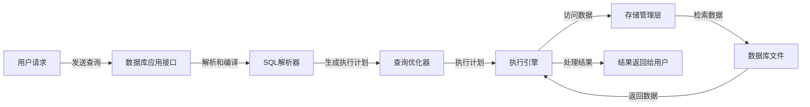
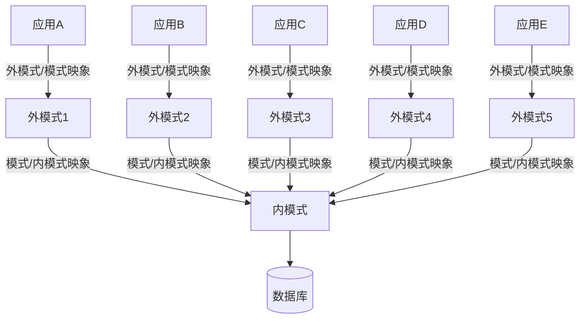

## 什么是数据库应用系统？数据库系统的应用领域

数据库应用系统是指利用数据库管理系统（DBMS）来存储、管理和检索数据的计算机系统。它通常包括以下几个主要组成部分：

1. **数据库管理系统（DBMS）**：这是数据库应用系统的核心，负责数据的存储、检索、更新和管理。DBMS提供了数据定义、数据操纵、数据控制和事务管理等功能。

2. **数据库**：这是存储数据的仓库，它由DBMS进行管理。数据库中的数据通常以表格的形式组织，每个表格由行（记录）和列（字段）组成。

3. **应用程序**：这是用户与数据库交互的接口，可以是桌面应用程序、Web应用程序、移动应用程序等。应用程序通过数据库访问接口与DBMS通信，执行数据查询、插入、更新和删除等操作。

4. **用户**：数据库应用系统的最终用户，他们通过应用程序与数据库进行交互，获取所需的信息或对数据进行修改。

5. **网络**：在分布式数据库应用系统中，网络是连接不同地理位置的数据库服务器和客户端应用程序的通信渠道。

数据库应用系统可以应用于多种领域，例如：

- **企业管理**：如客户关系管理（CRM）、企业资源规划（ERP）系统。
- **电子商务**：在线购物平台、库存管理系统。
- **金融行业**：银行业务处理、股票交易系统。
- **医疗保健**：电子健康记录（EHR）、预约管理系统。
- **教育**：学生信息系统、图书馆管理系统。

数据库应用系统的设计和实现需要考虑数据的完整性、安全性、一致性和性能等因素，以确保数据的准确性和系统的高效运行。

## 数据管理技术的发展

### 四个基本概念————数据、数据库、DBMS、DBS

- 数据 Data
- 数据库 Data Base 简称DB
- 数据库管理系统 Data Base Management System 简称DBMS
- 数据库系统 Data Base System 简称DBS

#### 数据 Data

- **数据（Data**）是数据库中存储的基本对象  
- **数据的定义**：描述事物的符号记录
- **数据的种类**：数据文字、图形、图像、声音
- **数据的特点**：数据与其语义是不可分的

#### 数据库 Data Base（DB)

- 定义
  - 数据库（Database，简称DB）是长期储存在计算机内、有<font color="brown"><u>组织</u></font>的、可<font color="brown"><u>共享</u></font>的<font color="purple"><u>大量</u></font><font color="red"><b>数据集合</b></font>

- 特征
  - 数据按一定的数据模型组织、描述和储存
  - 可为各种用户共享
  - 冗余度较小
  - 数据独立性比较搞
  - 易扩展

#### 数据库管理系统 DBMS

- 定义
  - 数据库管理系统（Database Management System，简称DBMS）是位于用户与操作系统之间的一层数据管理软件。

- DBMS的用途
  - 科学地组织和储存数据、高效地获取和维护数据

#### 数据库系统 DBS

- 什么是数据库系统
  - 数据库系统（Database System，简称DBS）是指在计算机系统中引入数据库后的系统构成。
  - 在不引起混淆的情况下常常把数据库系统简称为数据库
- 数据库系统的构成
  - 由数据库、数据库管理系统（及其开发工具）、应用系统、数据库管理员DBA（和用户）构成


​    



##### 何为DBA（Data Base Administrator)

- 协调用户和开发人员的工作
- 参与数据库设计
- 创建用户和授权
- 保证数据库的正常运行
- 维护工作        

### 数据管理技术的产生和发展

#### 什么是数据管理

​	对数据进行分类、组织、编码、存储、检索和维护+

#### 数据管理技术的发展阶段

数据管理技术是指人们对数据进行收集、组织、存储、加工、传播和利用的一系列活动的总和。它经历了人工管理、文件系统、数据库管理三个阶段，每个阶段的发展都以数据存储冗余的减少、数据独立性的增强、数据操作的便捷性为标志。

**人工管理阶段**（20世纪50年代中期以前）：在这个阶段，数据的管理工作全靠手工完成。数据不保存，系统没有专用的软件对数据进行管理，数据不共享，数据不具有独立性。程序员需要自己安排数据的物理存储，工作负担很重。

**背景**

- **应用需求**：主要用于科学计算，数据量小、结果简单，如高阶方程、曲线拟合等
- **硬件水平**：为顺序存取设有磁带、卡片、纸条，没有磁盘等直接存取设备
- **软件水平**：没有操作系统，没有数据管理软件
- **处理方式**：批处理，用户用机器指令编码，通过纸带机输入程序和数据，程序运行完毕后，用户取走纸带和运算结果，再让下一个上机操作

**特点**

- **数据的管理者**：用户（程序员），数据不保存
- **数据面向的对象**：某一应用程序
- **数据的共享程度**：无共享、冗余度极大
- **数据的独立性**：无独立，完全依赖于程序
- **数据的结构化**：无结构
- **数据控制能力**：应用程序自己控制

<center ><b>人工管理阶段应用程序与数据之间的对应关系</b></center>




**文件系统阶段**（20世纪50年代后期到60年代中期）：随着磁盘、磁鼓等直接存取设备的出现，数据可以长期保存在计算机外存上。文件系统实现了记录内的结构化，但从文件的整体来看却是无结构的。数据面向特定的应用程序，因此数据共享性、独立性差，且冗余度大。

**背景**

- **应用需求**：科学计算、管理（数据多样），大量的数据存储、检索和维护成为紧迫的需求
- **硬件水平**：磁盘、磁鼓等直接存取设备
- **软件水平**：高级语言和操作系统，操作系统中有了专门管理数据软件（文件系统）
- **处理方式**：联机实时处理、批处理

**特点**

- **数据的管理者**：文件系统，数据可长期保存
- **数据面向的对象**：某一应用程序
- **数据的共享程度**：共享性差，冗余度大
- **数据的独立性**：记录内有结构，整体无结构
- **数据的结构化**：独立性差，数据的逻辑结构改变必须修改应用程序
- **数据控制能力**：应用程序自己控制

**文件系统数据的结构**

- 记录内有结构
- 数据的结构是靠程序定义和解释的
- 数据只能是定长的
  - 可以间接实现数据变长的要求，但访问相应数据的应用程序复杂了
- 文件间是独立的，因此数据整体无结构
  - 可以间接实现数据整体的有结构，但必须在应用程序中对描述描述数据见的联系
- 数据的最小读取单位是记录

**文件系统阶段的缺点**

文件系统阶段是数据管理发展的一个早期阶段，它相比人工管理阶段有了一定的进步，但仍然存在许多缺点，主要包括：

1. **数据共享性差**：
   - 在文件系统中，数据通常是面向特定应用程序的，不同的应用程序往往需要建立自己的数据文件，导致相同的数据被多次存储，造成数据冗余。

2. **数据独立性差**：
   - 文件系统中的数据文件是为特定应用服务的，因此文件的逻辑结构和存储结构与应用程序紧密相关。当数据结构需要变更时，相关的应用程序也必须修改，这使得数据的独立性受到影响。

3. **数据冗余度高**：
   - 由于数据共享性差，相同或类似的数据可能被多个应用程序各自存储，导致数据在存储介质上的重复，增加了存储成本。

4. **数据不一致性问题**：
   - 当多个应用程序共享相同的数据时，由于缺乏有效的数据同步机制，容易造成数据的不一致性。例如，对数据的更新可能只在一个应用程序中进行，而其他应用程序可能无法及时反映这些变更。

5. **文件结构限制**：
   - 文件系统中的数据结构相对简单，通常只能表示线性序列或简单的层次结构，难以表示复杂的数据关系，如多对多关系。

6. **备份和恢复困难**：
   - 文件系统阶段的数据备份和恢复通常需要应用程序自己来处理，缺乏系统级的统一管理和支持，使得数据的备份和恢复操作变得复杂且容易出错。

7. **安全性和完整性问题**：
   - 文件系统阶段的数据安全性和完整性保护机制相对薄弱，容易受到未授权访问和数据损坏的威胁。

8. **缺乏数据字典和元数据管理**：
   - 在文件系统阶段，元数据（如数据的描述、结构、关系等）通常没有被系统地管理和维护，导致数据的管理和使用效率低下。

9. **应用程序与数据的紧耦合**：
   - 应用程序与数据文件之间的依赖性强，数据文件的任何改变都可能影响应用程序的运行，这限制了应用程序的灵活性和可维护性。

10. **文件系统的可扩展性有限**：
    - 随着数据量的增长，文件系统可能难以有效地管理大规模的数据集，性能也会受到影响。

由于这些缺点，文件系统阶段的数据管理方式逐渐被数据库系统阶段所取代，后者通过数据库管理系统（DBMS）提供了更高级的数据管理功能，包括数据模型、数据字典、数据独立性、事务管理等。

<center ><b>文件系统阶段应用程序与数据之间的对应关系</b></center>



**数据库系统阶段**（20世纪60年代后期以来）：计算机性能提升和大容量磁盘的出现使得数据管理技术得以进一步发展。数据库技术允许多个用户和应用程序共享数据，减少了数据冗余，提高了数据的共享性和独立性。数据库管理系统（DBMS）提供了数据安全性控制、数据完整性控制、并发控制和数据恢复等功能。

**背景**

- **应用需求**：计算机管理的数据量大，关系复杂、共享性要求强（多种应用、不同语言共享数据）
- **硬件水平**：大容量磁盘、磁盘阵列
- **软件水平**：软件价格上升，硬件价格下降，编制和维护软件及应用程序成本相对增加，出现了专门的数据库管理系统
- **处理方式**：联机实时处理、分布处理、批处理

**特点**

- 有了数据库管理系统
- 面向全组织，面向现实世界
- 独立性较强
- DBMS统一存取，维护数据语义及结构

**数据模型与数据库系统的发展**

- 第一代数据库系统
  - 网状、层次数据库系统
- 第二代数据库系统
  - 关系数据库系统
- 第三代数据库系统
  - 支持数据管理、对象管理和知识管理

**相关知识**

- 数据结构
  - 逻辑结构
    - 数据之间存在的逻辑关系
    - 表、树、图、数组……
  - 物理结构
    - 数据在计算机内的存储方式
    - 顺序方式、链接方式……
- 数据独立性
  - 当数据的结构发生变化时，通过系统提供的映像（转换）功能，使应用程序不必该百年
- 数据的物理独立性
  - 当数据的存储结构改变时，应用程序不必改变
- 数据的逻辑独立性
  - 当数据的逻辑结构改变时，应用程序不必改变

<center><b>数据库系统阶段应用程序与数据之间的对应关系</b></center>



随着技术的进步，数据管理技术也在不断发展。例如，元数据的概念在1995年被提出，为现代基于元数据驱动的数据管理奠定了基础。进入21世纪，随着大数据时代的到来，数据管理技术开始面临新的挑战和机遇，如数据的Volume（大量）、Velocity（高速）、Variety（多样）、Value（价值）、Veracity（真实性）等特点。

近年来，数据管理技术的研究热点包括大数据开发与挖掘技术、大数据分析与管理技术、大数据运维与云计算技术。数字化、智能化、网络化被认为是大数据技术的未来发展方向，而数据安全则是未来的研究热点。

总的来说，数据管理技术的产生和发展是随着计算机技术的进步而不断演进的，它涉及到数据的收集、存储、处理、分析和应用等多个方面，目的是为了更有效地发挥数据的作用。

#### 数据库系统的特点

数据库系统的设计和实现旨在满足数据管理的需求，它具有以下几个显著特点：

1. **数据结构化**：
   - 数据库系统使用结构化的方法存储数据，通常是以表格的形式，每张表由行和列组成，每一列代表一个字段，每一行代表一个记录。

2. **数据独立性**：
   - 数据独立性意味着物理数据的变化不会影响到应用程序。用户可以通过视图或抽象层与数据交互，而不需要关心数据在存储介质上的具体表示。

3. **数据集成**：
   - 数据库系统将分散的数据集成在一起，提供了一个统一的视图，使得数据的管理和使用更加高效。

4. **数据共享**：
   - 多个用户和应用程序可以同时访问和操作数据库中的数据，数据库系统通过权限控制和事务管理来保证数据的一致性和完整性。

5. **数据持久性**：
   - 数据库系统确保数据的持久存储，即使在系统故障或其他异常情况下，数据也不会丢失。

6. **数据安全性**：
   - 数据库系统提供了数据加密、用户认证、权限控制等安全机制，以防止未授权访问和数据泄露。

7. **事务管理**：
   - 数据库系统支持事务的概念，事务是一组原子性的数据库操作，它要么全部成功，要么全部失败，确保了数据的一致性和完整性。

8. **并发控制**：
   - 数据库系统能够处理多个用户同时对数据进行操作的情况，通过锁定机制和事务隔离级别来避免数据冲突和不一致。

9. **故障恢复**：
   - 数据库系统具备故障恢复机制，如日志记录和备份，以确保在系统故障后能够恢复到一致的状态。

10. **查询优化**：
    - 数据库系统包含查询优化器，它可以根据查询语句自动选择最有效的执行计划，以提高查询性能。

11. **数据备份与恢复**：
    - 数据库系统支持定期备份数据，并在数据丢失或损坏时能够恢复数据。

12. **可扩展性**：
    - 数据库系统设计时考虑了可扩展性，能够随着数据量的增长和用户需求的变化进行扩展。

13. **多用户支持**：
    - 数据库系统支持多用户同时访问，提供了并发控制和事务隔离机制，以确保数据的一致性和完整性。

14. **网络透明性**：
    - 在分布式数据库系统中，用户可以像访问本地数据库一样访问远程数据库，无需关心数据的物理位置。

15. **数据字典**：
    - 数据库系统维护一个数据字典，它存储了关于数据库结构的元数据，如表结构、视图定义、索引等。

数据库系统的特点使其成为现代信息技术基础设施中不可或缺的一部分，广泛应用于各种业务场景和行业。

### 数据库系统的组成

数据库系统（Database System）是一个复杂的系统，它由多个组件组成，以确保数据的有效存储、管理和访问。以下是数据库系统的一些主要组成部分：

1. **数据库（Database）**：
   - 数据库是存储数据的仓库，它包含了所有的数据表和相关的数据。

2. **数据库管理系统（Database Management System, DBMS）**：
   - DBMS是数据库的核心软件，它提供了数据存储、数据操纵、数据定义、数据控制和事务管理的功能。
   - DBMS的例子包括MySQL、PostgreSQL、Oracle、SQL Server、SQLite等。

3. **数据模型（Data Model）**：
   - 数据模型定义了数据如何组织、如何表现以及数据之间的关系。常见的数据模型有关系模型、对象模型、XML模型等。

4. **数据定义语言（Data Definition Language, DDL）**：
   - DDL用于定义和管理数据库的结构，例如创建、修改和删除数据库、表、索引等。

5. **数据操纵语言（Data Manipulation Language, DML）**：
   - DML用于访问和修改数据库中的数据，如插入、查询、更新和删除数据。

6. **数据控制语言（Data Control Language, DCL）**：
   - DCL用于定义数据库的安全策略和访问控制，如授权和撤销权限。

7. **事务（Transaction）**：
   - 事务是数据库操作的逻辑单元，它确保数据的完整性和一致性。事务具有原子性、一致性、隔离性和持久性（ACID）的特性。

8. **索引（Index）**：
   - 索引用于提高数据检索的效率，它类似于书籍的目录，可以帮助快速定位数据。

9. **查询优化器（Query Optimizer）**：
   - 查询优化器是DBMS的一部分，它负责选择执行查询的最佳策略，以提高查询性能。

10. **存储引擎（Storage Engine）**：
    - 存储引擎负责数据的物理存储和检索，不同的存储引擎可能支持不同的存储格式和特性。

11. **备份和恢复（Backup and Recovery）**：
    - 数据库系统需要定期备份数据，以便在数据丢失或损坏时能够恢复。

12. **数据安全（Data Security）**：
    - 数据安全包括用户认证、权限控制、数据加密和审计日志等，以保护数据不被未授权访问。

13. **数据仓库（Data Warehouse）**：
    - 数据仓库用于存储和管理大量历史数据，通常用于数据分析和报告。

14. **数据库监控和优化工具（Monitoring and Optimization Tools）**：
    - 这些工具用于监控数据库的性能，识别瓶颈，并进行调优以提高性能。

15. **数据库应用（Database Applications）**：
    - 数据库应用是使用数据库系统的软件，它们通过DBMS与数据库交互，执行各种数据操作。

数据库系统的组成可以根据不同的应用需求和环境有所不同，但上述组件是大多数数据库系统共有的基本组成部分。

### 数据库系统的构成

- 数据库系统的软硬件层次
- 数据库系统的主要成分
- 数据库系统结构



#### 数据库系统的主要成分

- 硬件
  - 大内存，放得下OS,DBMS核心，系统缓冲区，用户工作区等
  - 大容量、直接存取的外存设备
  - 作数据备份的磁带
- 软件
  - OS 、DBMS,高级语言编译系统及其与数据库的接口，应用开发工具，应用系统
- 数据
  - 目标数据：数据本身
  - 描述数据：元数据（meta-data)，数据字典
    - 描述数据的数据
    - 描述数据的含义和性质，以便更好地理解、管理和使用数据的数据
    - 示例
      - 数据：图书馆中的数据
    - 元数据：标题、作者、关键词、ISBN号
- 用户
  - 最终用户
    - 通过应用系统的用户接口（菜单等）使用数据库
  - 应用程序员
    - 基于外模式来编写应用程序
  - 系统分析员
    - 负责应用系统的需求分析和规范定义，确定系统的软硬件配置，参与数据库模式设计
  - 数据库管理员DBA（含数据库设计者）
    - 负责数据库的全面管理和控制

#### 数据库管理员（DBA）

- **DBA的重要性**
  - 重要资源
    - 维护整个组织的信息资源
  - 共享资源
    - 多用户共享，需要统一管理、协调、监控
- **DBA的职责**
  - 建库方面（数据库设计者）
    - 确定模式、外模式、存储结构、存取策略
    - 负责数据的整理和装入
  - 用库方面
    - 定义完整性约束条件
    - 规定数据的保密级别、用户权限
    - 监督和控制数据库的运行情况
    - 指定后援的回复策略，负责故障修复
  - 改进方面
    - 监督分析系统的性能（空间利用率、处理效率）
    - 数据库重组织，物理上重组织，以提高性能
    - 数据库重构造，设计上较大改动、模式和内模式

#### 数据库管理系统(DBMS)



##### DBMS概念

- 负责数据库的定义、建立、操作、管理和维护的软件系统
- 目的：
  - 保证数据安全可靠的、提高数据库应哟给的简明性和方便性。
- 工作机理：
  - 把用户对数据的操作转化为对系统存储文件的操作，
  - 有效地实现数据库三级之间转化

##### DBMS的主要功能

- **数据库定义功能**

  ​	DLL语言（Data Description Language）

  - 描述外模式、模式、内模式（源模式）

    模式翻译程序

  - 把源模式翻译成目标模式，存入数据字典中

    ```mermaid
    graph LR
    A(源模式)-->B(模式翻译程序)
    B-->id1[(数据字典/目标模式)]
    ```

    

- 数据存取功能

     DML语言（Data Manipulation Language）

  - 对数据库进行检索、插入、修改、删除

    DML类型

    - 宿主型

      DML不独立使用，嵌入到高级语言（主语言）程序中使用

    - 自含型

      独立使用，交互式命令方式

    DML语句执行

    - 宿主型

      预编译和增强编译

    - 自含型

      解释执行

- **数据库运行管理**

  并发控制、存取控制、完整性约束条件检查和执行，日志组织和管理，事务管理和自动恢复

- **数据组织、存储和管理**

  用户数据、索引、数据字典的组织、存储和管理，包括文件结构、存取方式、数据之间联系的实现等

- **数据库的建立和维护功能**

  数据的装入、转换、卸出，数据库的转储、恢复、性能监视和分析等

##### DBMS构成

- **DBMS是程序的集合**

  组成DBMS的每一个程序都有自己的功能，一个或几个程序一起完成DBMS的一件工作 ，或一个程序完成基建工作

  <center><font color="blue" ><b>DBMS的层次结构</b></font></center>

![[Hierarchy of DMBC.png]]

<center><font color="blue" ><b>DBMS的运行过程</b></font></center>



1. **用户请求**：用户通过应用程序或直接通过数据库查询语言（如SQL）向DBMS发出请求。
2. **解析和编译**：DBMS的解析器（Parser）解析用户的查询语句，并检查语法正确性。如果语法正确，查询语句会被转换成一个内部表示形式，如查询树。
3. **查询优化**：优化器（Optimizer）接收到解析后的查询树，并尝试找到执行该查询的最有效方式。这可能包括选择不同的索引、决定表的连接顺序等。
4. **执行计划生成**：优化器生成一个或多个可能的执行计划，并选择一个最优的执行计划。
5. **执行查询**：执行引擎（Execution Engine）根据执行计划执行查询。这可能包括访问磁盘上的数据文件、执行索引查找、执行连接操作等。
6. **数据访问**：执行引擎通过存储管理层访问实际存储在磁盘上的数据。
7. **数据处理**：执行引擎对数据进行必要的处理，如排序、聚合等。
8. **结果返回**：处理后的结果被返回给用户。
9. **事务管理**：DBMS还负责事务管理，确保数据的一致性和完整性。这包括事务的开始、提交或回滚。
10. **日志记录**：为了支持事务的持久性和恢复，DBMS会记录日志。
11. **缓存管理**：为了提高性能，DBMS通常会使用缓存来存储频繁访问的数据。
12. **备份和恢复**：DBMS还负责数据的备份和恢复，以防止数据丢失。

##### RDBMS分类

1. **按部署方式分类**：
   - **本地数据库**：安装在本地服务器或个人电脑上，如Microsoft Access。
   - **服务器数据库**：安装在服务器上，通过客户端软件访问，如MySQL、PostgreSQL、Oracle、SQL Server等。
2. **按许可模式分类**：
   - **开源数据库**：源代码公开，免费使用，如MySQL、PostgreSQL。
   - **商业数据库**：需要购买许可证，如Oracle、SQL Server、DB2。
3. **按功能和复杂性分类**：
   - **轻量级数据库**：适用于小型应用或个人项目，如SQLite、Access。
   - **企业级数据库**：提供高级功能，如并发控制、事务管理、数据仓库支持，适用于大型企业和复杂应用，如Oracle、SQL Server、DB2。
4. **按支持的SQL标准程度分类**：
   - **完全兼容SQL标准**：完全遵循ANSI SQL标准，如PostgreSQL。
   - **部分兼容SQL标准**：部分遵循SQL标准，可能有自己的扩展，如MySQL。
5. **按支持的数据类型和功能分类**：
   - **通用数据库**：支持广泛的数据类型和功能，适用于多种应用场景，如MySQL、PostgreSQL。
   - **特殊用途数据库**：专注于特定类型的数据或应用场景，如图形数据库（Neo4j）、时间序列数据库（InfluxDB）。
6. **按架构分类**：
   - **单实例数据库**：所有数据存储在一个数据库实例中，如大多数传统的RDBMS。
   - **分布式数据库**：数据存储在多个服务器上，提供更好的扩展性和可用性，如CockroachDB、Google Spanner。
7. **按存储引擎分类**：
   - **基于行存储**：数据按行存储，适合读密集型应用，如InnoDB（MySQL）。
   - **基于列存储**：数据按列存储，适合分析和数据仓库应用，如Columnar storage engines in PostgreSQL。
8. **按支持的操作系统分类**：
   - **跨平台数据库**：可以在多种操作系统上运行，如PostgreSQL、MySQL。
   - **特定平台数据库**：只能在特定操作系统上运行，如SQL Server主要在Windows上运行。

### 数据库系统的结构

#### 数据库系统模式的概念

##### “型”和“值”的概念

- 型（Type）
  - 对某一类数据的结构和属性的说明
- 值（Value）
  - 是型的一个具体赋值
- 例如
  - 学生记录型：（学号，姓名，性别，系别，年龄，籍贯）
  - 一个记录值：（900201，黎明，男，计算机，22，江苏）
- 模式（Schema）
  - 数据库逻辑结构和特征的描述
  - 是型的描述
  - 反映的是数据的结构及其联系
  - 模式是相对稳定的
- 实例（Instance）
  - 模式的一个具体值
  - 反映数据库某一时刻的状态
  - 同一模式可以有很多实例
  - 实例随数据库中的数据的更新而变动

#### 数据库系统的设计目标

##### 数据库系统的设计目标

​	允许用户逻辑的处理数据、而不涉及这些数据在计算机中是怎么样存放，在数据组织和用户应用之间提供某种程度的独立性。

##### 实现方法——模式的分级

​	为了提高数据的物理独立性和逻辑独立性，使数据库的用户观点（即用户看到的数据库）与数据库的物理方面（即实际存储的数据库）区分开来，数据库系统的模式是分级的。

##### 数据库系统三级模式结构

​	CODASYL（Conference On Data System Language,美国数据系统语言协商会）提出模式、外模式、存储模式三级模式的概念。三级模式之间有两级映像。

<center><font color="blue">数据库系统的三级结构两级独立性</font></center>



##### 数据库系统的三级模式

- 数据库系统划分为三抽象级：用户级、概念级、物理级
- 用户级数数据库 
  - 对应于外模式、子模式
- 概念级数据库
  - 对应于概念模式、逻辑模式，也称模式
- 物理级数据库
  - 对应于内模式

##### 模式（Schema）

- **模式（也称为逻辑模式）**
  - 数据库中全体数据的逻辑结构和特征的描述
  - 介于用户级和物理级之间，所用用户的公共数据视图，综合了所有用户的需求，是数据库管理员看到和使用的数据库，又称为DBA视图
- **一个数据库只有一个模式，把数据库 作为一个整体的抽象表示**
- **模式的地位**：是数据库系统模式结构的中间层
  - 与数据的物理存储细节和硬件环境无关
  - 与具体的应用程序、开发工具及高级程序设计语言无关
- 模式的定义
  - 数据的逻辑结构（数据项的名字、类型、取值范围等）
  - 数据之间的联系
  - 数据有关的安全性、完整性要求

##### 外模式（External Schema）

- **外模式（也称为子模式或用户模式）**
  - 最接近于用户的一级数据库，是数据库用户（包括应用程序员和最终用户）使用的局部数据的逻辑结构和特征的描述，又称用户视图。
  - 数据库用户的数据视图，是与某一应用有关的数据的逻辑表示
  - 不同的用户视图可以相互重叠，用户的所有操作都是针对用户视图进行。
- **外模式的地位：**介于模式与应用之间
  - 模式与外模式的关系：一对多
    - 外模式通常是模式的子集
    - 一个数据库可以有多个外模式。反映了不同的用户的应用需求、看待数据的方式、对数据保密的要求
    - 对模式中同一数据，在外模式中的结构、类型、长度、保密级别等都可以不同
  - **外模式与应用的关系：**一对多
    - 同一外模式也可以为某一用户的多个应用系统所使用
    - 但一个应用程序只能使用一个外模式
  - **外模式的用途：**
    - 保证数据库安全性的一个有力措施
    - 每个用户只能看见和访问所对应的外模式中的数据

##### 内模式（Internal Schema）

- **内模式（也称存储模式）**
  - 是数据物理结构和存储方式的描述
  - 是数据在数据库内部的表示方式
    - 记录的存储方式（顺序存储，按照B树结构存储，按Hash方法存储）
    - 索引的组织方式
    - 数据是否压缩存储
    - 数据是否加密码
    - 数据存储记录结构的规定
- **一个数据库只有一个内模式**

##### 数据库系统的两级独立性

- 数据库系统两级独立性：逻辑独立性、物理独立性
- 三个抽象级间通过两级映射（根据一定的对立规则）进行相互转化，使得数据库的三级形成一个统一是整体。
  - 三级模式是对数据的三个抽象级别
  - 二级映象在DBMS内部实现这三个抽象层次的联系和转换
    - 外模式/模式映像
    - 模式/内模式映像
- 映射隔离了各层之间的相互映像，实现数据独立性。各层间的映射能力决定数据独立性程度

##### 外模式/模式映像

- 模式：描述的是数据的全局逻辑结构
- 外模式：描述的是数据的局部逻辑结构
- 同一个模式可以有任意多个外模式
- 每一个外模式，数据库系统都一个外模式/模式映像，定义外模式与模式之间的对应关系
- 映像定义通常包含在各自外模式的描述中
- 保证数据的逻辑独立性
  - 当模式改变时，数据库管理员修改有关的外模式/模式映像，使外模式保持不变
  - 应用程序是一句数据的外模式编写的，从而应用程序不必修改，保证了数据与程序的逻辑独立性，简称数据的逻辑独立性
  - 示例：
    - 在模式中增加新的记录类型，只要不破坏原有记录类型之间的联系
    - 在原有记录类型之间增加新的联系
    - 在某些记录类型中增加新的数据项

##### 模式/内模式映像

- 模式/内模式映像定义了数据全局逻辑结构与存储结构之间的对应关系
  - 例如，说明逻辑记录和字段在内部是如何表示的
- 数据库中模式/内模式映像是唯一的
- 该映像定义通常包含在模式描述中
- 保证数据的物理独立性
  - 当数据库的存储结构改变了（例如选用了别一种存储结构），数据库管理员修改模式/内模式映像，使模式保持不变
  - 应用程序不受影响。保证了数据与程序的物理独立性，简称数据的物理独立性。
  - 示例：
    - 改变存储设备或引进新的存储设备
    - 改变数据的存储位置
    - 改变存储记录的体积
    - 改变数据组织方式
- 物理独立性
  - 存在于概念模式和内模式之间的映射转换实现物理独立性
  - 说明物理组织发生变化时应用程序的独立程序
  - 示例：
    - 改变存储设或引进新的存储设备
    - 改变数据的存储位置
    - 改变存储记录的体积
    - 改变数据组织方式

#### 数据库模式

- 即全局逻辑结构是数据库的中心与关键
- 独立于数据库的其他层次
- 设计数据库模式结构时应首先确定数据库的逻辑模式

##### 数据库的内模式

- 依赖于它的全局逻辑结构
- 独立于数据库的用户视图，即外模式
- 独立于具体的存储设备
- 将全局逻辑结构中所定义的数据结构及其联系按照一定的物理存储策略进行组织，以达到较好的时间与空间效率

##### 数据库的外模式

- 面向具体的应用程序
- 定义在逻辑模式之上
- 独立于存储模式和存储设备
- 当应用需求发生较大变化，相应外模式不能满足其视图要求时
- 该外模式就得做相应改动
- 设计外模式时影充分考虑到应用的扩充性

##### 特定的应用程序

- 在外模式描述的数据结构上编制的
- 依赖于特定的外模式
- 与数据库的模式和存储结构独立
- 不同的应用程序有时可以共用同一个外模式

##### 数据库的二级映像

- 保证了数据库外模式的稳定性
- 从底层保证了应用程序的稳定性，除非应用需求本身发生变化，否则应用程序一般不需要修改 

##### 数据与程序之间的独立性，使得数据的定义和描述可以从应用程序中分离出去

##### 数据的存取由DBMS管理

- 用户不必考虑存取路径等细节
- 简化了应用程序的编制
- 大大减少了应用程序的维护和修改 

