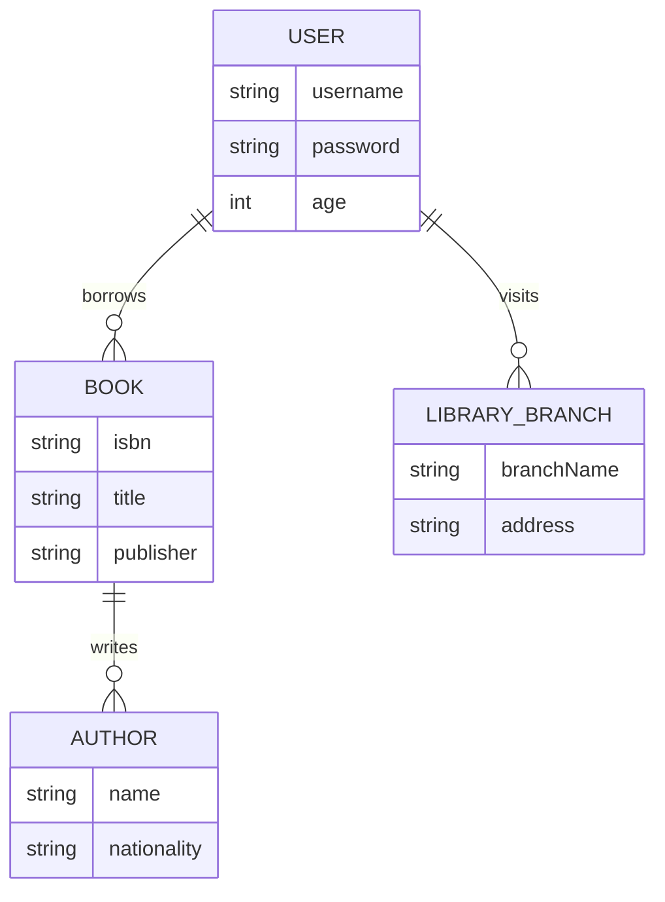
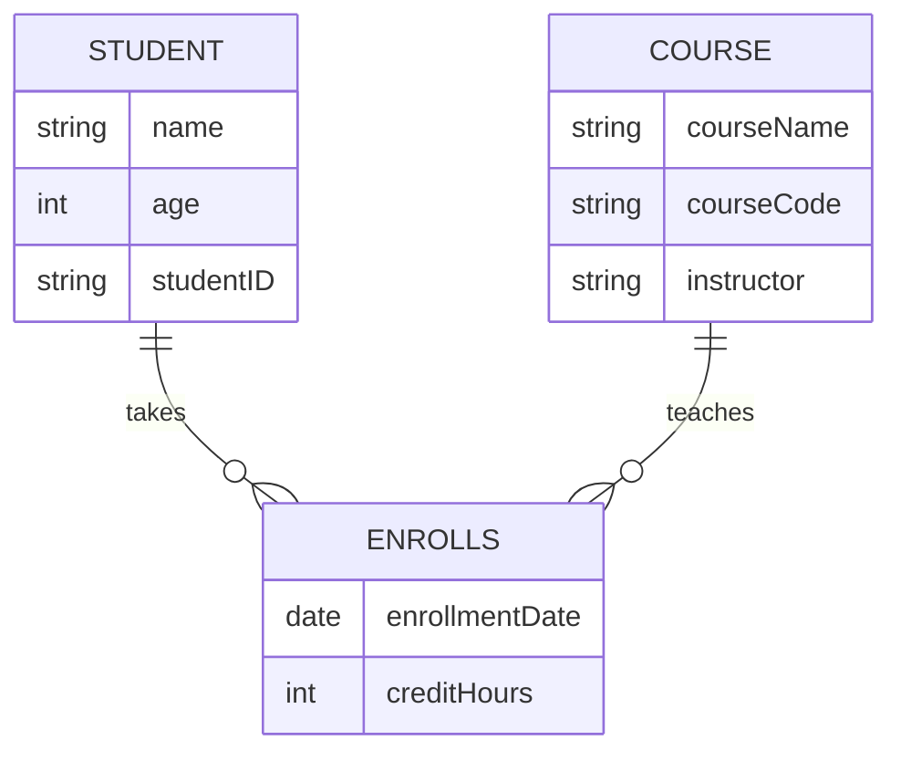
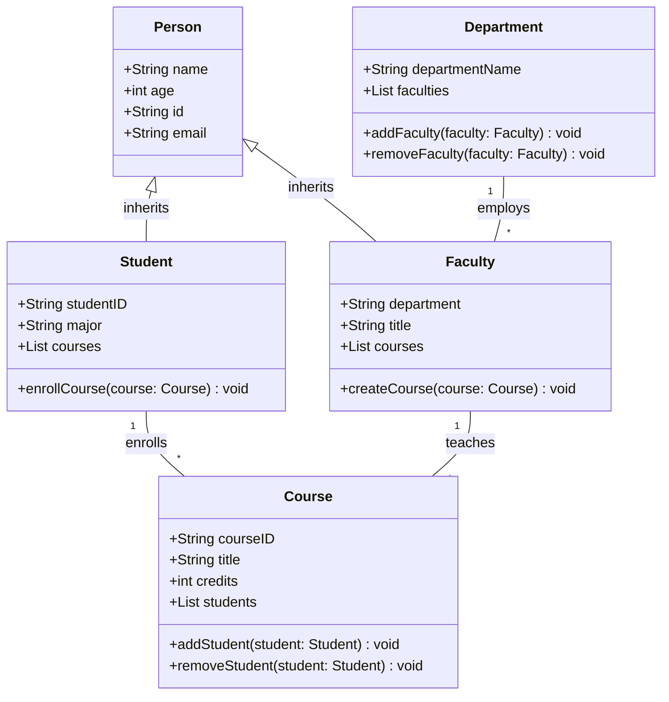
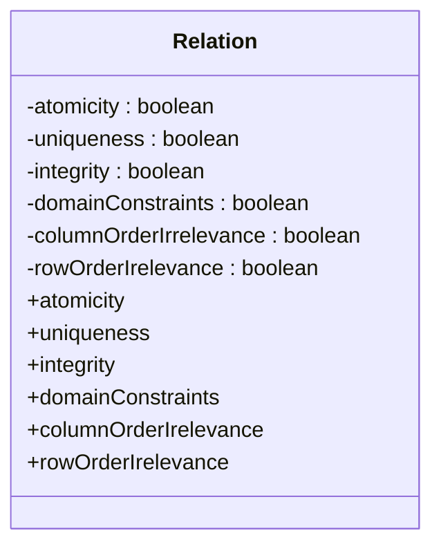

## 现实世界的数据化过程
1. **现实世界到信息世界的抽象**：
    
    - 现实世界是客观存在的，包含了各种事物及其相互联系。在数据化过程中，首先需要从现实世界中识别出感兴趣的事物和联系，并对其进行抽象，形成信息世界。这个信息世界是现实世界在人脑中的反映，是对客观事物及其联系的抽象描述。
2. **信息世界的构建**：
    
    - 在信息世界中，现实世界的事物被抽象为实体（Entity），事物的特征被抽象为属性（Attribute），事物之间的联系被抽象为关系（Relationship）。这一阶段涉及到概念模型的构建，如实体-联系模型（E-R模型），它帮助我们理解和组织信息世界中的数据结构。
3. **信息世界到计算机世界的转换**：
    
    - 信息世界的数据需要进一步转换为计算机可以处理的形式，即数据化。这个过程包括将概念模型转换为逻辑模型，如关系模型、层次模型等，这些模型被数据库管理系统（DBMS）所支持。然后，逻辑模型进一步转换为物理模型，涉及数据的存储方式和存取方法。
4. **数据的采集与整合**：
    
    - 在计算机世界中，数据被采集、整合，并存储在数据库中。这些数据可以是结构化的，如关系数据库中的表格数据，也可以是非结构化的，如文本、图片、视频等。数据采集可以通过各种方式进行，包括手动输入、传感器自动收集、从外部系统导入等。
5. **数据处理与分析**：
    
    - 采集的数据需要经过清洗、转换和加载（ETL过程），以确保数据的质量。之后，数据可以被用于各种分析，如统计分析、机器学习、数据挖掘等，以提取有价值的信息和知识。
6. **数据的应用与反馈**：
    
    - 数据化的结果可以用于支持决策、优化业务流程、创新产品和服务等。同时，数据分析的结果可以反馈到现实世界，指导实际操作和策略调整，形成一个闭环的数据化过程。
 ```mermaid
 graph TD
    A[现实世界] -->|抽象| B[信息世界]
    B -->|数据化| C[计算机世界]
    C -->|数据处理| D[数据分析]
    D -->|结果应用| E[业务决策与优化]
    E -->|反馈调整| A
```
## 数据抽象
### 三个世界的概念
1. **现实世界（Real World）**：
    
    - 现实世界指的是我们周围的物理环境和客观存在的事物。在数据抽象的语境中，它包括了所有需要被理解和处理的实际对象和事件。这些对象和事件具有各种属性和行为，它们是数据抽象过程的起点。例如，一个公司可能需要处理客户信息、交易记录等，这些都属于现实世界的一部分。
    - 事物和事物特性
2. **信息世界（Information World）**：
    
    - 信息世界是现实世界的一个抽象表示，它包含了从现实世界中提取出来的信息。这些信息被组织和结构化，以便于理解和交流。在信息世界中，现实世界的对象和事件被转换成信息实体，如数据库中的记录、文档、报告等。信息世界的目标是提供对现实世界的准确和有用的描述，以支持决策和行动。
    - 事物和事物特性←→实体和实体属性
3. **数据世界（Data World）**：
    
    - 数据世界是信息世界的进一步抽象，它关注于数据的存储、组织和处理。在数据世界中，信息被转换成数据结构和数据模型，这些结构和模型可以被计算机系统理解和操作。数据世界中的实体（如数据库中的表和字段）是对现实世界中实体的进一步抽象，它们定义了数据的组织方式和关系。数据世界的设计和实现需要考虑数据的完整性、一致性、安全性和效率。
    - 实体和实体属性←→记录和数据项


**在数据抽象的过程中，从现实世界到信息世界再到数据世界的转换涉及到对现实世界的理解和解释，以及将这些理解转换成可以被计算机处理的形式。这个过程中，数据抽象的层次逐渐增加，从具体的现实世界对象到抽象的信息表示，再到具体的数据结构和模型。每一步都涉及到对数据的进一步抽象和简化，以便于在计算机系统中有效地存储、处理和分析数据。**
![[Data abstraction.png|Data abstraction]]
### 三个世界的概念对应关系
![[The Concept of Three worlds.png]]
## 概念模型
### 概念模型定义

- **==按用户的观点来对数据和信息建模==**
- 用于组织信息世界的概念，表现从现实世界中抽象出来的事物以及它们之间的联系

**概念模型（Conceptual Model）是数据库领域中用于描述现实世界中的数据需求和数据结构的模型。它提供了一个高层次的、与特定数据库管理系统（DBMS）无关的框架，用于理解数据以及数据之间的关系。概念模型的主要目的是作为数据库设计者、系统分析员和用户之间沟通的桥梁，帮助他们达成对数据需求的共识。**

概念模型通常包括以下几个关键组成部分：

1. **实体（Entity）**：
    
    - 实体是现实世界中可以区分的对象。在概念模型中，实体通常用矩形表示。
2. **属性（Attribute）**：
    
    - 属性是实体所具有的性质或特征，用来描述实体。在概念模型中，属性通常用椭圆表示，并与它们所属的实体相连。
3. **关系（Relationship）**：
    
    - 关系是实体之间的逻辑联系。在概念模型中，关系用菱形表示，并通过连接线将相关的实体连接起来。
4. **角色（Role）**：
    
    - 角色描述了实体在关系中所扮演的部分或方面。
5. **约束（Constraint）**：
    
    - 约束是规则，它定义了数据的存储、操作和关系必须遵守的条件。这些规则确保数据的完整性和一致性。
6. **视图（View）**：
    
    - 视图是数据库的一个子集，它代表了用户或应用对数据的需求。在概念模型中，视图可以是实体、关系或它们的组合。

概念模型的类型主要有：

- **实体-关系模型（Entity-Relationship Model, E-R Model）**：这是最常用的概念模型之一，它通过实体、关系和属性来描述数据结构。
    
- **语义数据模型（Semantic Data Model）**：这种模型强调了数据的语义方面，包括数据的语义类型和数据之间的关系。
    
- **面向对象的数据模型（Object-Oriented Data Model）**：这种模型基于面向对象的编程概念，使用类和对象来描述数据结构。
    

概念模型是数据库设计过程中的一个关键步骤，它帮助设计者理解业务需求，并将其转换成逻辑模型，最终实现为物理模型，即数据库的实际实现。概念模型的抽象级别较高，不涉及具体的数据库实现细节，因此它对于不同背景的参与者来说都是易于理解和沟通的。

#### 实体-联系模型
实体-联系模型（Entity-Relationship Model，简称ER模型）是一种用于数据库设计的概念模型，它提供了一种描述现实世界中实体以及实体之间关系的方法。以下是ER模型中各个组成部分的详细定义：
**刻划工具：实体-联系图(E-R图)**
**实体：==矩形**==
**属性：==椭圆**==
**联系：==菱形**==
**实体和联系间、实体和属性间、联系和属性间：==线段**==


 #####  实体（Entity）
    
- **定义**：实体是现实世界中可以区分的对象。实体可以是人、物体、概念或事件，它们是数据库中存储信息的基本单位。（==客观事物==）
- **特征**：每个实体都有一组属性，这些属性描述了实体的特征。实体在ER图中通常用矩形表示，矩形内部写有实体的名称。
- **例子**：在图书馆管理系统中，“书籍”和“读者”都是实体。
![[Entities.png]]

##### 属性（Attribute）
    
- **定义**：属性是实体所具有的性质或特征，用来描述实体。属性是实体的详细信息，可以是文本、数字或日期等。（==客观事物的特征（属性）==）
- **实体码（KEY，实体标识符，又称实体键）：**能唯一标识实体的属性或极小属性组，用==下划线==标出。
- **域：属性的取值范围**
	- 同一实体类型所有实体都具有相同的属性及相同的对应域，但属性在域上的取值不一定相同。
- **特征**：属性在ER图中用椭圆形表示，并用线段连接到它们所属的实体。属性可以是单值的，也可以是多值的。
- **例子**：对于“书籍”实体，属性可能包括“书名”、“作者”和“ISBN号”。
![[eg5.png]]
![[table1.png]]
**在ER图中：**
- 带==下划线==的属性为**实体键或实体键的一部分**
- **组合属性**用一个==树型==表示
- **多值属性**用==虚线椭圆==表示或标出
![[er1.png]]
##### 关系（Relationship）
    
- **定义**：关系是实体之间的逻辑联系，表示不同实体间的相互作用或关联。
- **特征**：关系在ER图中用菱形表示，并通过线段连接到参与关系的实体。关系也可以有属性，这些属性描述了关系的特征。
- **例子**：在图书馆管理系统中，“借阅”是一个关系，它连接了“读者”和“书籍”实体。
![[eg2.png|联系的示例]]![[eg3.png|联系的参与多样性]]
**关系属性**
![[Attribute of Relationship.png|关系属性]]
**联系的元**
- 某一联系R锁对应的实体类型有n个，称R为n元联系
	- 一元联系 n=1
	- 二元联系 n=2
	- 多元联系 n>2
![[eg4.png]]
##### 实体集（Entity Set）
    
- **定义**：实体集是相同类型的实体的集合。实体集描述了一组具有相同属性和关系的实体。
- **特征**：在ER图中，实体集通常用双矩形框表示，以区分单个实体。

#####  联系集（Relationship Set）
    
- **定义**：联系集是实体间相同类型的关系的集合。联系集描述了一组具有相同属性的关系。
- **特征**：在ER图中，联系集用双菱形表示。

##### 基数（Cardinality）
    
- **定义**：基数描述了实体集之间的关系的数量特征，即一个实体集中的实体与另一个实体集中的实体之间可能的关联数量。
- **类型**：基数可以是一对一（1:1）、一对多（1:N）、多对一（N:1）或多对多（M:N）。

##### 参与度（Participation）

- **定义**：参与度描述了实体在关系中的参与程度，可以是部分参与（实体集中只有一部分实体参与关系）或全参与（实体集中的所有实体都参与关系）。

#####  弱实体集（Weak Entity Set）
    
- **定义**：弱实体集是那些没有足够属性来形成一个唯一标识的实体集。它们依赖于与另一个实体集（称为强实体集）的关系来获得唯一性。
- **特征**：在ER图中，弱实体集用双矩形框表示，并且通常与一个或多个属性（称为部分键）一起使用，这些属性与强实体集的键结合来唯一标识弱实体集的实例。

##### 主键（Primary Key）
    
- **定义**：主键是用于唯一标识实体集中每个实体的属性或属性组合。
- **特征**：在ER图中，主键属性通常用下划线标记。

**示例：**
ER模型通过这些元素提供了一种结构化的方式来理解和设计数据库，使得数据库设计者能够创建出准确反映现实世界数据需求的数据库结构。


在这个示例中，我们有四个实体类型：`USER`、`BOOK`、`AUTHOR` 和 `LIBRARY_BRANCH`。这些实体之间的关系如下：

- `USER` 和 `BOOK` 之间有一个“borrows”关系，表示用户可以借阅书籍。
- `BOOK` 和 `AUTHOR` 之间有一个“writes”关系，表示作者可以写书。
- `USER` 和 `LIBRARY_BRANCH` 之间有一个“visits”关系，表示用户可以访问图书馆的分馆。

每个实体都包含一些属性，例如：

- `USER` 实体包含 `username`、`password` 和 `age` 属性。
- `BOOK` 实体包含 `isbn`、`title` 和 `publisher` 属性。
- `AUTHOR` 实体包含 `name` 和 `nationality` 属性。
- `LIBRARY_BRANCH` 实体包含 `branchName` 和 `address` 属性。

##### 建立E-R模型
$$
定义实体集\begin{Bmatrix}
1、找实体并表示（每类实体一个二维表）
\end{Bmatrix}
$$
$$
定义属性
\begin{Bmatrix}
1、找属性（确定每个二维表的字段）\\
2、确定字段的属性、域\\
	名字、数据类型、精度、缺省值、\\
	取值范围、是否允许空值……\\
3、确定主码
\end{Bmatrix}
$$

$$
定义联系集 \begin{Bmatrix}
1、找联系（每类实体之间）\\
2、表示联系（参与多样性）
\end{Bmatrix} 
$$

![[Set up a ER Module.png]]
#### 语义数据模型
**语义数据模型（Semantic Data Model, SDM）**是一种用于表示和处理数据的模型，它强调数据之间的语义关系，即数据的含义和关联。语义数据模型的主要目的是通过定义数据元素之间的关系及其属性，帮助用户更好地理解和操作数据。

##### 结构与语义 

   - 语义数据模型不仅定义数据的结构（如数据类型、字段等），还描述数据的意义和元素之间的关系。这种模型使得数据不仅仅是存储的字节，而是具有实际含义的信息，从而提高了数据的可理解性和可操作性。

##### 三元组结构

   - 语义数据模型通常使用三元组（Triple）结构来表示数据，其中包括主语（Subject）、谓语（Predicate）和宾语（Object）。这种结构能够清晰地表示实体之间的关系，谓语则描述了这种关系的性质。

##### 本体与分类

   - 语义数据模型常常结合本体（Ontology）和分类法（Taxonomy）使用。本体定义了一个领域内的概念和类别，并指定它们之间的关系，而分类法则提供了数据的层次化分类。这使得数据的组织和理解更加系统化。

##### 数据一致性与集成

   - 语义数据模型能够促进不同数据源之间的集成，使得即使在底层系统的数据结构不同的情况下，也能实现一致的数据理解和共享。这对于处理来自多个来源的数据尤其重要。

##### 增强数据分析

   - 通过提供丰富的语义信息，语义数据模型使得数据分析更加深入和有意义，能够提取出传统数据模型难以解析的见解。

语义数据模型是一种在更高抽象层次上的数据模型，它通过强调数据的语义和关系，帮助用户更好地理解和利用数据。它不仅适用于数据的存储和管理，还在数据分析和决策支持中发挥着重要作用。

**示例：**


**在这个示例中，我们有两个实体类型：`STUDENT` 和 `COURSE`，以及一个关系类型 `ENROLLS`。`STUDENT` 和 `COURSE` 通过 `ENROLLS` 这个关系连接，表示学生选课的关系。`STUDENT` 实体包含 `name`、`age` 和 `studentID` 属性，而 `COURSE` 实体包含 `courseName`、`courseCode` 和 `instructor` 属性。`ENROLLS` 关系包含 `enrollmentDate` 和 `creditHours` 属性。**

##### 应用领域

   - 语义数据模型广泛应用于多个领域，包括知识管理、数据集成、人工智能和语义网技术等。在这些复杂的领域中，数据元素之间的相互关系对于理解数据至关重要。

#### 面向对象的数据模型
面向对象的数据模型是一种基于面向对象编程（OOP）概念的数据模型。它将数据和处理数据的方法封装在对象中，强调数据的抽象、封装、继承和多态性。以下是面向对象数据模型的一些核心概念：

##### 对象（Object）
    
- 现实世界中的实体在软件中被抽象为对象。
- 对象包含数据（属性）和方法（行为）。
#####  类（Class）

- 类是对象的蓝图或模板，定义了一组属性和方法。
- 类的实例化产生对象。

 ##### 封装（Encapsulation）
 
- 将数据（属性）和操作数据的方法（行为）封装在一起。
- 控制对属性的访问，通常通过公共接口（方法）来实现。

##### 继承（Inheritance）

- 允许新创建的类（子类）继承现有类（父类）的属性和方法。
- 支持代码重用和层次化的数据结构。

##### 多态性（Polymorphism）

- 允许不同类的对象对同一消息做出响应。
- 同一接口可以被不同的对象以不同的方式实现。

##### 消息传递（Message Passing）

- 对象之间的通信是通过发送消息完成的。
- 消息是对象的一个请求，请求执行某个操作。
##### 接口（Interface）

- 定义了对象必须遵守的规则和行为。
- 允许不同的对象以统一的方式被访问。
##### 抽象（Abstraction）

- 提供了一种方法来隐藏对象的复杂性，只暴露必要的信息。
- 通过抽象，可以专注于对象的功能而不是实现细节。

在数据库领域，面向对象的数据模型通常与面向对象数据库管理系统（OODBMS）相关联，它们使用面向对象的数据模型来存储和管理数据。这种模型特别适合于处理复杂的、具有丰富语义的数据，如图形、图像和多媒体数据，以及需要高度封装和重用的场景。

**示例：**

在这个示例中，我们有四个类：`Person`、`Student`、`Faculty` 和 `Course`。`Person` 是一个基类，`Student` 和 `Faculty` 都继承自 `Person` 类。`Student` 类表示学生，包含 `studentID`、`major` 和 `courses` 属性，以及 `enrollCourse` 方法。`Faculty` 类表示教师，包含 `department` 和 `title` 属性，以及 `createCourse` 方法。`Course` 类表示课程，包含 `courseID`、`title` 和 `credits` 属性，以及 `addStudent` 和 `removeStudent` 方法。`Department` 类表示系，包含 `departmentName` 和 `faculties` 属性，以及 `addFaculty` 和 `removeFaculty` 方法。

## E-R模型的设计方法
- **总的设计原则**
- **相对性原则**
	- 实体、属性、联系等，是对同一个对象抽象过程的不同解释和理解。
- **一致性原则**
	- 同一对象在不同的业务系统中的抽象结果，应保持一致。
- **简单化原则**
	- E-R模型中，能作为属性处理的对象，尽量归为属性。
### ER图的设计
#### 用实体集或属性代表物体？
    
- **实体集（Entity Set）**：实体集用来表示现实世界中的“事物”，这些“事物”是可以被区分和识别的独立对象。例如，如果我们要建模一个图书馆系统，那么“书籍”、“读者”和“图书馆员”都可以是实体集。
- **属性（Attribute）**：属性是用来描述实体集的特征或属性的。每个实体集由一组属性定义，这些属性提供了关于实体的详细信息。例如，“书籍”实体集可能包含“书名”、“作者”、“ISBN号”等属性。
#### 对现实世界的概念是用实体集还是联系集去描述？
    
- 实体集用来描述现实世界中的对象，而**联系集（Relationship Set）** 用来描述实体集之间的关系。例如，在图书馆系统中，“书籍”和“读者”之间可能存在“借阅”关系，这是一个联系集。

#### 用多元关系还是二元关系去描述？

- **二元关系**：这是最简单的关系类型，只涉及两个实体集。大多数基本的关系都是二元的，因为它们描述了两个实体集之间的直接联系。例如，“读者”和“书籍”之间的“借阅”关系。
- **多元关系**：当一个关系涉及三个或更多的实体集时，称为多元关系。在数据库设计中，通常推荐将多元关系分解为二元关系，以避免复杂性和数据冗余。例如，如果有一个“作者”、“书籍”和“出版社”之间的关系，这可以通过两个二元关系来表示：“作者”和“书籍”之间的“写作”关系，以及“书籍”和“出版社”之间的“出版”关系。
### 在建模过程中使用概括还是特殊化？

- **概括（Generalization）**：这是一种继承关系，其中一个通用的实体集（父实体集）可以有一个或多个更具体的实体集（子实体集）。概括用于表示“是一种”（is-a）关系。例如，“车辆”是一个通用实体集，而“汽车”和“摩托车”是更具体的子实体集。
- **特殊化（Specialization）**：这是概括的逆过程，用于创建更具体的实体集。特殊化有助于在模型中表示更详细的信息和规则。
- 在建模过程中，是否使用概括或特殊化取决于具体需求。概括有助于减少数据冗余和提高数据一致性，而特殊化则有助于更精细地控制数据和行为。

#### 子类和Is-a层次联系
##### 子类（Subclass）

子类是继承体系中的一个概念，它表示一个类（称为子类）继承了另一个类（称为父类或超类）的属性和方法。子类可以看作是父类的一个特化，它继承了父类的所有特征，并可以添加新的特征或覆盖（override）父类的方法。

**特点：**

- **继承性**：子类继承父类的所有属性和方法。
- **扩展性**：子类可以添加新的属性和方法。
- **多态性**：子类可以覆盖父类的方法，实现多态性。

##### Is-a层次联系（Is-a Hierarchy）

“is-a”关系是一种分类关系，用来描述一个类是另一个类的实例。在这种关系中，子类被视为父类的一个特例。这种关系构成了一个层次结构，称为“is-a”层次结构。

**特点：**

- **层次性**：类之间形成了一个层次结构，每个类都可以是另一个类的子类。
- **泛化**：父类通常是更通用的类，而子类是更具体的特例。
- **继承性**：子类继承父类的特征。

##### 子类和Is-a层次联系的关系

子类和“is-a”层次联系是紧密相关的。在面向对象编程中，子类的概念是通过“is-a”关系来定义的。如果一个类B是类A的子类，那么我们可以说B“is-a”A。这意味着B继承了A的所有属性和方法，并且可以有自己的特有属性和方法。

![[ER7.png]]
**子类示例**：
![[eg6.png]]

### “好”的E-R模型
- ==**满足用户功能需求==**
- ==**实体联系尽可能少**==
- ==**实体集所含属性尽可能少**==
- **==实体集间联系无冗余**==

**一个“好”的E-R（实体-关系）模型是指能够有效地表示现实世界问题的数据模型，同时满足数据库设计的原则和需求。以下是一些评价一个E-R模型是否“好”的标准：**

1. **准确性**：
    
    - 模型应准确反映业务需求和数据需求。
    - 所有重要的实体、属性和关系都应被识别并包含在模型中。
2. **简洁性**：
    
    - 模型应尽可能简洁，避免不必要的复杂性。
    - 应去除冗余的实体和关系，以减少数据冗余和维护成本。
3. **完整性**：
    
    - 模型应包含所有必要的信息，以支持业务操作和决策。
    - 应考虑到数据的完整性约束，如实体完整性、参照完整性等。
4. **一致性**：
    
    - 模型中的命名和设计应保持一致性。
    - 同一实体在不同地方的表示应该是一致的。
5. **灵活性**：
    
    - 模型应具有一定的灵活性，以适应未来可能的变化。
    - 应考虑到业务需求的演变和数据结构的扩展。
6. **可理解性**：
    
    - 模型应易于理解，便于非技术人员（如业务分析师和最终用户）理解。
    - 应使用清晰和直观的命名约定。
7. **规范化**：
    
    - 模型应遵循数据库规范化的原则，以减少数据冗余和提高数据一致性。
    - 应避免更新异常、插入异常和删除异常。
8. **可操作性**：
    
    - 模型应支持有效的数据操作，包括数据的插入、查询、更新和删除。
    - 应考虑到查询性能和数据访问的效率。
9. **可维护性**：
    
    - 模型应易于维护和修改。
    - 应考虑到模型的长期维护和升级。
10. **可扩展性**：
    
    - 模型应能够容易地扩展以适应新的业务需求。
    - 应考虑到未来可能添加的新实体、属性和关系。
11. **平衡性**：
    
    - 模型应平衡规范化和性能之间的关系。
    - 过度规范化可能会导致查询性能下降，而不足的规范化可能会导致数据冗余。
12. **文档化**：
    
    - 模型应有详细的文档，包括实体、属性和关系的描述。
    - 文档应清晰地说明模型的用途、设计决策和任何假设。

一个“好”的E-R模型不仅仅是一个技术产品，它还是一个沟通工具，帮助团队成员理解数据结构和业务需求。因此，模型的设计应该是一个迭代和协作的过程，涉及数据库设计师、业务分析师和最终用户。


#### 采用ER方法的数据库概念设计之设计局部ER模式 

![[Database Conceptual Design Using the ER Approach_Designing Local ER Models.png]]

**确定局部结构范围：**
- 范围的划分要自然，易于管理；
- 范围之间的界面要清晰，相互影响要小
- 范围的大小要适度
	- 太小了，会造成局部结构过多，设计过程繁琐，综合困难
	- 太大了，则容易造成内部结构复杂，不便分析
**实体定义**
- 采用人们习惯的划分
- 避免冗余，在一个局部结构中，对一个对象只取一种抽象形式，不要重复
- 依据用户的信息处理需求
**属性分配**
确定属性的原则：
	属性应该是不可再分解的语音单位，实体与属性之间的关系只能是1：N的，不同实体类型的属性之间应无直接关联关系
属性分配的原则：
	当多个实体类型用到同一个属性时，一般把属性分配给那些使用频率最高的实体类型，或分配给实体值少的实体类型。
	有些属性那个不宜归属于任一实体类型，只能说明实体之间联系的特性.

**相关实例**

![[ER2.png]]
![[ER3.png]]
![[ER4.png]]


#### 采用ER方法的数据库概念设计之设计全局ER模式


![[Designing the Global ER Model Using the Entity-Relationship Approach.png]]
**检查并消除冲突**
- 属性冲突 ：如，重量单位有的用公斤，有的用克。 
- 结构冲突 ：同一对象在不同应用中的不同抽象 ；同一实体在不同局部ER图中属性的个数或次序不同 ；实体之间的联系在不同的局部ER图中呈现不同的类型 
- 命名冲突 ：属性名、实体名、联系名之间存在同名异义或异名同义冲突

**优点**
- **实体类型的合并**
	- **1:1联系的两个实体类型** 
	- **具有相同码的实体类型** 
- **冗余属性的消除** 
- **冗余联系的消除：利用规范化理论中函数依赖的概念消除冗余联系**  


## 数据模型
- **数据模型：** 是对客观事物及联系的数据描述，==是信息模型的数据化。==
- 数据库管理系统是建立在一定的数据模型之上，根据数据模型实现在计算机上存储、处理、表示、组织数据，不同的数据模型对应不同类型的数据库管理系统。
- 从计算机实现的观点来对数据建模
- 是信息世界中的概念和联系在计算机世界中的表示方法
- 一般有严格的形式化定义，以便于在计算机上实现
- 如层次模型、网状模型、关系模型、面向对象模型
### 四种常见数据模型


![[table1.png]]
### 数据模型的三要素
==数据模型 = 数据的组织方法 + 数据操作集合 +数据完整性集合==

#### 1、数据的组织方法（数据结构）
   - 描述数据的组织方式，包括数据的类型、内容以及数据之间的联系。数据结构定义了数据的物理存储和逻辑关系，是数据模型的基础。
   - **数据本身**
	   - 类型、内容、性质。如网状模型中的数据项、记录，关系模型中的域、属性，关系等。
   - **数据之间的联系**
	   - 例如网状模型中的系型，关系模型中的外码。
   - 在数据库系统中一般按数据结构的类型来命名数据模型。
#### 2、数据操作集合
- 定义了对数据可以执行的操作集合，包括数据的检索、插入、删除和修改等。这些操作需要遵循一定的规则，以确保数据的一致性和完整性。
- 一般有检索、更新(插入、删除、修改)操作
- 数据模型要定义操作含义、操作符号、操作规则，以及实现操作的语言
####  3、数据的完整性集合(数据的约束条件)
- 确保数据库中数据的正确性、有效性和一致性的规则集合。完整性约束包括实体完整性、参照完整性、域完整性等，它们定义了数据必须满足的条件，以保证数据的准确性和可靠性。

## 关系模型
### 关系模型的基本概念

#### 关系(Relation)
- 定义：对应于关系模式的一个具体的表称为关系，又称表(Table)。
- 关系数据库：是若干表（关系）的集合。
- 关系模式：决定其对应关系的内容。
- 命名规则：每一个关系都必须命名（通常取对应的关系模式名），且同一关系数据模型中关系名互不相同。
#### 元组(Tuple)
- 定义：关系中的每一行称为关系的一个元组，又称行(Row)或记录。
- 构成：一个关系可由多个元组构成。
- 唯一性：一个关系中的元组各不相同。
#### 属性(Attributes)
- 定义：关系中的每一列称为关系的一个属性，又称列(Column)。
- n元关系：一个由n个属性的关系称为n元关系。
- 属性名：关系的属性名就是对应关系模式的对应属性名。
#### 变域(Domain)
- 定义：关系中的每一属性所对应的取值范围叫属性的变域，简称域。
- 域的组成：域是值的集合，关系中所有属性的实际值均来自它所对应的域，如整数的集合、字符串的集合、全体学生的集合。
- 域的要求：关系中每个属性都必须有一个相应的域，不同属性的域可不同也可相同。
#### 笛卡尔积(Cartesian Product)
- 定义：一组域 $D_1, D_2, \ldots, D_n$ 的笛卡尔积为：
$$
  D_1 \times D_2 \times \ldots \times D_n = \{(d_1, d_2, \ldots, d_n) | d_i \in D_i, i=1,\ldots, n\}
  $$
- n-元组：笛卡尔积的每个元素 ($d_1, d_2, \ldots, d_n$) 称作一个n-元组(n-tuple)。
- 分量：元组的每一个值 d_i 叫做一个分量(component)。
关系
- 定义：笛卡尔积 $D_1 \times D_2 \times \ldots \times D_n$ 的子集叫做在域 $D_1, D_2, \ldots, D_n$ 上的关系，用 $R(D_1, D_2, \ldots, D_n$) 表示。
- 关系的名字：R是关系的名字。
- 关系的度或目：n是关系的度或目。
- 关系的特性：关系是笛卡尔积中有意义的子集。
- 表示方式：关系也可以表示为二维表。
这些概念是关系数据库理论的基础，它们定义了如何在数据库中组织和操作数据。关系模式提供了关系的框架，而关系则是这个框架下的具体数据。元组和属性分别代表了关系中的行和列，变域定义了属性可能的取值范围。笛卡尔积是所有可能组合的集合，而关系则是这个集合中有意义的子集。
让我们通过一个简单的例子来说明笛卡尔积和关系之间的联系。
假设我们有两个域（Domain）：
- 域  D_1  表示学生的姓名，包含 {“Alice”, “Bob”, “Charlie”}。
- 域  D_2  表示课程，包含 {“Math”, “Science”, “History”}。
笛卡尔积
这两个域的笛卡尔积  $D_1 \times D_2$  将包含所有可能的学生姓名和课程的组合，即：
$$
D_1 \times D_2 = \{(Alice, Math), (Alice, Science), (Alice, History), (Bob, Math), (Bob, Science), (Bob, History), (Charlie, Math), (Charlie, Science), (Charlie, History)\}
$$
这个笛卡尔积包含了9个元素，每个元素都是一个二元组（2-tuple），代表了学生和课程的一个可能的组合。
关系
现在，假设我们有一个关系（Relation），它表示学生选课的情况。这个关系是笛卡尔积的一个子集，只包含实际选了课程的学生。例如：
- Alice 选了 Math 和 Science。
- Bob 选了 Science。
- Charlie 选了 History。
这个关系可以表示为：

`R(D_1, D_2) = \{(Alice, Math), (Alice, Science), (Bob, Science), (Charlie, History)\}`

#### 联系
- 笛卡尔积 是所有可能组合的集合，它不考虑实际的数据或约束条件，只是简单地将两个域中的每个元素与其他域中的每个元素配对。
- 关系 是笛卡尔积的一个子集，它基于实际的数据和特定的约束条件（在这个例子中是学生实际选的课程）来选择笛卡尔积中的元素。
在这个例子中，关系  R(D_1, D_2)  是从笛卡尔积  D_1 \times D_2  中筛选出来的，只包括那些符合特定条件（学生实际选课情况）的元组。这种筛选过程体现了关系数据库中数据的组织和查询方式，即从可能的所有组合中提取出有意义的数据子集。

### 关系模式与关系的联系：

- [[#关系模型]]：型（关系的结构），相对稳定。
- [[#关系(Relation)]]：值（元组的集合），随时间变化。

### 关系模式

#### 关系模式的基本概念
**关系模式（Relational Schema）是关系数据库中用来描述数据库中关系（表）的结构的一种方式。它是关系数据库理论中的一个基本概念，用于定义表的名称、列（属性）的名称、数据类型以及列之间的约束条件。**

#####  关系名（Relation Name）
- 每个关系模式都有一个唯一的名称，用来标识数据库中的一个特定表。
##### 属性（Attribute）
- 属性是关系模式中的列，代表表中的一个字段。
- 每个属性都有名称和数据类型，定义了可以存储的数据的种类。
##### 域（Domain）
- 域定义了属性可能取值的范围，即数据类型。
- 例如，一个属性的域可以是整数（INT）、字符串（VARCHAR）等。
##### 主键（Primary Key）
    
    - 主键是表中的一个或多个属性的组合，用于唯一标识表中的每条记录（元组）。
    - 主键的值不能为NULL，且在表中必须是唯一的。
##### 外键（Foreign Key）
    
    - 外键是表中的一个属性或属性组合，它对应于另一个表的主键。
    - 外键用于建立两个表之间的关系，确保数据的参照完整性。
##### 约束（Constraints）

- 约束是一组规则，用于限制可以存储在表中的数据。
- 包括唯一性约束（`Unique Constraint`）、非空约束（`Not Null Constraint`）、检查约束（`Check Constraint`）等。
##### 关系模式的结构（Relational Model）
- 关系模式通常表示为一个四元组：R=(E,D,DOM,F)R=(E,D,DOM,F)。
	- `EE `是关系名。
	- `DD `是属性名的集合。
	- `DOMDOM `是属性到域的映射。
	- `FF` 是属性之间的约束条件集合。
##### 元组（Tuple）
- 元组是关系中的一行，代表一个具体的数据记录。
- 每个元组包含一组属性值，对应于表中的一行数据。
##### 关系实例（Relation Instance）
- 关系实例是关系模式在某一时刻的具体内容，包括元组的集合。
- 实例随时间变化，但模式保持不变。

关系模式是数据库设计阶段的重要概念，它帮助数据库设计者定义和组织数据结构，确保数据的组织和存储方式满足应用需求。通过关系模式，可以清晰地表达数据之间的关系，为数据库的创建、维护和查询提供基础。
#### 关系模式中关系的六条性质
通常指的是关系数据库中关系（表）应该满足的一些设计原则，这些原则有助于确保数据库的规范化和数据的一致性。以下是这六条性质的描述：
##### 1.  原子性（Atomicity）：
关系的每个属性都应该不可再分，即属性是原子的。这意味着每个属性只能包含一个值，不能是集合、列表或其他复杂的数据结构。
##### 2.  唯一性（Uniqueness）：
关系中的每个元组（行）都应该有一个唯一的标识符，通常通过主键（Primary Key）来实现。主键的值在关系中是唯一的，不能有重复。
##### 3.  完整性（Integrity）：
关系中的数据应该满足实体完整性和参照完整性。实体完整性要求主键不能为NULL，参照完整性要求外键的值必须对应于另一个关系中的主键，或者为NULL（如果允许）。
##### 4.  域约束（Domain Constraints）：
每个属性的值都必须来自其定义的域，即属性的取值范围。这确保了数据的类型和格式的一致性。
##### 5.  列的顺序无关性（Column Order Irrelevance）：
在关系中，列（属性）的顺序并不重要。即，无论属性如何排列，关系的含义和数据的存储都不会改变。
##### 6.  行的顺序无关性（Row Order Irrelevance）：
与列的顺序无关性类似，行（元组）的顺序在关系中也不重要。关系的处理和查询结果不会因为行的顺序不同而有所变化。
这些性质是关系数据库设计的基础，它们帮助数据库设计者构建一个结构化、规范化且易于维护的数据库系统。通过遵循这些性质，可以减少数据冗余，提高数据的一致性和完整性。
以下是一个Mermaid图表的代码，描述了关系模式中关系的六条性质：

<table border="1">
    <tr>
        <th>性质</th>
        <th>描述</th>
        <th>示例</th>
    </tr>
    <tr>
        <td>原子性（Atomicity）</td>
        <td>属性不可再分</td>
        <td>学生表中的“姓名”属性是原子的，不能包含多个值。</td>
    </tr>
    <tr>
        <td>唯一性（Uniqueness）</td>
        <td>元组有唯一标识符</td>
        <td>学生表中的“学号”属性是唯一的，每个学生都有一个唯一的学号。</td>
    </tr>
    <tr>
        <td>完整性（Integrity）</td>
        <td>数据满足实体完整性和参照完整性</td>
        <td>选课表中的“学生ID”必须对应学生表中的“学号”。</td>
    </tr>
    <tr>
        <td>域约束（Domain Constraints）</td>
        <td>属性值来自定义的域</td>
        <td>年龄属性只能包含非负整数。</td>
    </tr>
    <tr>
        <td>列的顺序无关性</td>
        <td>列的顺序不影响关系的含义</td>
        <td>无论“姓名”和“年龄”属性的顺序如何，学生表的含义不变。</td>
    </tr>
    <tr>
        <td>行的顺序无关性</td>
        <td>行的顺序不影响关系的含义</td>
        <td>无论学生记录的顺序如何，学生表的含义不变。</td>
    </tr>
</table>


### 码
在数据库中，码是用来唯一标识表中记录的属性或属性组合。以下是码的不同类型及其定义和特点：
#### 1.  超码（Super Key）：
- 定义：能够唯一标识一个元组（数据库表中的一行数据）的属性组合。超码可以由一个或多个属性组合而成，只要能够唯一标识一个元组即可。
- 特点：超码的主要特点是它包含的属性足以区分表中的所有记录。超码可以是单个属性，也可以是多个属性的组合。
#### 2.  候选码（Candidate Key）：
- 定义：是能够唯一标识关系中某一个元组的一个属性或属性集，也称为候选键。候选码需要满足唯一性和最小性，即构成候选码的属性个数最少。
- 特点：候选码是超码的一个子集，它不包含任何多余的属性，即候选码的任意真子集都不能成为超码。候选码用于选择主码，通常会选择一个最适合的候选码作为主码，其他的候选码作为备选。
#### 3.  合成码（Composite Key）：
- 定义：由多个属性组合而成的候选码，用于唯一标识记录。
- 特点：合成码通常用于那些没有单一属性能够唯一标识记录的情况。合成码的特点是它由两个或更多属性组合而成，这些属性联合起来可以唯一标识表中的每条记录。
#### 4.  主码（Primary Key）：
- 定义：从候选键中选择一个作为查询、插入、删除元组操作的操作变量，也称为主键、主码、关系键、关键字。
- 特点：主码是唯一的，即数据库表中的每一行数据都必须有唯一的主码；主码不能为空，即主码不能包含空值；主码可以由一个或多个属性组合而成。在数据库设计中，主码是非常重要的，它用来建立表之间的关系、保证数据的完整性和一致性。
#### 5.  外部码（Foreign Key）：
- 定义：子数据表中出现的父数据表的主键，称为子数据表的外码。
- 特点：外码用于在两个表之间建立联系，它引用另一个表的主码，从而实现表之间的关联。外码的取值是由被参照的关系的主码的域决定的，即外码的域来自那个主码的域。
这些码的概念在数据库设计中至关重要，它们帮助确保数据的完整性、一致性和高效访问。


### 表的关联
表的关联（Table Association）在数据库中通常指的是两个或多个表之间通过外键（Foreign Key）建立的关系。这种关系使得数据能够在不同的表之间保持一致性和完整性。关联可以是一对一（One-to-One）、一对多（One-to-Many）或多对多（Many-to-Many）。
实例：学生和课程的关联
假设我们有两个表：学生表（Students）和课程表（Courses），以及一个选课表（Enrollments）来表示学生和课程之间的多对多关系。
1.  学生表（Students）：
- StudentID (主键)
- Name
- Age
2.  课程表（Courses）：
- CourseID (主键)
- CourseName
- Credits
3.  选课表（Enrollments）：
- EnrollmentID (主键)
- StudentID (外键，关联到Students表的StudentID)
- CourseID (外键，关联到Courses表的CourseID)
- Grade
##### 关联的建立
- 在选课表（Enrollments）中，StudentID 和 CourseID 作为外键，分别关联到学生表（Students）和课程表（Courses）的主键。
- 这种设计允许一个学生选修多门课程，同时一门课程也可以被多个学生选修。
实例数据
- Students:
<table border="1">
    <tr>
        <th>StudentID</th>
        <th>Name</th>
    </tr>
    <tr>
        <td>1</td>
        <td>Alice</td>
    </tr>
    <tr>
        <td>2</td>
        <td>Bob</td>
    </tr>
</table>
- Courses:
<table border="1">
    <tr>
        <th>CourseID</th>
        <th>CourseName</th>
        <th>Credits</th>
    </tr>
    <tr>
        <td>101</td>
        <td>Math</td>
        <td>4</td>
    </tr>
    <tr>
        <td>102</td>
        <td>Science</td>
        <td>3</td>
    </tr>
</table>
- Enrollments:
<table border="1">
    <tr>
        <th>EnrollmentID</th>
        <th>StudentID</th>
        <th>CourseID</th>
        <th>Grade</th>
    </tr>
    <tr>
        <td>1</td>
        <td>1</td>
        <td>101</td>
        <td>A</td>
    </tr>
    <tr>
        <td>2</td>
        <td>1</td>
        <td>102</td>
        <td>B</td>
    </tr>
    <tr>
        <td>3</td>
        <td>2</td>
        <td>101</td>
        <td>C</td>
    </tr>
</table>
##### 关联的证明
在这个例子中，我们可以看到学生Alice（StudentID 1）选修了数学（CourseID 101）和科学（CourseID 102）两门课程，而学生Bob（StudentID 2）选修了数学（CourseID 101）。通过选课表（Enrollments）中的外键，我们可以清楚地看到学生和课程之间的关联。
这种关联使得数据库能够高效地管理和查询学生选课的信息。例如，要查询所有选修了数学课程的学生，我们可以通过数学课程的CourseID在选课表中查找所有相关的StudentID，然后查询学生表以获取学生的详细信息。这种设计不仅保持了数据的一致性，还提高了查询的效率。


### 关系数据模型的优缺点
关系数据模型是一种基于关系理论的数据模型，它使用表格来存储数据。
#### 优点
1.  数据结构简单：关系模型使用表格形式存储数据，易于理解和使用。
2.  数据独立性高：数据的逻辑结构与物理存储分离，用户可以在不改变应用程序的情况下对数据库进行修改。
3.  数据完整性：通过主键、外键、唯一性约束等机制，可以保证数据的完整性和一致性。
4.  数据共享性好：关系数据库允许多个用户和应用程序共享数据，提高了数据的利用率。
5.  易于维护：数据的增删改查操作简单，且可以通过SQL（结构化查询语言）轻松实现。
6.  支持复杂查询：关系数据库支持复杂的查询操作，如连接（JOIN）、分组（GROUP BY）、排序（ORDER BY）等。
7.  标准化：关系模型遵循严格的数学基础，有助于数据库的标准化设计。
8.  易于扩展：关系数据库易于扩展，可以方便地添加新的表和字段。
#### 缺点
1.  性能问题：对于某些类型的查询，尤其是涉及大量数据的复杂查询，关系数据库可能不如非关系数据库（如NoSQL数据库）性能高。
2.  扩展性限制：虽然关系数据库易于扩展，但在处理大规模数据和高并发访问时，可能需要更复杂的架构和优化。
3.  固定模式：关系模型要求数据在存储之前就定义好模式，这在处理非结构化或半结构化数据时可能不够灵活。
4.  复杂性：随着数据库规模的增长，关系数据库的设计和维护可能会变得复杂。
5.  不适合某些数据类型：关系数据库在处理某些类型的数据，如文档、图形、键值对等，可能不如专门的数据库系统有效。
6.  事务处理开销：关系数据库在处理事务时可能会有较大的开销，尤其是在需要保证ACID（原子性、一致性、隔离性、持久性）属性的情况下。
7.  数据冗余：为了实现数据的规范化，关系数据库可能会引入一些数据冗余。
8.  成本：商业关系数据库系统可能需要较高的成本，包括软件许可、硬件资源和维护费用。
关系数据模型因其结构化、易于理解和使用的特点，在许多应用场景中仍然是首选的数据模型。然而，随着大数据和多样化数据需求的出现，关系数据模型也在与其他类型的数据库系统（如NoSQL数据库）一起被使用，以满足不同的业务需求。


### ER图向关系模型的转换
ER图（实体-关系图）转换成关系模式集的规则

#### • 实体类型的转换

• 每个实体类型在转换成关系模式时，实体的属性成为关系模式的属性，实体的标识符（通常是一个或多个属性的组合，称为主键）成为关系模式的码（主键）。


#### • 二元联系类型的转换

• 1:1联系：如果两个实体间的联系是一对一的，可以在任一实体对应的关系模式中加入另一个实体的主键和联系类型的属性。这样，每个实体的实例都与另一个实体的单一实例相关联。

• 1:N联系：如果联系是一对多的，那么在“N”端实体对应的关系模式中加入“1”端实体的主键和联系类型的属性。这允许“N”端的多个实例与“1”端的单一实例相关联。

• M:N联系：对于多对多的联系，需要创建一个新的关系模式来表示这种联系。这个新的关系模式将包含两端实体的主键和联系类型的属性，且这个关系模式的主键是两端实体主键的组合。


#### • 一元联系类型的转换

• 一元联系类型的转换与二元联系相同，因为一元联系可以视为实体与自身的一种特殊二元联系。


#### • 三元联系类型的转换

• 三元联系类型涉及到三个实体之间的联系。在转换成关系模式时，创建一个新的关系模式，其属性包括三个实体的主键和联系类型的属性。这个新关系模式的主键是三个实体主键的组合。

这些规则帮助数据库设计者将ER图中的概念模型转换为关系数据库中的逻辑模型，确保数据的组织和存储能够反映实体和它们之间的关系。通过这种方式，可以有效地实现数据的管理和操作。


