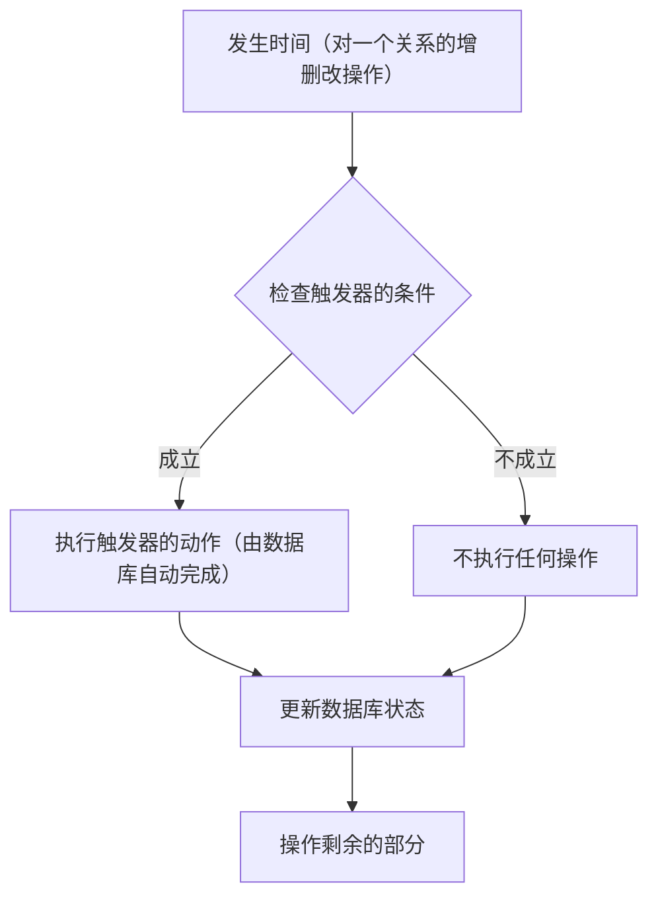
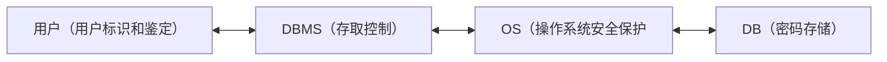

## 数据的完整性

### 数据的完整性
数据完整性是指数据的准确性和一致性，确保数据在存储、处理和检索过程中保持正确、可靠和有效。数据完整性是数据库管理系统中的一个核心概念，它涉及到防止数据损坏和确保数据的正确性。
数据在数据库中必须符合一定的条件或与其他数据保持特定的关系，以确保数据的完整性和准确性。以下是数据需要满足的一些关键条件和关系：
#### 1.  唯一性（Uniqueness）：
数据在特定字段或字段组合中必须是唯一的，以避免重复记录。这通常通过设置主键或唯一索引来实现。
#### 2.  非空性（Not Null）：
某些字段可能要求必须有值，即不允许为空（NULL）。这确保了数据的完整性，尤其是在关键字段如主键上。
#### 3.  数据类型一致性（Data Type Consistency）：
数据必须符合字段定义的数据类型，例如，整数字段只能包含整数值，日期字段只能包含日期值。
#### 4.  格式和模式（Format and Pattern）：
数据可能需要符合特定的格式或模式，如电话号码、邮政编码、电子邮件地址等。
#### 5.  范围和域（Range and Domain）：
数据必须在字段允许的范围内，例如，年龄字段可能限制在0到150岁之间。
#### 6.  一致性约束（Consistency Constraints）：
数据必须与其他相关数据保持一致，例如，如果一个表中的记录被更新或删除，相关联的表中的记录也应相应更新或删除。
#### 7.  业务规则（Business Rules）：
数据必须遵守特定的业务规则，这些规则可能涉及数据的逻辑关系，如价格必须高于成本，或者员工的入职日期不能晚于离职日期。
#### 8.  数据依赖性（Data Dependencies）：
数据之间可能存在依赖关系，如一个表中的字段值依赖于另一个表中的字段值。
确保数据符合这些条件和关系对于维护数据库的准确性、可靠性和有效性至关重要。数据库管理系统（DBMS）通常提供工具和机制来定义和执行这些约束，以保护数据的完整性。


#### 数据完整性
数据完整性主要包括以下三个方面：
##### 1.  实体完整性（Entity Integrity）
•  定义：实体完整性确保数据库表中的每个元组（行）都有一个唯一标识符，通常是主键，且主键的值不能为NULL。
•  实例：在学生表（Students）中，每个学生都有一个唯一的学号（StudentID）作为主键。这个学号不能为空，且每个学生的学号都是唯一的，这样就能确保每个学生记录都能被唯一地识别和区分。
##### 2.  参照完整性（Referential Integrity）
•  定义：参照完整性确保外键值必须对应于另一个表中的有效主键，或者为NULL（如果允许NULL值）。这保证了表之间的关系是一致的，避免了孤立的记录。
•  实例：在选课表（Enrollments）中，StudentID 和 CourseID 作为外键，分别引用学生表（Students）和课程表（Courses）的主键。如果一个学生没有在学生表中注册，那么他的学号就不能作为选课表中的外键值。同样，如果一个课程没有在课程表中定义，那么它的课程号也不能出现在选课表中。
##### 3.  用户自定义完整性（User-Defined Integrity）
•  定义：用户自定义完整性是由数据库设计者根据特定应用的需求定义的约束。这些约束可以是任何确保数据有效性的规则，如数据类型、值的范围、格式等。
•  实例：在员工表（Employees）中，可以定义一个年龄属性（Age）的约束，要求年龄值必须在16岁到65岁之间。这样，任何试图插入或更新年龄为15岁或66岁的记录都会违反用户自定义的完整性约束，从而被数据库系统拒绝。
数据完整性是数据库设计和维护中的关键因素，它有助于确保数据的可靠性和准确性，支持有效的数据管理和决策制定。通过实施实体完整性、参照完整性和用户自定义完整性，可以大大减少数据错误和不一致性，提高数据库的整体质量。
### 完整性约束条件
整个完整性控制都是围绕完整性约束条件进行的，从这个角度说，完整性约束条件是完整性控制机制的核心
确实，完整性约束条件是数据库管理系统中确保数据完整性的核心机制。它们定义了数据必须遵守的规则和条件，以保持数据的准确性、一致性和可靠性。以下是一些常见的完整性约束条件：
1.  实体完整性：
•  确保每个表都有一个主键，主键的值必须唯一，不能为NULL。
•  保证表中的每一行都可以被唯一标识。
2.  参照完整性：
•  确保外键约束，即一个表中的外键必须对应另一个表中已存在的主键。
•  维护表之间的关系，确保数据之间的引用是有效的。
3.  域完整性：
•  确保列中的数据类型和格式符合定义的域规则。
•  例如，年龄字段不能是负数，电话号码必须符合特定的格式。
4.  用户定义的完整性：
•  根据特定应用的需求，用户可以定义额外的约束条件。
•  例如，某些字段可能需要满足特定的业务规则，如折扣率必须在0到100之间。
5.  触发器：
•  可以定义触发器来自动执行某些操作，以维护数据的完整性。
•  触发器可以在数据插入、更新或删除之前或之后自动执行。
6.  断言：
•  断言是一个数据库级的约束，用于确保数据库中所有行的数据都满足某个条件。
•  例如，可以有一个断言确保没有员工的工资低于最低工资标准。
7.  检查约束：
•  检查约束用于限制列中数据值的范围。
•  例如，可以设置一个检查约束，确保温度值在-40到120度之间。
8.  唯一约束：
•  确保列中的所有值都是唯一的，即使它们不是主键的一部分。
•  例如，可以对电子邮件地址或用户名设置唯一约束。
这些完整性约束条件共同工作，以确保数据库中的数据在插入、更新或删除时都符合预定义的规则，从而维护数据的完整性。违反这些约束条件的操作将被数据库系统拒绝，以防止数据不一致或错误。

#### 完整性约束条件作用的对象
完整性约束条件在数据库管理系统中作用于多个对象，以确保数据的完整性和一致性。以下是完整性约束条件主要作用的对象：
1.  表（Tables）：
•  完整性约束定义在数据库表上，以确保表中的数据满足特定的规则和条件。
2.  列（Columns）：
•  列级别的约束，如非空（NOT NULL）、唯一（UNIQUE）和检查（CHECK）约束，确保列中的数据符合特定的标准。
3.  行（Rows）：
•  完整性约束确保每一行数据都符合表定义的规则，如主键约束确保每一行都有一个唯一的标识符。
4.  关系（Relationships）：
•  参照完整性约束维护表之间的关系，确保外键引用的数据在相关表中存在。
5.  事务（Transactions）：
•  完整性约束在事务中起作用，确保事务的执行不会导致数据不一致，事务要么完全成功，要么在遇到违反约束的情况下完全回滚。
6.  视图（Views）：
•  视图可以包含完整性约束，这些约束定义了视图中数据的呈现和行为。
7.  索引（Indexes）：
•  虽然索引主要用于提高查询性能，但它们也可以与唯一性约束结合使用，以确保数据的唯一性。
8.  触发器（Triggers）：
•  触发器可以定义为在特定数据库操作之前或之后自动执行的代码，它们可以用来实施复杂的完整性约束。
9.  存储过程和函数（Stored Procedures and Functions）：
•  在存储过程中，可以定义和实施完整性约束，以确保数据在被处理时保持一致性。
10.  数据库模式（Database Schema）：
•  完整性约束是数据库模式的一部分，定义了数据库的结构和数据必须遵守的规则。
11.  数据字典（Data Dictionary）：
•  在某些数据库系统中，数据字典或系统目录存储了关于数据库对象的元数据，包括完整性约束的定义。
12.  备份和恢复（Backup and Recovery）：
•  完整性约束也适用于备份和恢复过程，确保备份数据的完整性，并在恢复时能够恢复到一致的状态。
通过这些作用对象，完整性约束条件确保了数据库的各个组成部分都符合预定义的规则，从而维护了整个数据库系统的完整性和一致性。

#### 完整性约束条件作用的对象状态

根据静态和动态两个维度，我们可以将上述完整性约束作用的对象状态进行分类：
##### 静态状态（Static States）
静态状态指的是数据在没有发生操作或者在操作之前的状态，它们是数据库操作的基础条件。
1.  初始状态（Initial State）：
•  数据库表和列在创建时定义的完整性约束条件。
2.  备份状态（Backup State）：
•  数据备份时的数据一致性状态。
3.  恢复状态（Recovery State）：
•  从备份中恢复数据时的一致性状态。
##### 动态状态（Dynamic States）
动态状态指的是数据在操作过程中或者操作之后的状态，它们涉及到数据的变化和数据库的响应。
1.  插入状态（Insert State）：
•  新数据被插入数据库时的状态。
2.  更新状态（Update State）：
•  现有数据被更新时的状态。
3.  删除状态（Delete State）：
•  数据被删除时的状态。
4.  查询状态（Query State）：
•  数据被查询时的状态，尽管查询操作不直接修改数据，但它涉及到数据的读取和展示。
5.  事务状态（Transaction State）：
•  事务执行过程中的状态，包括事务的开始、执行和结束。
6.  同步状态（Synchronization State）：
•  分布式数据库系统中数据同步时的状态。
7.  迁移状态（Migration State）：
•  数据从一个系统迁移到另一个系统时的状态。
8.  并发状态（Concurrency State）：
•  多用户环境中并发操作的状态。
9.  审计状态（Audit State）：
•  数据变更被审计和跟踪时的状态。
10.  报告状态（Reporting State）：
•  数据被用于生成报告时的状态。
11.  维护状态（Maintenance State）：
•  数据库进行维护和优化时的状态。
通过这种分类，我们可以更清晰地理解完整性约束在数据库操作的不同阶段所起的作用，以及它们如何帮助维护数据的完整性和一致性。静态状态更多关注于数据的初始定义和备份恢复，而动态状态则涉及到数据的实时操作和变化。

![[sort.png]]

#### 静态列级约束
静态列级约束是对一个列的取值域的说明，这是最常见最简单同时也是最容易实现的一类完整性约束
五类静态列级约束
1.  数据类型约束（Data Type Constraints）：
•  定义：确保列中的数据符合特定的数据类型，如整数、字符串、日期等。
•  实例：假设有一个users表，其中有一个age列，可以定义为INT类型，确保只能插入整数值。
2.  非空约束（NOT NULL Constraints）：
•  定义：确保列不能包含NULL值，即该列的每个记录都必须有值。
•  实例：在users表中，email列可以设置为NOT NULL，这意味着每个用户记录都必须包含一个电子邮件地址。
3.  唯一性约束（UNIQUE Constraints）：
•  定义：确保列中的所有值都是唯一的，即不允许有重复的值。
•  实例：在users表中，username列可以设置为UNIQUE，这样每个用户名都是独一无二的，不允许两个用户有相同的用户名。
4.  主键约束（PRIMARY KEY Constraints）：
•  定义：主键约束是一种特殊的唯一性约束，它不仅要求列的值是唯一的，还要求它们不能为NULL。
•  实例：在users表中，user_id列可以设置为主键（PRIMARY KEY），这样每个用户的ID都是唯一的，并且不能为空。
5.  检查约束（CHECK Constraints）：
•  定义：检查约束用于限制列中的数据值必须满足的条件，例如年龄必须大于0，价格必须大于0等。
•  实例：在orders表中，price列可以设置一个检查约束，如CHECK (price > 0)，确保所有订单的价格都是正数。
这些静态列级约束在数据库设计和数据管理中起着至关重要的作用，它们帮助数据库管理员和开发者确保数据的准确性和一致性，同时防止无效数据的插入。在实际应用中，这些约束可以单独使用，也可以组合使用，以满足复杂的数据完整性要求。

#### 静态元组约束
静态元组约束是指在数据库中，对于单个元组（即表中的一行数据）的各个列之间的约束关系。这种约束局限在单个元组上，不涉及元组之间的比较或关系。以下是静态元组约束的定义、相关实例以及需要注意的点：
定义
静态元组约束规定了组成一个元组的各个列之间的约束关系，确保元组内的数据在任何时候都满足特定的业务规则或逻辑。
相关实例
1.  订货关系中的约束：假设有一个订货关系表，包含ID、商品、订货量、发货量等列。可以设置一个静态元组约束，要求每条记录中的发货量不能大于订货量。这可以用CHECK约束实现：
```sql
CREATE TABLE OrderDetails (
  ID INT,
  商品 VARCHAR(255),
  订货量 INT,
  发货量 INT,
  CHECK (发货量 <= 订货量)
);
```
这个约束确保了在任何时候，对于任何一条订单记录，发货量都不会超过订货量。
2.  教师工资约束：假设有一个教师信息表，包含教师ID、姓名、职称、工资等列。可以设置一个静态元组约束，要求教授的工资不得低于某个值，例如7000元。这同样可以用CHECK约束实现：
```sql
CREATE TABLE Teachers (
  教师ID INT,
  姓名 VARCHAR(255),
  职称 VARCHAR(255),
  工资 INT,
  CHECK (职称 = '教授' AND 工资 >= 7000)
);
```
这个约束确保了所有教授的工资都不会低于7000元。
需要注意的点
1.  性能影响：过多的静态元组约束可能会影响数据库操作的性能，尤其是在数据量大的情况下，因为每次插入或更新数据时都需要检查这些约束。
2.  可维护性：随着业务逻辑的变更，可能需要调整或删除现有的静态元组约束，这可能需要额外的数据库维护工作。
3.  数据迁移和同步：在数据迁移或同步过程中，需要确保静态元组约束在新系统中得到适当的处理和应用，以保持数据的一致性。
4.  与其他约束的关系：静态元组约束可能与其他类型的约束（如静态关系约束）相互作用，设计时需要考虑这些约束之间的潜在冲突。
5. 静态元组约束只局限在单个元组上
通过合理地使用静态元组约束，可以有效地保证数据库中数据的正确性和业务逻辑的一致性。


#### 静态关系约束

静态关系约束是指在一个关系的各个元组之间或者若干关系之间存在的各种联系或约束。这些约束是数据库中数据应该满足的语义条件，它们是数据库完整性控制机制的核心。
以下是常见的静态关系约束及其实例：
1.  实体完整性约束（Entity Integrity Constraint）：
•  定义：确保每个表都有一个主键，并且主键的值不能为空（NOT NULL）。
•  实例：在students表中，student_id是主键，每个学生的ID都是唯一的，且不能留空。
2.  参照完整性约束（Referential Integrity Constraint）：
•  定义：确保外键的值必须在另一个表的相应列（通常是主键）中存在，或者为NULL。
•  实例：假设orders表中有一个customer_id列，它是外键，指向customers表的customer_id主键。这意味着orders表中的每个customer_id都必须在customers表中有对应的记录，或者为NULL。
3.  函数依赖约束（Functional Dependency Constraint）：
•  定义：如果关系数据库中的某个属性集合A的值决定了另一个属性集合B的值，则称B函数依赖于A。
•  实例：在employees表中，如果department_id决定了manager_id（即同一个部门有同一个经理），则存在函数依赖department_id -> manager_id。
4.  统计约束（Statistical Constraint）：
•  定义：涉及数据的统计特性，如数据的分布、频率等。
•  实例：可以规定employees表中性别比例，例如男员工和女员工的数量应该大致相等。这种约束可能需要通过统计方法来检查和维护。

这些静态关系约束确保了数据库中数据之间的正确关系和一致性，是数据库设计和维护中的重要组成部分。通过实施这些约束，可以防止数据不一致和无效数据的产生，从而维护数据库的完整性。


#### 动态列级约束

动态列级约束是指在修改列定义或列值时应满足的约束条件。这些约束涉及到数据的更新和变更，确保在数据发生变化时，仍然能够保持数据的完整性和一致性。动态列级约束主要包括以下两个方面：
1.  修改列定义时的约束：
•  这类约束涉及到当列的定义（如数据类型、大小等）被修改时，必须满足的条件。例如，如果一个列原本允许空值（NULL），在将其修改为不允许空值时，必须确保该列目前已存在的所有值都不是空值，否则这种修改将被拒绝。
2.  修改列值时的约束：
•  这类约束涉及到当列的值被更新时，新值必须满足的条件。例如，可以规定工资调整必须大于或等于原来的工资，或者年龄只能增加不能减少等。
以下是一些常见的动态列级约束实例：
实例1：工资调整
假设有一个employees表，其中包含salary列。我们可以设置一个触发器，确保每次更新操作后，员工的工资只能增加不能减少：
```sql
CREATE TRIGGER CheckSalaryIncrease
BEFORE UPDATE ON employees
FOR EACH ROW
BEGIN
  IF NEW.salary < OLD.salary THEN
    SIGNAL SQLSTATE '45000'
    SET MESSAGE_TEXT = 'Salary cannot be decreased.';
  END IF;
END;

```

在这个例子中，如果尝试将员工的工资减少，数据库将抛出一个错误，阻止这种操作。
实例2：年龄只能增加
假设有一个person表，其中包含age列。我们可以设置一个触发器，确保年龄字段在更新时只能增加或保持不变：

```sql
CREATE TRIGGER CheckAgeIncrease
BEFORE UPDATE ON person
FOR EACH ROW
BEGIN
  IF NEW.age < OLD.age THEN
    SIGNAL SQLSTATE '45000'
    SET MESSAGE_TEXT = 'Age cannot be decreased.';
  END IF;
END;
```
 
在这个例子中，如果尝试将某人的年龄减少，数据库将抛出一个错误，阻止这种操作。
这些动态列级约束通过触发器实现，可以在数据更新时自动检查和执行，从而维护数据的完整性和业务规则。


#### 动态元组约束

动态元组约束是指在修改数据库中某个元组（即行）的值时，需要参照其旧值，并且新旧值之间需要满足某种约束条件。这类约束通常涉及到行级别的数据变化，确保数据的变更符合特定的业务规则或逻辑。以下是常见的动态元组约束和相关实例：
1.  工资只能增加不能减少：
•  定义：这种约束确保员工的工资在更新时只能增加不能减少，以反映工资的正常增长。
•  实例：假设有一个employees表，其中包含employee_id、name和salary列。可以设置一个触发器，当更新salary列时，检查新工资是否大于或等于旧工资，如果不是，则拒绝更新。

```sql
CREATE TRIGGER CheckSalaryIncrease
BEFORE UPDATE OF salary ON employees
FOR EACH ROW
BEGIN
  IF NEW.salary < OLD.salary THEN
    SIGNAL SQLSTATE '45000'
    SET MESSAGE_TEXT = 'Salary cannot be decreased.';
  END IF;
END;

```

这个触发器确保了工资不会降低。
2.  课程选修数量更新：
•  定义：当学生选修一门新课程时，自动更新学生已选课程的总数。
•  实例：假设有一个students表，其中包含student_id和sum_courses列，以及一个enrollments表，记录学生的课程选修情况。可以设置一个触发器，在enrollments表插入新记录时，自动增加students表中相应学生的sum_courses值。
```sql
CREATE TRIGGER UpdateCourseCount
AFTER INSERT ON enrollments
FOR EACH ROW
BEGIN
  UPDATE students
  SET sum_courses = sum_courses + 1
  WHERE student_id = NEW.student_id;
END;

```

这个触发器确保了每当学生选修新课程时，他们的已选课程总数会自动更新。
这些动态元组约束通过触发器实现，触发器是一种特殊的存储过程，它会在INSERT、UPDATE或DELETE操作发生之前或之后自动执行，以确保数据的完整性和业务规则的执行。触发器的使用需要谨慎，因为不当的触发器可能会影响数据库性能，并使数据库逻辑变得复杂。

#### 动态关系约束

动态关系约束是指在数据库关系变化前后状态上的限制条件，它们通常涉及到事务的一致性、原子性等约束条件。这些约束确保了数据库在进行数据修改操作时，能够保持数据的完整性和一致性。以下是一些常见的动态关系约束及其实例：
##### 1.  事务一致性约束（Transaction Consistency Constraints）：
•  定义：确保事务的执行结果必须从一个一致性状态转换到另一个一致性状态。事务中的所有操作要么全部成功，要么在遇到错误时全部回滚，以保持数据的一致性。
•  实例：在银行转账操作中，从一个账户向另一个账户转账时，必须确保转账前后两个账户的余额总和保持不变。如果转账过程中发生错误，必须回滚所有操作，以保持账户余额的一致性。
##### 2.  原子性约束（Atomicity Constraints）：
•  定义：事务中的所有操作要么全部完成，要么全部不完成，不能有中间状态。这是ACID属性之一，确保事务的原子性。
•  实例：在图书馆管理系统中，借书操作涉及更新库存和记录借阅信息两个步骤。这两个步骤必须作为一个整体执行，如果其中一个步骤失败，整个借书操作需要回滚，以保持库存和借阅记录的一致性。
##### 3.  隔离性约束（Isolation Constraints）：
•  定义：并发执行的事务彼此隔离，一个事务的执行不应影响其他事务的执行结果。这也是ACID属性之一，确保事务在并发环境下的正确性。
•  实例：在在线购物平台中，多个用户同时对同一商品进行下单操作时，系统需要确保每个用户的下单操作是隔离的，不会因为其他用户的下单而受到影响，直到事务提交。
##### 4.  持久性约束（Durability Constraints）：
•  定义：一旦事务被提交，它对数据库所做的更改就是永久性的。即使系统发生故障，已提交的数据更改也不会丢失。这也是ACID属性之一，确保事务的持久性。
•  实例：在航班预订系统中，一旦用户成功预订机票，该预订信息将被持久化存储，即使系统随后发生故障，用户的预订信息也不会丢失。
##### 5.  触发器约束（Trigger Constraints）：
•  定义：触发器是一种特殊的动态关系约束，它允许在特定数据库操作（如INSERT、UPDATE、DELETE）之前或之后自动执行一段代码，以维护数据的完整性。
•  实例：在学生信息系统中，可以设置一个触发器，当学生的成绩被更新时，自动更新学生的绩点（GPA）。如果成绩更新导致GPA低于某个阈值，触发器可以阻止成绩的更新，或者将学生标记为学术警告状态。
这些动态关系约束是数据库管理系统中确保数据完整性和一致性的关键机制，它们在数据库操作过程中发挥着重要作用。

**完整性约束条件小结**
<table>
  <tr>
    <th>粒度 状态</th>
    <th>列级</th>
    <th>元组级</th>
    <th>关系级</th>
  </tr>
  <tr>
    <td>静态</td>
    <td>列定义 ·类型 ·格式 ·值域 ·空值</td>
    <td>元组值应满足的条件</td>
    <td>实体完整性约束 参照完整性约束 函数依赖约束 统计约束</td>
  </tr>
  <tr>
    <td>动态</td>
    <td>改变列定义 或列值</td>
    <td>元组新旧值之间应满足的约束条件</td>
    <td>关系新旧状态间应满足的约束条件</td>
  </tr>
</table>

#### DBMS的完整性控制机制
##### 定义功能
DBMS通过数据定义语言（DDL）提供定义数据库中数据对象的能力。这包括创建、修改和删除数据库结构的指令，如表、视图、索引等。
##### 检查功能
1. **数据的完整性（Integrity）检查**：DBMS确保数据在插入、更新或删除时满足预定义的完整性约束条件。这些约束条件可以是实体完整性、参照完整性和用户定义的完整性。
2. **实体完整性**：确保每个表都有一个主键，并且主键的值是唯一的。
3. **参照完整性**：确保外键的值必须在相关的表中存在，或者为NULL（如果允许）。
4. **用户定义的完整性**：允许用户定义特定于应用的约束，如检查约束、唯一约束等。

##### 违约反应
当完整性约束被违反时，DBMS会采取以下反应：

1. **拒绝操作**：如果一个事务试图违反完整性约束，DBMS将拒绝这个事务，并且不执行该操作。
2. **回滚事务**：如果事务已经部分完成，但后续操作违反了完整性约束，DBMS将回滚事务，撤销所有已执行的操作，以保持数据库的一致性。
3. **错误消息**：DBMS会返回错误消息给用户或应用程序，指明违反了哪些完整性约束，以及事务为何被拒绝。

#### 关系系统三类完整性的实现
- 提供有定义和检查实体完整性、参照完整性和用户定义的完整性的功能
- 对于违反实体完整性规则和用户定义的完整性规则的操作一般都是采用拒绝执行的方式进行处理。
- 而对于违反参照完整性的操作，并不都是简单地拒绝执行，有时还需要采取另一种方法，即接受这个操作，同时执行一些附加的操作，以保证数据库的状态仍然是正确的。
##### 1. 实体完整性
**定义**：实体完整性确保每个表的主键属性不能为NULL，并且主键的值必须唯一。

**实现**：
- 在创建表时，使用`PRIMARY KEY`约束来定义主键。
- 例如，创建一个学生表时，学号（SNO）作为主键，不能为NULL。

**实例**：
```sql
CREATE TABLE Student (
    SNO INT PRIMARY KEY,
    SNAME CHAR(20) NOT NULL,
    AGE INT CHECK (AGE >= 16 AND AGE < 50)
);
```
在这个例子中，`SNO`是主键，不能为NULL，确保每个学生都有唯一的标识。

##### 2. 参照完整性
**定义**：参照完整性确保外键的值必须在被参照表的主键中存在，或者为NULL。

**实现**：
- 在创建表时，使用`FOREIGN KEY`约束来定义外键。
- 例如，学生表中的专业号（DEPT）引用专业表的主键（DEPT_ID）。

**实例**：
```sql
CREATE TABLE Department (
    DEPT_ID INT PRIMARY KEY,
    DEPT_NAME CHAR(20) NOT NULL
);

CREATE TABLE Student (
    SNO INT PRIMARY KEY,
    SNAME CHAR(20) NOT NULL,
    DEPT INT,
    FOREIGN KEY (DEPT) REFERENCES Department(DEPT_ID)
);
```
在这个例子中，`DEPT`是外键，必须在`Department`表的`DEPT_ID`中存在，确保学生的专业是有效的。

##### 3. 用户定义的完整性
**定义**：用户定义的完整性是特定于应用的约束，反映了业务规则或逻辑。

**实现**：
- 可以使用`CHECK`约束、`TRIGGER`或`ASSERTION`来实现。
- 例如，要求学生的年龄必须在某个范围内，或者课程的学分只能取特定值。

**实例**：
```sql
CREATE TABLE Course (
    CNO CHAR(4) PRIMARY KEY,
    CNAME CHAR(40) NOT NULL,
    CREDIT INT CHECK (CREDIT IN (1, 2, 3, 4))
);
```
在这个例子中，`CREDIT`属性的值只能是1、2、3或4，确保课程的学分符合规定。

- **实体完整性**确保主键的唯一性和非空性。
- **参照完整性**确保外键的有效性。
- **用户定义的完整性**允许用户根据业务需求定义特定的约束条件。

这些完整性约束共同维护了数据库的准确性和一致性，防止了数据错误和不一致的发生。


#### 外码是否接受可以空值的问题
关于外键（Foreign Key）是否可以接受空值的问题，答案是可以的。在数据库系统中，外键列可以被设置为接受空值，这取决于具体的业务规则和设计需求。当外键列被设置为可以包含空值时，这意味着该列可以不引用任何主键值，即对应的关联实体可以不存在。

##### 外键接受空值的情况
1. **表示没有关联**：当外键列被设置为可以包含空值时，空值可以表示该实体没有与之关联的实体。例如，在学生表中，如果学生尚未分配专业，那么专业号（外键）可以被设置为空值。

2. **可选关系**：在某些情况下，外键列的空值表示与另一个实体的关系是可选的，即该关系不是强制性的。

##### 相关实例
假设有一个学生表（Student）和一个专业表（Department），其中学生表中的专业号（DepartmentID）是外键，引用专业表的主键（DepartmentID）。

```sql
CREATE TABLE Department (
    DepartmentID INT PRIMARY KEY,
    DepartmentName VARCHAR(255) NOT NULL
);

CREATE TABLE Student (
    StudentID INT PRIMARY KEY,
    StudentName VARCHAR(255) NOT NULL,
    DepartmentID INT,
    FOREIGN KEY (DepartmentID) REFERENCES Department(DepartmentID)
);
```

在这个例子中，`Student`表的`DepartmentID`列被设置为外键，它可以包含空值。这意味着：
- 如果`DepartmentID`为非空值，它必须在`Department`表的`DepartmentID`列中存在。
- 如果`DepartmentID`为空值，表示该学生尚未分配到任何专业，或者该学生与专业之间没有关联。

这种设计允许在数据库中灵活地处理那些可能没有固定关联关系的实体，同时保持数据的完整性和一致性。


#### 删除被参照关系的元组时的问题
##### 出现违约操作的情形
在数据库中，出现违约操作（违反完整性约束）的情形主要包括以下几种：

1. **违反实体完整性**：尝试插入或更新记录时，主键列包含NULL值，或者违反了唯一性约束。
   - 实例：如果一个表的主键定义为不允许NULL，而用户尝试插入一个主键列为NULL的记录，这将违反实体完整性。

2. **违反参照完整性**：尝试插入、更新或删除记录时，外键列的值在被参照表的主键中不存在，或者尝试删除被参照表中的记录，而参照表中存在对应的外键记录。
   - 实例：如果`Employee`表中的`DepartmentID`是外键，指向`Department`表的`DepartmentID`，那么不能删除`Department`表中存在对应`DepartmentID`的记录，否则会违反参照完整性。

3. **违反用户定义的完整性**：尝试插入、更新或删除记录时，违反了业务规则或逻辑约束。
   - 实例：如果业务规则规定年龄必须在18到65岁之间，而用户尝试插入一个年龄为17岁的记录，这将违反用户定义的完整性。

4. **违反域约束**：尝试插入或更新记录时，字段值超出了预定义的域范围。
   - 实例：如果一个字段被定义为只能包含特定范围内的整数值，而用户尝试插入一个超出这个范围的值，这将违反域约束。

5. **违反检查约束**：尝试插入或更新记录时，违反了CHECK约束。
   - 实例：如果一个表定义了CHECK约束，要求某个字段的值必须大于0，而用户尝试插入一个小于或等于0的值，这将违反CHECK约束。

在实际操作中，违反这些完整性约束的操作会被数据库管理系统拒绝，并可能返回错误消息，提示用户操作失败的原因。例如，在尝试删除`Department`表中的一个部门时，如果`Employee`表中存在对应的外键记录，数据库将拒绝删除操作，并返回错误消息，指出违反了参照完整性约束。
	
**当删除被参照关系的元组时，DBMS（数据库管理系统）需要确保参照完整性不被破坏。以下是几种常见的处理方式和相关实例：**

##### 1. 级联删除（CASCADE）
如果被参照表中的元组被删除，那么所有参照表中对应的外键元组也会被删除。

**实例**：
假设有两个表，`Department`（部门）和`Employee`（员工），其中`Employee`表中的`DepartmentID`是外键，指向`Department`表的`DepartmentID`。

```sql
CREATE TABLE Department (
    DepartmentID INT PRIMARY KEY,
    DepartmentName VARCHAR(255) NOT NULL
);

CREATE TABLE Employee (
    EmployeeID INT PRIMARY KEY,
    EmployeeName VARCHAR(255) NOT NULL,
    DepartmentID INT,
    FOREIGN KEY (DepartmentID) REFERENCES Department(DepartmentID) ON DELETE CASCADE
);
```

在这个例子中，如果删除`Department`表中的一个部门，那么所有在`Employee`表中具有相应`DepartmentID`的员工记录也会被级联删除。

##### 2. 置空值删除（SET NULL）
如果被参照表中的元组被删除，那么参照表中对应的外键元组的值会被设置为NULL。

**实例**：
继续使用上面的`Department`和`Employee`表，如果我们将外键约束修改为置空值删除：

```sql
CREATE TABLE Employee (
    EmployeeID INT PRIMARY KEY,
    EmployeeName VARCHAR(255) NOT NULL,
    DepartmentID INT,
    FOREIGN KEY (DepartmentID) REFERENCES Department(DepartmentID) ON DELETE SET NULL
);
```

在这个例子中，如果删除`Department`表中的一个部门，那么所有在`Employee`表中具有相应`DepartmentID`的员工记录的`DepartmentID`字段会被设置为NULL。

##### 3. 受限删除（RESTRICT）
如果被参照表中的元组被删除，那么只有当参照表中没有元组与被参照表中要删除的元组主键值相同时才执行删除操作，否则拒绝删除。

**实例**：
使用同样的`Department`和`Employee`表，如果我们将外键约束设置为受限删除：

```sql
CREATE TABLE Employee (
    EmployeeID INT PRIMARY KEY,
    EmployeeName VARCHAR(255) NOT NULL,
    DepartmentID INT,
    FOREIGN KEY (DepartmentID) REFERENCES Department(DepartmentID) ON DELETE RESTRICT
);
```

在这个例子中，如果尝试删除`Department`表中的一个部门，而`Employee`表中存在具有相应`DepartmentID`的员工记录，那么删除操作会被拒绝，以保持参照完整性。

这些删除行为确保了在删除被参照关系的元组时，数据库的完整性和一致性得到维护。

#### 修改被参照关系中主码的问题
关于修改被参照关系中主码的问题，我们可以从两种策略来讨论：不允许修改主码和允许修改主码。每种策略下，都会有相应的违约操作和违约反应。

##### 策略1：不允许修改主码

**违约操作**：尝试修改被参照表的主码值。

**违约反应**：数据库管理系统（DBMS）会拒绝这种修改操作，以保持参照完整性。

**实例**：
假设有两个表，`Students`（学生）和`Enrollments`（选课记录），其中`Enrollments`表的`StudentID`是外键，引用`Students`表的`StudentID`主键。

```sql
CREATE TABLE Students (
    StudentID INT PRIMARY KEY,
    Name VARCHAR(100) NOT NULL
);

CREATE TABLE Enrollments (
    EnrollmentID INT PRIMARY KEY,
    StudentID INT,
    CourseID INT,
    FOREIGN KEY (StudentID) REFERENCES Students(StudentID)
);
```

如果尝试将`Students`表中某个学生的`StudentID`从1改为2，而`Enrollments`表中存在`StudentID`为1的记录，DBMS将拒绝这种修改，以防止`Enrollments`表中的外键值变得无效。

##### 策略2：允许修改主码

**违约操作**：在允许修改主码的情况下，可能会出现以下违约操作：
1. **直接修改被参照表的主码值**：这可能会导致参照表中的外键值不再有效。
2. **不更新参照表中的外键值**：在被参照表的主码值修改后，如果没有相应地更新参照表中的外键值，也会导致完整性问题。

**违约反应**：为了解决这些问题，可以采取以下措施：
1. **级联更新（CASCADE UPDATE）**：当被参照表的主码值被更新时，自动更新参照表中的相应外键值。
2. **设置为空值（SET NULL）**：将参照表中的外键值设置为NULL，表示它们不再引用任何主码。

**实例**：
继续使用上述的`Students`和`Enrollments`表，我们可以在创建外键时指定级联更新的行为：

```sql
CREATE TABLE Enrollments (
    EnrollmentID INT PRIMARY KEY,
    StudentID INT,
    CourseID INT,
    FOREIGN KEY (StudentID) REFERENCES Students(StudentID) ON UPDATE CASCADE
);
```

在这个例子中，如果`Students`表中的`StudentID`从1改为2，`Enrollments`表中所有`StudentID`为1的记录会自动更新为2，以保持参照完整性。

总结来说，不允许修改主码的策略通过拒绝修改操作来维护完整性，而允许修改主码的策略则需要通过级联更新或设置为空值等措施来保持数据一致性。

### 如何进行完整性维护系统的设计
#### 1. 如何表达完整性约束条件

完整性约束条件可以通过以下几种方式表达：

- **实体完整性**：通过定义主键（PRIMARY KEY）来表达，确保主属性不能取空值（NULL）。
- **参照完整性**：通过外键（FOREIGN KEY）约束来表达，指明外键列参照其他表的主键。
- **用户定义的完整性**：通过CHECK约束、断言（ASSERTION）和触发器（TRIGGERS）来表达具体应用的语义要求。

#### 2. 如何检查完整性约束条件

完整性约束条件的检查通常在以下情况下进行：

- **属性级别的检查**：在INSERT或UPDATE操作时，系统会自动检查数据是否满足列级别的约束，如NOT NULL、UNIQUE和CHECK约束。
- **元组级别的检查**：在数据变化时（INSERT、UPDATE、DELETE），系统会检查元组是否满足定义的表级约束条件，如CHECK约束。
- **事务级别的检查**：在事务提交时，系统会检查所有更改是否满足完整性约束条件。

#### 3. 违反条件时的处理

违反完整性约束条件时，数据库管理系统会采取以下措施：

- **拒绝操作**：最常见的反应是拒绝执行违反完整性约束的操作。
- **级联操作**：对于参照完整性，可以设置级联删除（CASCADE）或级联更新（CASCADE），意味着当被参照表中的记录被删除或更新时，参照表中的相应记录也会被级联删除或更新。
- **设置为空值**：在删除被参照表中的记录时，可以选择将参照表中的外键列设置为NULL，以保持参照表的完整性。

#### 相关实例

##### 实体完整性实例

```sql
CREATE TABLE Student (
    Sno CHAR(9) PRIMARY KEY,
    Sname CHAR(20) NOT NULL,
    Ssex CHAR(2),
    Sage SMALLINT,
    Sdept CHAR(20)
);
```

在这个例子中，`Sno` 被定义为主键，因此不能取空值，且每个学生的学号必须是唯一的。

##### 参照完整性实例

```sql
CREATE TABLE SC (
    Sno CHAR(9) NOT NULL,
    Cno CHAR(4) NOT NULL,
    Grade SMALLINT,
    PRIMARY KEY (Sno, Cno),
    FOREIGN KEY (Sno) REFERENCES Student(Sno),
    FOREIGN KEY (Cno) REFERENCES Course(Cno)
);
```

在这个例子中，`SC` 表的 `Sno` 和 `Cno` 分别作为外键参照 `Student` 表和 `Course` 表的主键。如果 `Student` 或 `Course` 表中的相应记录被删除，那么 `SC` 表中的记录也会受到影响。

##### 用户定义的完整性实例

```sql
CREATE TABLE Student (
    Sno CHAR(9) PRIMARY KEY,
    Sname CHAR(8) NOT NULL,
    Ssex CHAR(2) CHECK (Ssex IN ('男', '女')),
    Sage SMALLINT CHECK (Sage >= 14 AND Sage <= 50)
);
```

在这个例子中，`Ssex` 只能取“男”或“女”，`Sage` 的取值范围被限制在14到50之间。

#### DBMS中完整性的定义：使用约束
<table border="1">
  <tr>
    <th>完整性的类型</th>
    <th>约束的类型</th>
    <th>说明</th>
  </tr>
  <tr>
    <td rowspan="2">实体完整性</td>
    <td>PRIMARY KEY</td>
    <td>唯一标识每一行，保证用户不输入重复的数据，且创建一个索引来提高性能。不允许空值</td>
  </tr>
  <tr>
    
    <td>UNIQUE</td>
    <td>防止非主关键字的重复，并保证创建一个索引来提高性能。允许空值</td>
  </tr>
  <tr>
    <td>用户定义完整性</td>
    <td>DEFAULT</td>
    <td>指定在INSERT语句中没有明确提供一个值时，为该列提供的值</td>
  </tr>
  <tr>
    <td>用户定义完整性</td>
    <td>CHECK</td>
    <td>指定在一个列中可接受的数据值</td>
  </tr>
  <tr>
    <td>参照完整性</td>
    <td>FOREIGN KEY</td>
    <td>定义一个列或几个列的组合，他们的值匹配同一个表或另一个表中关键字</td>
  </tr>
</table>

##### Create Table 定义约束 
约束涉及单个属性的，有重量说明方法 定义为列级 约束条件 定义为表级约束题哦啊见 若约束涉及多个属性的，只有一种说明方法 定义为表级约束条件

在数据库中，约束用于确保数据的完整性和准确性。约束可以应用于列（字段）级别或表级别。以下是列级约束和表级约束的一些例子： 列级约束（Column-level Constraints）

1. NOT NULL • 确保列不接受NULL值。 • 例子：CREATE TABLE Employees (ID INT NOT NULL, Name VARCHAR(100));
    
2. UNIQUE • 确保列中的所有值都是唯一的。 • 例子：CREATE TABLE Employees (ID INT, Email VARCHAR(255) UNIQUE);
    
3. PRIMARY KEY • 确保列的唯一性，并且通常用于标识表中的每一行。 • 例子：CREATE TABLE Employees (ID INT PRIMARY KEY, Name VARCHAR(100));
    
4. FOREIGN KEY • 用于建立两个表之间的关系，确保引用的完整性。 • 例子：CREATE TABLE Orders (OrderID INT, CustomerID INT, FOREIGN KEY (CustomerID) REFERENCES Customers(CustomerID));
    
5. CHECK • 确保列中的值满足特定的条件。 • 例子：CREATE TABLE Employees (Age INT CHECK (Age > 0 AND Age < 120));
    
6. DEFAULT • 为列提供一个默认值，如果插入行时没有指定该列的值。 • 例子：CREATE TABLE Employees (ID INT, IsActive BOOLEAN DEFAULT TRUE); 表级约束（Table-level Constraints）
    
7. UNIQUE • 可以应用于多个列，确保这些列的组合值是唯一的。 • 例子：CREATE TABLE Employees (ID INT, FirstName VARCHAR(100), LastName VARCHAR(100), UNIQUE (FirstName, LastName));
    
8. PRIMARY KEY • 也可以在表级别定义，以指定表的主键。 • 例子：CREATE TABLE Employees (ID INT, Name VARCHAR(100), CONSTRAINT PK_Employees PRIMARY KEY (ID));
    
9. FOREIGN KEY • 虽然通常在列级别定义，但可以在表级别定义多个外键约束。 • 例子：CREATE TABLE Orders (OrderID INT, CustomerID INT, ProductID INT, CONSTRAINT FK_Customer FOREIGN KEY (CustomerID) REFERENCES Customers(CustomerID), CONSTRAINT FK_Product FOREIGN KEY (ProductID) REFERENCES Products(ProductID));
    
10. CHECK • 可以应用于整个表，确保表中所有行的数据满足某个条件。 • 例子：CREATE TABLE Employees (ID INT, Salary DECIMAL(10, 2), CONSTRAINT CK_Salary CHECK (Salary > 0));
    
11. INDEX • 虽然不是数据完整性约束，但可以定义在表级别，用于优化查询性能。 • 例子：CREATE TABLE Employees (ID INT, Name VARCHAR(100), INDEX idx_name (Name)); 这些例子展示了如何在SQL中使用列级和表级约束来维护数据的完整性和一致性。
    

##### Alter Table定义约束
在SQL中，ALTER TABLE语句用于修改已存在的表结构，包括添加和删除约束。以下是添加和删除约束的基本语法以及一些实例。 添加约束 添加列级约束

```sql
ALTER TABLE table_name  
ALTER COLUMN column_name CONSTRAINT constraint_name constraint_type;  
```

​

• table_name 是你想要修改的表名。
• column_name 是你想要添加约束的列名。
• constraint_name 是你为约束指定的名称（可选）。
• constraint_type 是约束的类型，例如 NOT NULL, UNIQUE, CHECK, DEFAULT 等。 实例：为列添加非空约束
```sql
ALTER TABLE Employees  
ALTER COLUMN Email VARCHAR(255) NOT NULL;
```

添加表级约束

```sql
ALTER TABLE table_name  
ADD CONSTRAINT constraint_name constraint_type;  
```

• table_name 是你想要修改的表名。 
• constraint_name 是你为约束指定的名称。
• constraint_type 是约束的类型，例如 PRIMARY KEY, FOREIGN KEY, UNIQUE, CHECK 等。 实例：为表添加主键约束
```sql
ALTER TABLE Employees  
ADD CONSTRAINT PK_Employees PRIMARY KEY (ID);
```


删除约束 删除列级约束
```sql
ALTER TABLE table_name  
ALTER COLUMN column_name DROP CONSTRAINT constraint_name;
```

• table_name 是你想要修改的表名。 • column_name 是包含要删除约束的列名。 • constraint_name 是要删除的约束名称。 实例：删除列的非空约束
```sql
ALTER TABLE Employees  
ALTER COLUMN Email DROP CONSTRAINT CK_EmailNotNull;
```

删除表级约束
```sql
ALTER TABLE table_name  
DROP CONSTRAINT constraint_name;
```
• table_name 是你想要修改的表名。
• constraint_name 是要删除的约束名称。 实例：删除表的主键约束
```sql
ALTER TABLE Employees  
DROP CONSTRAINT PK_Employees;
```


请注意，删除约束时，你需要知道约束的确切名称。在实际应用中，你可能需要查询数据库的元数据来找到这些名称。例如，在SQL Server中，你可以使用以下查询来找到约束名称：
```sql
SELECT name  
FROM sys.key_constraints  
WHERE type = 'PK' AND parent_object_id = OBJECT_ID('Employees');
```
在MySQL中，你可以使用SHOW INDEXES来查看索引和约束信息。 在实际操作中，确保在删除约束之前备份数据库，以防意外删除重要数据。

##### UNIQUE约束

1. 允许空值：UNIQUE约束允许列中有多个NULL值，因为NULL值被视为不唯一。
    
2. 多个UNIQUE约束：一个表可以有多个UNIQUE约束，每个约束可以应用于一个或多个列。
    
3. 非主键的唯一值：UNIQUE约束可以用于确保列或列的组合的唯一性，即使它们不是表的主键。
    
4. 通过唯一索引强制UNIQUE：在很多数据库系统中，UNIQUE约束实际上是通过创建一个唯一索引来强制的。 相关实例 添加UNIQUE约束 实例1：在单个列上添加UNIQUE约束
    
```sql
CREATE TABLE Users (  
    ID INT,  
    Username VARCHAR(50),  
    Email VARCHAR(255)  
);  
ALTER TABLE Users  
ADD CONSTRAINT UC_Email UNIQUE (Email);  
```
在这个例子中，我们创建了一个Users表，并添加了一个UNIQUE约束到Email列，确保每个用户的电子邮件地址是唯一的。 实例2：在多个列上添加UNIQUE约束

```sql
ALTER TABLE Users  
ADD CONSTRAINT UC_Username_Email UNIQUE (Username, Email);
```
在这个例子中，我们添加了一个UNIQUE约束到Username和Email列的组合上，确保用户名和电子邮件地址的组合是唯一的。 允许空值
```sql
INSERT INTO Users (ID, Username, Email) VALUES (1, 'user1', NULL);  
INSERT INTO Users (ID, Username, Email) VALUES (2, 'user2', NULL);

```

在这个例子中，我们可以插入两个NULL值到Email列，因为UNIQUE约束允许多个NULL值。 通过唯一索引强制UNIQUE 在某些数据库系统中，如MySQL，你可以显式地创建一个唯一索引来强制UNIQUE约束：
```sql
CREATE UNIQUE INDEX idx_unique_email ON Users (Email);
```


这个唯一索引idx_unique_email确保Email列中的值是唯一的。 删除UNIQUE约束 如果你需要删除一个UNIQUE约束，可以使用以下语句：
```sql
ALTER TABLE Users  
DROP CONSTRAINT UC_Email;
```

或者，如果你知道索引的名称，也可以直接删除索引：
```sql
DROP INDEX idx_unique_email ON Users;
```


##### PRIMARY KEY约束

1. 每个表只能定义一个PRIMARY KEY约束：一个表只能有一个主键，它用来唯一标识表中的每一行。
    
2. 输入的值必须是唯一的：主键列中的每个值都必须是唯一的，不能有重复。
    
3. 不允许为空（NOT NULL）：主键列不能接受NULL值，因为NULL值无法唯一标识一行。
    
4. 在指定的列上创建一个唯一索引：主键约束自动在指定的列上创建一个唯一索引，确保数据的唯一性和快速检索。 相关实例 创建表时定义PRIMARY KEY约束 实例1：单列主键
    
```sql
CREATE TABLE Employees (  
    EmployeeID INT,  
    FirstName VARCHAR(50),  
    LastName VARCHAR(50),  
    PRIMARY KEY (EmployeeID)  
);
```


在这个例子中，我们创建了一个Employees表，并定义了EmployeeID作为主键，确保每个员工的ID是唯一的，并且非空。 添加PRIMARY KEY约束到已存在的表 实例2：向现有表添加主键
```sql
CREATE TABLE Employees (  
    EmployeeID INT,  
    FirstName VARCHAR(50),  
    LastName VARCHAR(50)  
);  
  
ALTER TABLE Employees  
ADD PRIMARY KEY (EmployeeID);  

```

在这个例子中，我们首先创建了一个没有主键的Employees表，然后通过ALTER TABLE语句添加了主键约束。 多列主键 实例3：复合主键
```sql
CREATE TABLE StudentCourses (  
    StudentID INT,  
    CourseID INT,  
    Grade DECIMAL(3, 2),  
    PRIMARY KEY (StudentID, CourseID)  
);
```


在这个例子中，我们创建了一个StudentCourses表，它有一个复合主键，由StudentID和CourseID两列组成，确保每个学生对每门课程的记录是唯一的。 删除PRIMARY KEY约束 实例4：删除主键
```sql
ALTER TABLE Employees  
DROP PRIMARY KEY;
```


在这个例子中，我们从Employees表中删除了主键约束。请注意，删除主键是一个敏感操作，因为它可能会影响表的数据完整性。 主键上的唯一索引 实例5：查看主键上的唯一索引 在某些数据库系统中，你可以查询数据库的元数据来查看主键上的唯一索引。例如，在SQL Server中，你可以使用以下查询：
```sql
SELECT i.name AS [IndexName],  
       ic.index_column_id,  
       c.name AS [ColumnName]  
FROM sys.indexes i  
INNER JOIN sys.index_columns ic ON i.object_id = ic.object_id AND i.index_id = ic.index_id  
INNER JOIN sys.columns c ON ic.object_id = c.object_id AND ic.column_id = c.column_id  
WHERE i.object_id = OBJECT_ID('Employees') AND i.is_primary_key = 1;

```

这个查询将返回Employees表的主键上的唯一索引的详细信息。

##### Identity属性

1. 标识列：每个表可以有一个标识列，该列包含由系统自动生成的唯一序列值，用于标识表中的每一行数据。
    
2. 格式： IDENTITY[(SEED, INCREMENT)]
    

• SEED：初始值，表中的第一行数据的标识列的取值，默认值为1。 • INCREMENT：步长值，每一新标识值比上一个增长多少，默认值为1。

3. 使用IDENTITY列时的注意事项： • 每张表只允许有一个IDENTITY列。 • 该列必须使用下列数据类型之一：decimal、numeric、int、smallint和tinyint。 • 该列必须设置为不允许为空值（NOT NULL），且不能有默认值。 相关实例 创建表时定义IDENTITY属性 实例1：定义IDENTITY属性
    
```sql
CREATE TABLE Employees (  
    EmployeeID INT IDENTITY(1,1) PRIMARY KEY,  
    FirstName VARCHAR(50),  
    LastName VARCHAR(50)  
);
```


在这个例子中，我们创建了一个Employees表，并定义了EmployeeID作为标识列，初始值为1，步长值为1。这意味着EmployeeID将从1开始自动递增。 修改表添加IDENTITY属性 实例2：向现有表添加IDENTITY属性
```sql
CREATE TABLE Employees (  
    EmployeeID INT PRIMARY KEY,  
    FirstName VARCHAR(50),  
    LastName VARCHAR(50)  
);  
  
ALTER TABLE Employees  
ALTER COLUMN EmployeeID INT IDENTITY(1,1);  

```
在这个例子中，我们首先创建了一个没有IDENTITY属性的Employees表，然后通过ALTER TABLE语句添加了IDENTITY属性。 使用不同的SEED和INCREMENT 实例3：自定义SEED和INCREMENT
```sql
CREATE TABLE Products (  
    ProductID INT IDENTITY(100,5) PRIMARY KEY,  
    ProductName VARCHAR(100)  
);
```

在这个例子中，我们创建了一个Products表，并定义了ProductID作为标识列，初始值为100，步长值为5。这意味着ProductID将从100开始，每次递增5。 查看IDENTITY列的当前值 实例4：查看IDENTITY列的当前值 在某些数据库系统中，你可以查询数据库的元数据来查看IDENTITY列的当前值。例如，在SQL Server中，你可以使用以下查询：
```sql
SELECT IDENT_CURRENT('Employees') AS CurrentIdentityValue;
```

这个查询将返回Employees表的EmployeeID列的当前IDENTITY值。

##### DEFAULT约束

1. 应用于INSERT语句：DEFAULT约束定义了一个列的默认值，当在INSERT语句中没有为该列指定值时，将自动使用这个默认值。
    
2. 每列只能定义一个DEFAULT约束：一个列只能有一个DEFAULT约束，这意味着你不能为同一列设置多个默认值。
    
3. 不能用于IDENTITY属性或TIMESTAMP数据类型：DEFAULT约束不能用于IDENTITY属性列或TIMESTAMP数据类型的列。
    
4. TIMESTAMP：TIMESTAMP是一个数据库范围内的唯一数字，占用8字节，用于版本控制，每个表中只能有一个TIMESTAMP类型的列。
    
5. 允许使用系统提供的值：DEFAULT约束可以设置为一些系统提供的值，如GETDATE()（返回当前日期和时间）等。 相关实例 为列添加DEFAULT约束 实例1：为列设置默认值
    
```sql
CREATE TABLE Employees (  
    EmployeeID INT PRIMARY KEY,  
    FirstName VARCHAR(50),  
    LastName VARCHAR(50),  
    HireDate DATETIME,  
    IsActive BIT DEFAULT 1 -- 默认值为1，表示员工活跃  
);  
```


在这个例子中，我们创建了一个Employees表，并为IsActive列设置了默认值为1。 使用系统提供的值作为DEFAULT约束 实例2：使用系统提供的值
```sql
CREATE TABLE Orders (  
    OrderID INT PRIMARY KEY,  
    CustomerID INT,  
    OrderDate DATETIME DEFAULT GETDATE(), -- 使用GETDATE()作为默认值  
    Status VARCHAR(50) DEFAULT 'Pending' -- 默认状态为'Pending'  
);
```


在这个例子中，我们创建了一个Orders表，并为OrderDate列设置了默认值为当前日期和时间，为Status列设置了默认状态为’Pending’。 修改表添加DEFAULT约束 实例3：向现有表添加DEFAULT约束
```sql
CREATE TABLE Employees (  
    EmployeeID INT PRIMARY KEY,  
    FirstName VARCHAR(50),  
    LastName VARCHAR(50),  
    HireDate DATETIME  
);  
  
ALTER TABLE Employees  
ADD CONSTRAINT DF_Employees_HireDate DEFAULT GETDATE() FOR HireDate;  

```

在这个例子中，我们首先创建了一个没有DEFAULT约束的Employees表，然后通过ALTER TABLE语句添加了DEFAULT约束，为HireDate列设置了默认值为当前日期和时间。 删除DEFAULT约束 实例4：删除DEFAULT约束
```sql
ALTER TABLE Employees  
DROP CONSTRAINT DF_Employees_HireDate;  
```

在这个例子中，我们从Employees表中删除了HireDate列的DEFAULT约束。

##### Check约束 
在每次执行`INSERT`或`UPDATE`语句时验证数据 可以应用同一表中的其他列 不能在具有IDENTITY属性的列或具有`timestamp`或`uniquedentifier`数据类型的列上放置`check`约束 不能含有子查询 CHECK约束补充说明 CHECK约束用于限制列中的值的范围，确保数据的完整性。以下是一些补充说明和实例：

1. 在每次执行INSERT或UPDATE语句时验证数据：CHECK约束会在数据插入或更新时检查数据是否满足指定的条件。
    
2. 可以应用同一表中的其他列：CHECK约束的条件可以引用表中的其他列。
    
3. 不能在具有IDENTITY属性的列或具有timestamp或uniquedentifier数据类型的列上放置CHECK约束：这些列类型有其特殊的用途和约束，因此不允许使用CHECK约束。
    
4. 不能含有子查询：CHECK约束不能包含子查询，只能使用简单的逻辑表达式。
    
5. 允许使用一些系统提供的值：CHECK约束可以利用系统提供的值，如当前日期等。 相关实例 实例1：单列上的CHECK约束
    
```sql
CREATE TABLE Employees (  
    EmployeeID INT PRIMARY KEY,  
    FirstName VARCHAR(50),  
    LastName VARCHAR(50),  
    Age INT CHECK (Age >= 18)  -- 确保年龄不小于18岁  
);  
```


在这个例子中，我们在Employees表的Age列上创建了一个CHECK约束，确保输入的任何年龄都必须是18岁或以上。 实例2：多列上的CHECK约束
```sql
CREATE TABLE Persons (  
    P_Id INT NOT NULL,  
    LastName VARCHAR(255) NOT NULL,  
    FirstName VARCHAR(255),  
    Address VARCHAR(255),  
    City VARCHAR(255),  
    CONSTRAINT chk_Person CHECK (P_Id > 0 AND City='Sandnes')  -- 确保P_Id大于0且城市为Sandnes  
);  

```

在这个例子中，我们在Persons表上创建了一个CHECK约束，确保P_Id列的值必须大于0，并且City列的值必须是’Sandnes’。 实例3：在修改表时添加CHECK约束
```sql
ALTER TABLE Persons  
ADD CONSTRAINT chk_Age CHECK (Age >= 18);  

```

在这个例子中，我们在已存在的Persons表上添加了一个CHECK约束，确保Age列的值必须大于或等于18。

注意，完整性约束的检查将话费系统一定的时间，特别是那些复杂的CHECK条件，虽然非常有用，但不应该泛滥使用

##### Foreign Key约束

1. 必须引用一个Primary key约束或unique约束：Foreign Key约束必须引用另一个表中的主键（Primary Key）或者唯一键（Unique Key）。
    
2. 提供单列或多列引用完整性：Foreign Key可以是单个列的引用，也可以是多个列的组合引用，以确保引用的完整性。
    
3. 不自动创建索引：与Unique约束不同，Foreign Key约束不会自动创建索引，尽管它有助于维护数据的完整性。
    
4. 用户在引用的表上必须有SELECT或REFERENCES权限：用户必须有权限访问他们正在引用的表，以确保能够正确地实施外键约束。
    
5. 在同一表中只使用REFERENCES子句：在同一表中，只能通过REFERENCES子句来定义外键约束。 相关实例 创建表时添加Foreign Key约束 实例1：单列外键约束
    
```sql
CREATE TABLE Orders (  
    OrderID INT NOT NULL,  
    CustomerID INT,  
    OrderNo INT NOT NULL,  
    PRIMARY KEY (OrderID),  
    FOREIGN KEY (CustomerID) REFERENCES Customers(CustomerID)  
);  
```


在这个例子中，我们创建了一个Orders表，并添加了一个外键约束，使得CustomerID列引用Customers表中的CustomerID列。 实例2：多列外键约束
```sql
CREATE TABLE Orders (  
    OrderID INT NOT NULL,  
    CustomerID INT,  
    EmployeeID INT,  
    OrderNo INT NOT NULL,  
    PRIMARY KEY (OrderID),  
    FOREIGN KEY (CustomerID, EmployeeID) REFERENCES Customers(CustomerID, EmployeeID)  
);  

```

在这个例子中，我们创建了一个Orders表，并定义了一个多列外键约束，使得CustomerID和EmployeeID列的组合引用Customers表中的相应列。 修改表时添加Foreign Key约束 实例3：向已存在的表添加外键约束
```sql
ALTER TABLE Orders  
ADD FOREIGN KEY (CustomerID) REFERENCES Customers(CustomerID);  

```

在这个例子中，我们向已存在的Orders表添加了一个外键约束，使得CustomerID列引用Customers表中的CustomerID列。 这些实例展示了如何在创建表和修改表时使用Foreign Key约束来维护数据的引用完整性。

参照完整性检查和违约处理
```sql
ON DELETE {NO ACTION | CASCADE | SET NULL | SET DEFAULT}  
ON UPDATE { NO ACTION | CASCADE | SET NULL | SET DEFAULT}
```


高版本SQL SERVER支持 SET NULL、SET DEFAULT 在SQL中，ON DELETE和ON UPDATE子句用于定义外键约束的行为，当主键表中的数据被删除或更新时，这些子句决定了外键表中相应数据的处理方式。以下是这些操作的描述和默认值，以及相关实例：
##### ON DELETE 
指定如果已创建表中的行具有引用关系，并且被引用已从父表中删除，则对这些行采取的操作 默认值为NO ACTION

- NO ACTION： 数据库引擎将引发错误，并回滚对父表中相应行的删除操作如果主键表中的记录被删除，而外键表中存在对该记录的引用，则删除操作将被拒绝，以保持数据的一致性。这是默认行为。 
- CASCADE：如果主键表中的记录被删除，外键表中所有引用该记录的行也会被删除。
- SET NULL：如果主键表中的记录被删除，外键表中引用该记录的外键列将被设置为NULL（如果列允许NULL值）。 
- SET DEFAULT：如果父表中的对应行被删除，则组成外键的所有值都将设置为默认值。若要执行此约束，所有外键列都必须有默认定义。如果某个列可为空值，并且未设置显式的默认值，则将使用null作为该列的隐式默认值。
    

##### ON UPDATE
• NO ACTION： 数据库引擎将引发错误，并回滚对父表中相应行的删除操作如果主键表中的记录被删除，而外键表中存在对该记录的引用，则删除操作将被拒绝，以保持数据的一致性。这是默认行为。 
• CASCADE：如果主键表中的记录被更新，外键表中所有引用该记录的行也会被更新。 
• SET NULL：如果主键表中的记录被更新，外键表中引用该记录的外键列将被设置为NULL（如果列允许NULL值）。 
• SET DEFAULT：如果父表中的对应行被删除，则组成外键的所有值都将设置为默认值。若要执行此约束，所有外键列都必须有默认定义。如果某个列可为空值，并且未设置显式的默认值，则将使用null作为该列的隐式默认值。

相关实例 实例1：ON DELETE CASCADE 和 ON UPDATE CASCADE
```sql
CREATE TABLE courses (  
    course_id INT AUTO_INCREMENT PRIMARY KEY,  
    course_name VARCHAR(100) NOT NULL,  
    credits INT NOT NULL  
);  
  
CREATE TABLE students (  
    student_id INT AUTO_INCREMENT PRIMARY KEY,  
    student_name VARCHAR(100) NOT NULL,  
    course_id INT,  
    FOREIGN KEY (course_id) REFERENCES courses(course_id)  
    ON DELETE CASCADE  
    ON UPDATE CASCADE  
);  

```

在这个例子中，如果一个课程从courses表中被删除，那么students表中所有选修该课程的学生记录也会被级联删除。如果课程的course_id被更新，students表中相应的course_id也会被级联更新。 实例2：ON DELETE SET NULL 和 ON UPDATE RESTRICT
```sql
CREATE TABLE employees (  
    emp_id INT AUTO_INCREMENT PRIMARY KEY,  
    emp_name VARCHAR(100) NOT NULL,  
    department_id INT  
);  
  
CREATE TABLE departments (  
    dept_id INT AUTO_INCREMENT PRIMARY KEY,  
    dept_name VARCHAR(100) NOT NULL  
);  
  
ALTER TABLE employees  
ADD CONSTRAINT fk_department  
FOREIGN KEY (department_id) REFERENCES departments(dept_id)  
ON DELETE SET NULL  
ON UPDATE RESTRICT;

```

在这个例子中，如果一个部门从departments表中被删除，那么employees表中所有属于该部门的员工的department_id将被设置为NULL。如果尝试更新departments表中的dept_id，而employees表中存在对该ID的引用，则更新操作将被拒绝。
## 触发器
### 触发器的基本概念


#### 定义
触发器（Trigger）是数据库管理系统（DBMS）中的一种特殊类型的存储过程，它在特定的数据库事件（如插入、更新、删除等操作）发生时自动执行。触发器由数据库管理系统自动调用，无需用户显式调用。触发器可以定义在表上，当表中的数据发生变化时，触发器会自动执行预定义的操作。

#### 特点
1. **自动执行**：触发器在特定事件发生时自动执行，无需用户干预。
2. **事件驱动**：触发器基于特定的数据库事件（如INSERT、UPDATE、DELETE）来触发。
3. **条件执行**：触发器可以包含条件判断，只有在满足特定条件时才执行。
4. **事务处理**：触发器操作是在同一个事务中执行的，这意味着如果触发器中的操作失败，整个事务将回滚。

#### 类型
1. **DML触发器**：
   - **INSERT触发器**：在插入新记录时触发。
   - **UPDATE触发器**：在更新记录时触发。
   - **DELETE触发器**：在删除记录时触发。
   - **Before Trigger**：在执行DML操作之前触发。
   - **After Trigger**：在执行DML操作之后触发。
   - **Instead Of Trigger**：替代DML操作，执行触发器中定义的操作。

2. **DDL触发器**：
   - 在执行数据定义语言（DDL）语句（如CREATE、ALTER、DROP）时触发。
   - 通常用于审计和安全管理。

3. **系统触发器**：
   - 在特定的系统事件（如登录、注销、错误等）发生时触发。
   - 通常用于系统管理和安全审计。

#### 语法
触发器的定义通常包括以下几个部分：
1. **触发器名称**：触发器的唯一标识符。
2. **触发事件**：定义触发器在哪些事件（INSERT、UPDATE、DELETE）上触发。
3. **触发时间**：定义触发器是在事件发生之前（BEFORE）还是之后（AFTER）执行。
4. **触发条件**：可选部分，定义触发器在什么条件下执行。
5. **触发动作**：定义触发器执行的具体操作。

#### 示例
假设有一个员工表 `Employees` 和一个日志表 `EmployeeLog`，我们希望在每次更新员工记录时，将更新的信息记录到日志表中。

```sql
-- 创建日志表
CREATE TABLE EmployeeLog (
    LogID INT AUTO_INCREMENT PRIMARY KEY,
    EmployeeID INT,
    OldSalary DECIMAL(10, 2),
    NewSalary DECIMAL(10, 2),
    UpdatedAt TIMESTAMP DEFAULT CURRENT_TIMESTAMP
);

-- 创建触发器
CREATE TRIGGER trg_LogEmployeeUpdate
AFTER UPDATE ON Employees
FOR EACH ROW
BEGIN
    -- 检查是否有薪资变化
    IF NEW.Salary <> OLD.Salary THEN
        -- 插入日志记录
        INSERT INTO EmployeeLog (EmployeeID, OldSalary, NewSalary)
        VALUES (OLD.EmployeeID, OLD.Salary, NEW.Salary);
    END IF;
END;
```

在这个例子中：
- `trg_LogEmployeeUpdate` 是触发器的名称。
- `AFTER UPDATE ON Employees` 表示在 `Employees` 表上的更新操作之后触发。
- `FOR EACH ROW` 表示每行记录都会触发一次。
- `BEGIN ... END` 块中定义了触发器的具体操作。
- `IF NEW.Salary <> OLD.Salary THEN` 是一个条件判断，只有在薪资发生变化时才会执行插入日志的操作。
- `INSERT INTO EmployeeLog ...` 是具体的触发动作，将更新前后的薪资信息记录到日志表中。

#### 优势
1. **数据完整性**：触发器可以强制执行复杂的业务规则，确保数据的一致性和完整性。
2. **审计和日志记录**：触发器可以用于记录对表的更改历史，帮助跟踪数据的变化。
3. **级联操作**：触发器可以用来实现级联更新或删除操作，确保数据的一致性。
4. **复杂计算**：触发器可以用于执行复杂的计算或逻辑处理，这些处理可能在应用程序中难以实现或效率低下。
5. **数据同步**：触发器可以用于在多个表之间同步数据，确保数据的一致性。
6. **安全性**：触发器可以用于增强数据库的安全性，限制对敏感数据的访问或操作。

#### 注意事项
1. **性能影响**：触发器可能会对数据库性能产生影响，特别是在大量数据操作时。
2. **调试困难**：触发器的调试相对困难，因为它们在后台自动执行。
3. **过度使用**：过度使用触发器可能导致数据库设计复杂，维护成本增加。
4. **事务管理**：触发器操作是在同一个事务中执行的，因此需要特别注意事务的管理和回滚。

通过合理设计和使用触发器，可以显著提升数据库的管理和维护能力，确保数据的一致性和完整性。
### 触发器的作用
触发器（Trigger）在数据库管理中扮演着重要的角色，其主要作用包括以下几个方面：

#### 1. 维护数据完整性
- **强制业务规则**：触发器可以用来强制执行复杂的业务规则，这些规则可能无法通过简单的约束（如CHECK约束）来实现。
  - 例如，可以在插入新记录时检查某些条件，如果条件不满足则拒绝插入。
- **数据验证**：在数据插入或更新之前，触发器可以进行额外的验证，确保数据符合特定的标准。
  - 例如，确保某个字段的值在一定范围内，或者确保某些字段的组合是唯一的。

#### 2. 审计和日志记录
- **记录变更历史**：触发器可以用于记录对表的更改历史，帮助跟踪数据的变化。
  - 例如，每当表中的记录被更新或删除时，触发器可以将这些操作的详细信息记录到另一个日志表中。
- **审计追踪**：触发器可以记录谁在何时进行了哪些操作，这对于审计和合规性要求非常重要。
  - 例如，记录用户的登录和登出时间，或者记录对敏感数据的访问。

#### 3. 级联操作
- **级联更新和删除**：触发器可以用来实现级联更新或删除操作，确保数据的一致性。
  - 例如，当一个父表中的记录被删除时，触发器可以自动删除所有相关的子表记录。
- **维护关联表**：在更新或删除主表记录时，触发器可以自动更新或删除关联表中的相关记录。

#### 4. 复杂计算
- **自动计算**：触发器可以用于执行复杂的计算或逻辑处理，这些处理可能在应用程序中难以实现或效率低下。
  - 例如，当插入或更新记录时，触发器可以自动计算某些字段的值，如累计金额、平均值等。
- **动态更新**：在数据发生变化时，触发器可以自动更新相关字段的值。
  - 例如，当订单中的商品数量变化时，触发器可以自动更新订单的总金额。

#### 5. 数据同步
- **多表同步**：触发器可以用于在多个表之间同步数据，确保数据的一致性。
  - 例如，当一个表中的记录被更新时，触发器可以自动更新另一个表中的相关记录。
- **跨数据库同步**：在某些情况下，触发器可以用于跨数据库的同步操作，确保不同数据库之间的数据一致。

#### 6. 安全性
- **限制数据访问**：触发器可以用于增强数据库的安全性，限制对敏感数据的访问或操作。
  - 例如，可以设置触发器来阻止未经授权的用户删除或修改某些记录。
- **数据保护**：触发器可以用于保护重要数据，防止意外或恶意的数据更改。
  - 例如，当尝试删除某个关键记录时，触发器可以抛出错误并阻止删除操作。

#### 7. 自动化任务
- **定期任务**：触发器可以用于自动化一些定期任务，如数据归档、清理过期记录等。
  - 例如，每天凌晨自动清理超过30天的日志记录。
- **事件驱动**：触发器可以响应特定的事件，自动执行预定的操作。
  - 例如，当用户注册成功时，触发器可以自动发送欢迎邮件。

#### 示例
假设有一个订单表 `Orders` 和一个订单详情表 `OrderDetails`，我们希望在删除一个订单时，同时删除该订单的所有详情记录。可以定义一个触发器来实现这一功能：

```sql
CREATE TRIGGER trg_DeleteOrderDetails
AFTER DELETE ON Orders
FOR EACH ROW
BEGIN
    DELETE FROM OrderDetails WHERE OrderID = OLD.OrderID;
END;
```

在这个例子中：
- `trg_DeleteOrderDetails` 是触发器的名称。
- `AFTER DELETE ON Orders` 表示在 `Orders` 表上的删除操作之后触发。
- `FOR EACH ROW` 表示每行记录都会触发一次。
- `DELETE FROM OrderDetails WHERE OrderID = OLD.OrderID;` 是具体的触发动作，将删除 `OrderDetails` 表中所有与该订单相关的记录。

**触发器是数据库中非常强大的工具，可以帮助开发人员和数据库管理员维护数据的完整性和一致性，执行复杂的业务逻辑，记录审计信息等。然而，过度使用触发器也可能导致数据库性能下降，因此在设计和使用触发器时需要谨慎考虑。**


**触发器的临时视图**
![[Temporary View.png]]

### INSTEAD OF和AFTER触发器
在数据库中，`INSTEAD OF` 和 `AFTER` 触发器的定义通常依赖于特定的数据库管理系统（DBMS），如 SQL Server、Oracle、MySQL 等。以下是这两种触发器的一般性定义：
```sql
CREATE [OR REPLACE] TRIGGER trigger_name
{BEFORE | AFTER | INSTEAD OF}
{INSERT | DELETE | UPDATE [OF column [, column …]]}
ON [schema.]table_name | [schema.]view_name
[REFERENCING {OLD [AS] old | NEW [AS] new | PARENT as parent}]
[FOR EACH ROW]
[WHEN condition]
PL/SQL_BLOCK | CALL procedure_name;
```

#### INSTEAD OF 触发器

`INSTEAD OF` 触发器是在视图或表上定义的，用于替代对视图或表的特定操作（如INSERT、UPDATE、DELETE）。当尝试对视图执行这些操作时，如果视图不支持直接的操作（比如视图基于多个表或包含聚合函数），则可以定义`INSTEAD OF`触发器来指定替代的操作。

**SQL Server 示例**:
```sql
CREATE TRIGGER trigger_name
ON view_name
INSTEAD OF INSERT, UPDATE, DELETE
AS
BEGIN
    -- 替代操作的代码
    -- 例如，更新基础表
END
```

**Oracle 示例**:
```sql
CREATE OR REPLACE TRIGGER trigger_name
INSTEAD OF INSERT ON view_name
FOR EACH ROW
BEGIN
    -- 替代操作的代码
    -- 例如，更新基础表
END;
```

#### AFTER 触发器

`AFTER` 触发器是在表或视图上定义的，用于在对表或视图执行特定操作（如INSERT、UPDATE、DELETE）之后执行。`AFTER`触发器通常用于执行一些附加的逻辑，比如日志记录、验证、更新其他表等。

**SQL Server 示例**:
```sql
CREATE TRIGGER trigger_name
ON table_name
AFTER INSERT, UPDATE, DELETE
AS
BEGIN
    -- 附加操作的代码
    -- 例如，记录日志
END
```

**Oracle 示例**:
```sql
CREATE OR REPLACE TRIGGER trigger_name
AFTER INSERT OR UPDATE OR DELETE ON table_name
FOR EACH ROW
BEGIN
    -- 附加操作的代码
    -- 例如，记录日志
END;
```

请注意，具体的语法可能会根据您使用的数据库系统有所不同。上述示例提供了一个基本的框架，您需要根据实际情况调整代码以适应您的数据库环境。

### 触发器的机制

### 创建触发器
#### 如何创建触发器

创建触发器的基本语法如下：

```sql
CREATE TRIGGER trigger_name
    {BEFORE | AFTER} {INSERT | UPDATE | DELETE}
    ON table_name FOR EACH ROW
BEGIN
    -- 触发器代码逻辑
END;
```

在这个语法中：
- `trigger_name` 是触发器的名称。
- `BEFORE/AFTER` 指定触发器是在操作前还是操作后触发。
- `INSERT/UPDATE/DELETE` 指定触发器的操作类型。
- `table_name` 是应用触发器的表名。
- `FOR EACH ROW` 表示触发器会对每行数据进行触发。
- `BEGIN ... END;` 之间的部分是触发器要执行的 SQL 语句。

#### 创建触发器的须知以及需要考虑的地方

1. **触发器的自动执行**：当在表上执行指定操作时，触发器会自动激活。
   
2. **与表关联**：触发器与特定的表相关联，并且只能在该表上定义的触发事件上激活。

3. **复杂逻辑定义**：触发器可以包含复杂的 SQL 语句，这些语句可以执行数据验证、更新其他表、发送电子邮件等。

4. **触发时间**：触发器可以在事件之前（BEFORE）或之后（AFTER）激活。

5. **触发事件**：触发器可以响应六种触发事件，包括 `BEFORE INSERT`、`AFTER INSERT`、`BEFORE UPDATE`、`AFTER UPDATE`、`BEFORE DELETE`、`AFTER DELETE`。

6. **性能考虑**：触发器可能会影响数据库性能，尤其是在高并发环境下，因为它们会在每次触发事件时执行额外的代码。

7. **调试难度**：触发器可能难以调试，因为它们的行为可能不如预期，尤其是在嵌套调用时。

8. **事务管理**：触发器是事务性操作的一部分，如果触发器失败，整个事务可能会回滚。

9. **避免耗时操作**：尽量避免在触发器中执行耗时操作，因为触发器会与SQL语句在同一事务中，事务不结束，就无法释放锁。

10. **避免复杂操作**：影响触发器性能的因素比较多，编写高性能触发器还是很难的。

11. **多行触发处理**：触发器编写时注意多行触发时的处理，一般不建议使用游标。

12. **触发器数量**：触发器数目不宜太多，反而会增加服务器工作量，加大开销。

13. **手动数据修改**：手工修改数据的时候，根据实际情况暂时关闭触发器。

14. **避免触发器嵌套**：尽量不要出现触发器触发其他触发器的情况，太复杂，容易出错。

15. **可移植性**：触发器的可移植性差，不同的数据库系统可能有不同的触发器实现。

16. **资源占用**：触发器占用服务器资源，给服务器造成压力。

17. **执行速度**：执行速度主要取决于数据库服务器的性能与触发器代码的复杂程度。

通过考虑这些因素，可以更有效地使用触发器，同时避免可能的问题和性能瓶颈。

### 触发器编程需要注意的地方
在创建和使用触发器时，需要注意以下几个重要的事项：

1. **避免复杂逻辑**：触发器会在表操作时立即执行，因此复杂的业务逻辑会增加操作延迟。建议将复杂的逻辑移到应用层，触发器中仅进行简单的操作。

2. **减少不必要的表操作**：触发器中的每个 SQL 操作都会增加数据库的负担，尤其是在高频的插入、更新或删除操作中，避免在触发器中执行过多查询或更新操作。

3. **避免递归调用**：如果一个触发器在其操作过程中触发了另一个触发器，可能会导致递归调用，甚至出现死循环。确保触发器操作的原子性，避免触发器间的相互依赖。

4. **使用索引优化查询**：触发器中如果涉及查询操作，确保相关字段上创建了合适的索引，以提高查询效率。

5. **定期监控和审查**：随着业务增长，触发器的执行时间可能变长。定期审查触发器的运行效率，及时优化其逻辑或将部分功能移至应用层执行。

6. **触发器无法嵌套**：即触发器中不能再触发另一个触发器。

7. **触发器不支持事务控制**：在触发器中无法直接使用 `COMMIT`、`ROLLBACK` 等语句。

8. **触发器调试较难**：一旦触发器出错，错误信息较少，因此在编写触发器时需要特别小心。

9. **记录触发器操作**：在触发器中记录操作日志，有助于后续的故障排查和性能优化。

10. **测试触发器**：在部署触发器前进行充分的测试，确保其功能正确且不会引发意外的副作用。

11. **启用和禁用触发器**：可以使用 `ALTER TRIGGER` 语句启用或禁用触发器，以便在需要时控制触发器的行为。

12. **删除触发器**：可以使用 `DROP TRIGGER` 语句删除触发器，以移除不再需要的触发器。

13. **查看触发器信息**：可以使用数据库特定的视图查看当前用户下的触发器信息，如 `USER_TRIGGERS` 视图。

14. **性能影响**：触发器的执行会增加数据库的负担，特别是在高并发环境下。

15. **复杂性增加**：触发器的存在会增加数据库逻辑的复杂性，给维护和调试带来困难。

16. **意外副作用**：不恰当的触发器可能导致意外的数据变更或系统行为。

17. **避免跨服务器触发器**：这将网络操作引入到触发器中，可能导致在出现连接问题时写入速度变慢或失败。

18. **避免触发器调用触发器**：当插入一行时，写操作会导致多个触发器执行，这通常是不必要的，并且可能导致性能问题。

19. **避免在触发器中使用函数、存储过程或视图**：在触发器中封装更多的业务逻辑会使它们变得更复杂，并给人一种触发器代码短小简单的错误印象，而实际上并非如此。

20. **最小化操作**：尽量使触发器的操作最小化，避免在触发器中执行复杂的操作或查询。

21. **使用SET NOCOUNT ON**：在触发器中设置SET NOCOUNT ON可以减少与触发器相关的网络流量和系统资源的使用。

遵循这些注意事项可以帮助你更有效地使用触发器，同时避免可能的问题和性能瓶颈。

### 修改触发器

“修改触发器”这个表述可能涉及到数据库管理或者编程中的触发器（Trigger）。触发器是一种特殊的存储过程，它会在指定的数据库表上发生特定的事件（如插入、更新或删除操作）时自动执行。如果你需要修改数据库中的触发器，以下是一些基本步骤：

1. **确定触发器的目的和行为**：在修改之前，你需要了解触发器当前的功能和它对数据库操作的影响。

2. **备份触发器**：在进行任何修改之前，最好先备份现有的触发器代码，以防万一需要恢复。

3. **编写修改后的触发器代码**：根据需要修改触发器的逻辑或行为，编写新的触发器代码。

4. **测试新触发器**：在开发环境中测试新触发器，确保它按照预期工作，并且不会对数据库操作产生负面影响。

5. **部署新触发器**：在测试无误后，将新触发器部署到生产环境中。

6. **监控和优化**：在新触发器部署后，监控其性能和影响，必要时进行进一步的优化。

如果你需要具体的帮助，比如如何编写或修改SQL Server、MySQL、Oracle或其他数据库系统中的触发器代码，请提供更多的上下文信息，包括你使用的数据库系统、触发器的当前代码以及你希望如何修改它。这样我可以提供更具体的指导。

### 查看依赖关系
在MySQL中，触发器本身并不直接提供查看依赖关系的功能。触发器主要用于在特定的数据库操作（如INSERT、UPDATE、DELETE）之前或之后自动执行一些代码。然而，你可以通过触发器来实现一些逻辑，以便在数据库操作发生时检查或记录依赖关系。

#### 1. 查看触发器依赖关系

如果你想要查看触发器本身的依赖关系，即哪些表或数据库对象被触发器引用，你可以使用`INFORMATION_SCHEMA.TRIGGERS`表。这个表包含了数据库中所有触发器的信息，包括它们依赖的表。

```sql
SELECT *
FROM INFORMATION_SCHEMA.TRIGGERS
WHERE TRIGGER_SCHEMA = 'your_database_name';
```

这个查询将返回指定数据库中所有触发器的详细信息，包括触发器名、触发的事件、触发的时间（BEFORE或AFTER）以及触发器依赖的表。

#### 2. 在触发器中检查依赖关系

如果你想在触发器中检查数据的依赖关系，比如在更新或删除操作之前检查是否有其他表的记录依赖于当前表的记录，你可以在触发器中编写SQL查询来实现这一点。

#### 示例：在删除操作之前检查依赖关系

假设你有两个表：`orders`和`order_details`，其中`order_details`表有一个外键指向`orders`表的`order_id`。你可能想要在删除`orders`表中的记录之前检查是否有任何`order_details`记录依赖于这个`order_id`。

```sql
DELIMITER //

CREATE TRIGGER check_order_details_before_delete
BEFORE DELETE ON orders
FOR EACH ROW
BEGIN
    IF EXISTS (
        SELECT 1
        FROM order_details
        WHERE order_id = OLD.order_id
    ) THEN
        SIGNAL SQLSTATE '45000'
        SET MESSAGE_TEXT = 'Cannot delete order because there are dependent order details';
    END IF;
END;

//
DELIMITER ;
```

在这个触发器中，我们使用`IF EXISTS`语句来检查`order_details`表中是否有任何记录的`order_id`与`orders`表中即将被删除的记录的`order_id`相匹配。如果有，触发器将抛出一个错误，阻止删除操作。

#### 3. 记录依赖关系

你也可以在触发器中记录依赖关系，比如在日志表中记录每次数据库操作时哪些记录被影响。

```sql
DELIMITER //

CREATE TRIGGER log_order_updates
AFTER UPDATE ON orders
FOR EACH ROW
BEGIN
    INSERT INTO order_update_log (order_id, updated_at, old_value, new_value)
    VALUES (NEW.order_id, NOW(), OLD.column_name, NEW.column_name);
END;

//
DELIMITER ;
```

这个触发器在每次更新`orders`表的记录后，将更新的信息记录到`order_update_log`日志表中。

通过这些方法，你可以在MySQL中使用触发器来管理和记录数据库操作的依赖关系。

### 获取触发器的有关信息
在MySQL中获取触发器的相关信息，可以通过以下几种方式：

#### 1. 使用 `SHOW TRIGGERS` 命令
这是最直接和常用的查看触发器的方法。该命令会列出当前数据库中所有触发器的详细信息。基本语法如下：
```sql
SHOW TRIGGERS;
```
执行该命令后，你将看到包括触发器名称、触发事件、触发器作用的表名、触发器执行的SQL语句、触发时间（BEFORE或AFTER）以及触发器的创建时间等信息。

#### 2. 使用 `SHOW CREATE TRIGGER` 命令
如果你想查看特定触发器的详细创建语句，可以使用 `SHOW CREATE TRIGGER` 命令。基本语法如下：
```sql
SHOW CREATE TRIGGER trigger_name;
```
其中，`trigger_name` 是你想查看的触发器名称。该命令会返回触发器的完整创建语句，包括触发器的定义和执行的SQL代码。

#### 3. 查询 `information_schema.TRIGGERS` 表
`information_schema` 数据库中的 `TRIGGERS` 表包含了所有触发器的详细信息。你可以通过查询这个表来获取触发器的信息。基本语法如下：
```sql
SELECT * FROM information_schema.TRIGGERS WHERE TRIGGER_SCHEMA = 'your_database_name';
```
其中，`your_database_name` 是你想要查询的数据库名称。通过这种方式，你可以获取到更详细的触发器信息，如触发器的类型、状态等。

#### 4. 查看特定触发器或表的触发器
如果你想要查看特定触发器的信息或者与特定表相关的所有触发器，可以使用更具体的查询条件。例如：
```sql
SELECT * FROM information_schema.TRIGGERS WHERE TRIGGER_NAME = 'trigger_name';
```
或者
```sql
SELECT * FROM information_schema.TRIGGERS WHERE EVENT_OBJECT_TABLE = 'table_name';
```
这些查询可以帮助你更精确地获取特定触发器或与特定表相关的触发器信息。

通过上述方法，你可以有效地管理和查看MySQL数据库中的触发器信息。

### 触发器无效化或重新有效化
在MySQL中，触发器的无效化或重新有效化可以通过`ALTER TABLE`语句配合`DISABLE TRIGGER`和`ENABLE TRIGGER`选项来实现。以下是具体的操作步骤：

#### 禁用触发器（无效化）

如果你想要禁用一个触发器，使其不再执行，可以使用以下语法：

```sql
ALTER TABLE table_name DISABLE TRIGGER trigger_name;
```

这条命令会将指定的触发器`trigger_name`在`table_name`表上禁用。禁用后，该触发器不会在相应的数据库操作发生时执行。

#### 启用触发器（重新有效化）

相反地，如果你想要重新启用一个已经被禁用的触发器，可以使用以下语法：

```sql
ALTER TABLE table_name ENABLE TRIGGER trigger_name;
```

这条命令会将之前禁用的触发器`trigger_name`在`table_name`表上重新启用。启用后，该触发器会在相应的数据库操作发生时执行。

#### 示例

假设你有一个名为`my_trigger`的触发器，关联到`my_table`表，你可以按照以下步骤来禁用和启用这个触发器：

1. **禁用触发器**：
   ```sql
   ALTER TABLE my_table DISABLE TRIGGER my_trigger;
   ```

2. **启用触发器**：
   ```sql
   ALTER TABLE my_table ENABLE TRIGGER my_trigger;
   ```

通过这种方式，你可以灵活地控制触发器的启用和禁用状态，以适应不同的业务需求或进行数据库维护。

### 删除触发器
在MySQL中，删除触发器可以通过`DROP TRIGGER`语句来实现。以下是删除触发器的基本语法：

```sql
DROP TRIGGER [IF EXISTS] trigger_name;
```

- `IF EXISTS`是一个可选的子句，用于在触发器不存在时避免错误。如果省略这个子句，而指定的触发器不存在，MySQL将返回一个错误。

以下是具体的步骤：

#### 1. 使用`DROP TRIGGER`语句

```sql
DROP TRIGGER trigger_name;
```

将`trigger_name`替换为你想要删除的触发器的名称。

#### 2. 使用`IF EXISTS`子句（可选）

如果你不确定触发器是否存在，可以使用`IF EXISTS`子句来避免错误：

```sql
DROP TRIGGER IF EXISTS trigger_name;
```

这样，如果触发器不存在，MySQL将不会返回错误，而是返回一个成功的结果。

#### 示例

假设你有一个名为`my_trigger`的触发器，你可以使用以下命令来删除它：

```sql
DROP TRIGGER my_trigger;
```

或者，如果你不确定`my_trigger`是否存在，可以使用：

```sql
DROP TRIGGER IF EXISTS my_trigger;
```

#### 注意事项

- 在删除触发器之前，确保你不再需要它，因为一旦删除，你将无法恢复触发器的定义，除非你有备份。
- 如果触发器正在被使用，可能需要先禁用它，然后再删除。
- 删除触发器可能会影响依赖于该触发器的数据库操作，因此在删除之前，请确保了解触发器的作用和影响。

通过以上步骤，你可以安全地删除不再需要的触发器，以保持数据库的整洁和高效。

## 域中的完整性限制
#### 用户自定义数据类型
##### 域完整性限制

域完整性限制主要是指数据集对某一列是否有效和确定，是否允许为空值，通常通过空值约束、默认约束和检查约束来实现域完整性约束。

1. **空值约束**：设置列是否可以为空值，通过 `NULL` 或 `NOT NULL` 来声明列是否可以为空值。可以在 `CREATE TABLE` 或 `ALTER TABLE` 语句中使用 `NULL` 或 `NOT NULL` 子句，实现空值约束的创建、删除或修改。

2. **默认约束**：为列设置默认值。通过 `DEFAULT` 子句来为列设置默认值，可以在 `CREATE TABLE` 或 `ALTER TABLE` 语句中使用 `DEFAULT` 子句，实现默认约束的创建、删除或修改。

3. **检查约束**：确保列中的数据符合特定的条件。例如，学生的考试成绩必须在0～100之间，性别只能是“男”或“女”。

##### 用户自定义数据类型 (UDTs)

用户自定义数据类型是 SQL Server 中的一种自定义数据类型，它允许用户定义自己的数据类型来满足特定的业务需求。

1. **创建用户自定义数据类型**：
   - 利用对象资源管理器创建：在 SQL Server Management Studio (SSMS) 中，选中“用户定义数据类型”，鼠标右键单击“新建用户定义数据类型”，填写类型名称，勾选是否允许NULL值等，确定即可。
   - 利用SQL语句创建：新建一个查询窗口，编写SQL语句执行后生成新的数据类型。例如，创建一个基于`VARCHAR`的用户自定义数据类型：
     ```sql
     CREATE TYPE PhoneType FROM VARCHAR(25) NOT NULL;
     ```
     

2. **修改用户自定义数据类型**：
   在 SQL Server 中修改用户自定义数据类型，可以使用 `ALTER TYPE` 语句。`ALTER TYPE` 语句允许修改 UDT 的属性、方法和大小等。

3. **删除用户自定义数据类型**：
   使用系统存储过程 `sp_droptype` 来删除用户自定义数据类型。在删除之前，需要确保没有任何表或列使用了该数据类型。例如，删除名为 `Nameperson` 的数据类型：
   ```sql
   EXEC sp_droptype Nameperson;
   ```
   

4. **查看用户自定义数据类型**：
   - 在 SSMS 中查看：在“对象资源管理器”下找到“数据库”→“可编程性”→“类型”→“用户定义数据类型”来查看所有用户自定义数据类型。
   - 使用 T-SQL 命令查看：使用 `sp_help <type_name>` 命令可以返回有关该数据类型的详细信息，包括数据类型的基本信息、长度、是否允许 NULL 值等。使用以下命令列出数据库中所有的用户自定义数据类型：
     ```sql
     SELECT * FROM sys.types WHERE is_user_defined = 1
     ```
     

##### 权限管理

权限管理涉及到对数据库对象的访问和操作权限的控制。可以通过 `GRANT` 和 `REVOKE` 语句来授予和回收权限。例如，授予用户对用户定义类型 `PhoneNumber` 的 `VIEW DEFINITION` 权限：
```sql
GRANT VIEW DEFINITION ON TYPE::Telemarketing.PhoneNumber TO KhalidR WITH GRANT OPTION;
```

域的完整性限制规则是指在数据库中，为了保证数据的准确性和一致性，对数据表中字段属性的约束。这些规则包括但不限于非空约束、唯一约束、检查约束、主键约束和外键约束等。以下是关于域的完整性限制规则的概念、创建、修改和删除的详细说明：

### 规则
#### 规则的概念
域的完整性限制规则用于维护数据库中数据的准确性和一致性。它们确保数据符合特定的业务逻辑和要求，例如，确保某个字段的值在特定的范围内，或者确保引用的数据在另一个表中存在。

#### 创建规则
创建规则通常在创建表或定义列时进行。例如，在SQL Server中，可以使用`CREATE TABLE`语句来定义带有完整性约束的表：
```sql
CREATE TABLE Student
(
    Sno NUMERIC(6) CONSTRAINT C1 CHECK(Sno BETWEEN 90000 AND 99999) CONSTRAINT StudentKey PRIMARY KEY(Sno),
    Sname CHAR(20) CONSTRAINT C2 NOT NULL,
    Sage NUMERIC(3) CONSTRAINT C3 CHECK(Sage < 30),
    Ssex CHAR(2) CONSTRAINT C4 CHECK(Ssex IN('男', '女'))
);
```
在这个例子中，`Sno`字段被定义为主键并且有一个检查约束，确保学号在90000到99999之间；`Sname`字段被定义为非空；`Sage`字段有一个检查约束，确保年龄小于30；`Ssex`字段有一个检查约束，确保性别只能是“男”或“女”。

#### 修改规则
修改规则通常使用`ALTER TABLE`语句。例如，在SQL Server中，可以修改表中的约束条件，如下所示：
```sql
ALTER TABLE Student DROP CONSTRAINT C3;
ALTER TABLE Student ADD CONSTRAINT C3 CHECK(Sage < 40);
```
这个例子中，首先删除了原有的`C3`约束，然后添加了一个新的`C3`约束，将年龄的限制从小于30改为小于40。

#### 捆绑规则

捆绑规则通常指的是在创建表或修改表结构时，将多个列的约束一起设置。这可以通过在创建表的SQL语句中为多个列指定约束来实现。

**示例**：


```sql
CREATE TABLE users (
    id INT AUTO_INCREMENT PRIMARY KEY,
    username VARCHAR(50) NOT NULL,
    status VARCHAR(20) DEFAULT 'active',
    age INT CHECK (age > 0 AND age < 130)
);
```

在这个例子中，`username`列被设置了非空约束，`status`列被设置了默认值为'active'，`age`列被设置了CHECK约束，确保年龄在1到129岁之间。

#### 查看规则

查看规则可以通过查询数据库的元数据或使用数据库管理工具来实现。在MySQL中，可以使用`information_schema`数据库中的表来查看约束信息。

**查看主键约束的示例**：


```sql
SELECT * FROM information_schema.table_constraints
WHERE table_name = 'your_table_name' AND constraint_type = 'PRIMARY KEY';
```

这个查询将返回指定表的主键约束信息。

**查看特定列的CHECK约束的示例**：


```sql
SELECT * FROM information_schema.check_constraints
WHERE table_name = 'your_table_name' AND constraint_name = 'your_constraint_name';
```

这个查询将返回指定表中特定CHECK约束的详细信息

#### 删除规则
删除规则也使用`ALTER TABLE`语句。例如，如果要删除`Student`表中对性别的限制，可以使用以下命令：
```sql
ALTER TABLE Student DROP CONSTRAINT C4;
```
这个命令会删除`Ssex`字段的检查约束，允许性别字段接受除“男”和“女”之外的其他值。

通过这些操作，数据库管理员可以灵活地管理和维护数据库的完整性，确保数据的准确性和一致性。

### 默认值
#### 默认值的概念

在数据库中，**默认值**是指当在插入或更新记录时没有为某个字段指定值时，数据库系统会自动为该字段赋予一个预设的值。默认值是确保数据完整性和一致性的一种手段，它可以防止某些字段因未被显式赋值而出现空值（NULL），从而满足某些业务规则或数据完整性要求。

#### 创建默认值

创建默认值通常是在定义表结构时进行的，也可以在表创建后添加。以下是如何在不同数据库系统中为列设置默认值的示例：

##### SQL Server
```sql
-- 在创建表时设置默认值
CREATE TABLE Employees (
    EmployeeID INT NOT NULL,
    FirstName NVARCHAR(50) NOT NULL,
    LastName NVARCHAR(50) NOT NULL,
    JoinDate DATETIME NOT NULL,
    Department NVARCHAR(50) NOT NULL DEFAULT 'General'
);

-- 在现有表中添加默认值
ALTER TABLE Employees
ADD CONSTRAINT DF_Employees_Department
DEFAULT ('General') FOR Department;
```

##### MySQL
```sql
-- 在创建表时设置默认值
CREATE TABLE Employees (
    EmployeeID INT NOT NULL,
    FirstName VARCHAR(50) NOT NULL,
    LastName VARCHAR(50) NOT NULL,
    JoinDate DATETIME NOT NULL,
    Department VARCHAR(50) NOT NULL DEFAULT 'General'
);

-- 在现有表中添加默认值
ALTER TABLE Employees
ALTER COLUMN Department SET DEFAULT 'General';
```

##### PostgreSQL
```sql
-- 在创建表时设置默认值
CREATE TABLE Employees (
    EmployeeID SERIAL NOT NULL,
    FirstName VARCHAR(50) NOT NULL,
    LastName VARCHAR(50) NOT NULL,
    JoinDate TIMESTAMP NOT NULL,
    Department VARCHAR(50) NOT NULL DEFAULT 'General'
);

-- 在现有表中添加默认值
ALTER TABLE Employees
ALTER COLUMN Department SET DEFAULT 'General';
```

#### 修改默认值

修改默认值通常涉及到删除旧的默认值约束并添加新的默认值。以下是如何在不同数据库系统中修改默认值的示例：

##### SQL Server
```sql
-- 删除默认值
ALTER TABLE Employees
DROP CONSTRAINT DF_Employees_Department;

-- 添加新的默认值
ALTER TABLE Employees
ADD CONSTRAINT DF_Employees_Department
DEFAULT ('HR') FOR Department;
```

##### MySQL
```sql
-- 删除默认值
ALTER TABLE Employees
ALTER COLUMN Department DROP DEFAULT;

-- 添加新的默认值
ALTER TABLE Employees
ALTER COLUMN Department SET DEFAULT 'HR';
```

##### PostgreSQL
```sql
-- 删除默认值
ALTER TABLE Employees
ALTER COLUMN Department DROP DEFAULT;

-- 添加新的默认值
ALTER TABLE Employees
ALTER COLUMN Department SET DEFAULT 'HR';
```

####  捆绑默认值

捆绑默认值指的是在创建或修改表时，同时为多个列设置默认值。

**例子**：

##### SQL

```sql
CREATE TABLE users (
    id INT AUTO_INCREMENT PRIMARY KEY,
    username VARCHAR(50) NOT NULL,
    status VARCHAR(20) DEFAULT 'active',
    created_at TIMESTAMP DEFAULT CURRENT_TIMESTAMP
);
```

在这个例子中，`status`列和`created_at`列都被设置了默认值，分别是`'active'`和当前时间戳。

#### 查看默认值

查看默认值可以通过查询数据库的元数据或使用数据库管理工具来实现。

**例子**： 在MySQL中，可以使用`DESCRIBE`或`SHOW COLUMNS`语句来显示表的结构信息，其中包括字段名、数据类型和默认值等。

##### SQL

```sql
DESCRIBE users;
```

或者

```sql
SHOW COLUMNS FROM users;
```

这些命令将显示`users`表的结构，包括每个列的默认值
#### 删除默认值

删除默认值通常是通过修改表结构来实现的，以下是如何在不同数据库系统中删除默认值的示例：

##### SQL Server
```sql
ALTER TABLE Employees
DROP CONSTRAINT DF_Employees_Department;
```

##### MySQL
```sql
ALTER TABLE Employees
ALTER COLUMN Department DROP DEFAULT;
```

##### PostgreSQL
```sql
ALTER TABLE Employees
ALTER COLUMN Department DROP DEFAULT;
```

在这些示例中，我们可以看到不同数据库系统在处理默认值时的语法略有不同，但基本概念是相同的。通过设置默认值，可以确保数据的完整性，避免因遗漏数据而导致的问题。

### 规则与CHECK约束、默认值与DEFAULT约束的异同点
域的完整性限制中的规则与CHECK约束、默认值与DEFAULT约束都是数据库完整性控制机制的一部分，它们用于确保数据的准确性和一致性。以下是它们之间的异同点：

#### 相同点：

1. **目的**：它们都旨在维护数据库的完整性，确保数据满足特定的业务规则和要求。
2. **应用**：都可以在创建表时定义，或者在表创建后通过ALTER TABLE语句添加到现有的表中。
3. **类型**：它们都是数据库约束（Constraints）的一部分，用于控制数据的输入和修改。

#### 不同点：

1. **功能**：
   - **CHECK约束**：用于限制列中的值必须满足的条件。它是一个逻辑表达式，用于确保数据值在插入或更新时符合特定的规则。
   - **DEFAULT约束**：用于为列提供一个默认值，当插入记录时没有为该列指定值，则自动使用这个默认值。

2. **使用场景**：
   - **CHECK约束**：适用于需要确保数据值在逻辑上符合特定条件的场景，例如，年龄必须大于0，或者某个字段的值必须在预定义的集合中。
   - **DEFAULT约束**：适用于需要为某些字段提供一个默认值的场景，以避免NULL值或者确保字段总是有一个初始值。

3. **执行时机**：
   - **CHECK约束**：在数据插入或更新时检查条件是否满足，如果不满足，则拒绝操作。
   - **DEFAULT约束**：在数据插入时，如果没有为该字段提供值，则自动使用默认值。

4. **对查询的影响**：
   - **CHECK约束**：不会直接影响查询性能，因为它们不涉及索引或存储。
   - **DEFAULT约束**：可能会影响查询性能，因为它们可能涉及到计算默认值。

5. **索引和优化**：
   - **CHECK约束**：通常不会被数据库系统用于索引或查询优化。
   - **DEFAULT约束**：可以被数据库系统用于查询优化，因为它们提供了一个明确的值。

6. **存储**：
   - **CHECK约束**：不存储在表的数据行中，它们是数据库元数据的一部分。
   - **DEFAULT约束**：存储在表的定义中，但不会存储在每个数据行中，除非该行实际使用了默认值。

7. **触发条件**：
   - **CHECK约束**：在数据插入或更新时触发，用于验证数据的合法性。
   - **DEFAULT约束**：仅在数据插入时触发，用于提供未指定值的字段的默认值。

总的来说，CHECK约束和DEFAULT约束虽然都是完整性控制的一部分，但它们在功能和使用场景上有明显的区别。CHECK约束用于确保数据的逻辑正确性，而DEFAULT约束用于提供默认值，以确保数据的完整性和一致性。

### 数据库完整性的重要性

数据库完整性确保数据的准确性、一致性和可靠性。它是数据库管理系统（DBMS）中的关键特性，用于维护数据的准确性和有效性。

#### RDBMS完整性实现的机制

1. **完整性约束定义机制**：在数据库设计阶段，通过定义各种约束来保证数据的完整性。这些约束包括主键约束、外键约束、唯一约束、检查约束等。
    
2. **完整性检查机制**：DBMS在数据操作过程中，如插入、更新或删除操作时，会自动检查数据是否满足已定义的完整性约束。
    
3. **违背完整性约束条件时RDBMS应采取的动作**：当操作违反完整性约束时，RDBMS会拒绝该操作，并可能返回错误信息，以防止数据不一致。
    

#### 关系系统中最重要的完整性约束

1. **实体完整性**：确保表中的每个记录都是唯一的，通常通过主键来实现。
    
2. **参照完整性**：确保表之间的引用关系是有效的，即外键值必须在关联表中存在，或者为NULL（如果允许）。
    
3. **用户定义的完整性**：根据特定应用需求定义的约束，如年龄必须大于0，或者某个字段的值必须符合特定的格式。
    

#### 完整性约束的类型

- **主键约束（PRIMARY KEY）**：表中的每一行都必须有一个唯一的标识符。
- **外键约束（FOREIGN KEY）**：用于维护两个表之间的关系，确保引用的数据的完整性。
- **唯一约束（UNIQUE）**：保证列中的所有值都是唯一的。
- **检查约束（CHECK）**：确保列中的值满足特定的条件。
- **非空约束（NOT NULL）**：确保列不能包含NULL值。

通过这些机制和约束，数据库管理系统能够确保数据的完整性，从而提高数据的质量和可靠性。
根据您提供的文件内容，以下是提取并补充的文字：

#### 数据库完整性的定义

数据库完整性是指确保数据库中数据准确性和一致性的规则和约束。这些规则和约束定义了数据的正确性和有效性，防止了无效数据或相互矛盾的数据进入数据库。

- 一般由SQL的DDL（数据定义语言）语句实现。
- 作为数据库模式的一部分存入数据字典。

#### 完整性检查机制

- 在数据库数据修改时，RDBMS（关系数据库管理系统）的完整性检查机制就按照数据字典中定义的这些约束进行检查。

#### 完整性机制的影响

- 完整性机制的实施会影响系统性能。
- 随着硬件性能的提高和数据库技术的发展，目前的RDBMS都提供了定义和检查实体完整性、参照完整性和用户定义的完整性的功能。

#### 违反完整性的操作

- 对于违反完整性的操作，要根据应用语义来选择合适的处理策略，以保证数据库的正确性。
- 这可能包括拒绝操作、提供错误消息、触发级联更新或级联删除等，具体取决于业务规则和数据完整性要求。

数据库完整性是确保数据可靠性和有效性的关键，它有助于维护数据的准确性和一致性，从而提高数据的质量和可信度。

<table>
<tr>
    <th>被参照表(例如 Student)</th>
    <th>参照表(例如 SC)</th>
    <th>违约处理</th>
  </tr>
  <tr>
    <td>可能破坏参照完整性</td>
    <td>插入元组</td>
    <td>拒绝</td>
  </tr>
  <tr>
    <td>可能破坏参照完整性</td>
    <td>修改外码值</td>
    <td>拒绝</td>
  </tr>
  <tr>
    <td>删除元组</td>
    <td>可能破坏参照完整性</td>
    <td>拒绝/级连删除 /设置为空值</td>
  </tr>
  <tr>
    <td>修改主码值</td>
    <td>可能破坏参照完整性</td>
    <td>拒绝/级连修改 /设置为空值</td>
  </tr>
</table>

根据您提供的文件内容，以下是提取并补充的文字：

### 完整性小结

**触发器**  
实现数据库完整性的一个重要方法是触发器。触发器是定义在关系表上的由事件驱动的特殊过程。它们可以用于数据库完整性检查，也可以用来实现数据库系统的其他功能，包括：

- **数据库安全性**：通过触发器可以增强数据库的安全性，确保只有符合特定条件的数据才能被插入或修改。
- **应用系统的业务流程和控制流程**：触发器可以自动执行某些操作，以支持应用系统的业务逻辑。
- **基于规则的数据和业务控制功能**：通过定义触发器，可以实现复杂的业务规则和数据验证。

需要注意的是，不同的关系数据库管理系统（RDBMS）实现触发器的语法可能不同，因此在使用时需要参考具体数据库的文档。

## 数据库的安全性

### 数据库保护
**数据库中的数据由DBMS统一管理控制，为适应数据共享的环境，DBMS必须提供数据的安全性、完整性、并发控制和数据备份恢复等数据保护能力，以保证数据库中的数据安全可靠和正确有效。**

#### 1. 安全性（Security）

数据库安全性涉及保护数据库免受未授权访问和各种威胁，确保数据的机密性、完整性和可用性。

- **访问控制**：通过用户认证和权限分配来限制对数据库的访问。
- **加密**：对数据进行加密，以保护存储和传输过程中的数据不被窃取。
- **审计和监控**：记录和监控数据库活动，以便检测和响应可疑行为。
- **数据脱敏**：在展示或共享数据时，对敏感数据进行处理，以防止泄露。

#### 2. 完整性（Integrity）

数据库完整性确保数据的准确性和一致性，防止脏数据的产生。

- **约束**：使用主键、外键、唯一性约束和检查约束等来维护数据的完整性。
- **触发器**：使用触发器自动执行复杂的完整性检查和数据校验。
- **事务管理**：通过事务来确保操作的原子性，保证数据的一致性。

#### 3. 并发控制（Concurrency Control）

并发控制管理多个用户同时访问数据库时的数据一致性和隔离性。

- **锁机制**：通过行级锁、表级锁等防止数据冲突和不一致。
- **事务隔离级别**：定义不同的事务隔离级别，如读未提交、读已提交、可重复读和串行化。
- **死锁检测和解决**：识别并解决事务中的死锁问题。

#### 4. 数据备份和恢复（Backup and Recovery）

数据备份和恢复确保在发生硬件故障、数据丢失或其他灾难时，数据可以被恢复。

- **定期备份**：定期对数据库进行全备份和增量备份，包括数据和日志。
- **恢复计划**：制定数据恢复计划，以便在数据丢失时快速恢复业务。
- **灾难恢复**：建立灾难恢复站点，确保业务连续性。

数据库保护的这些方面是相互关联的，它们共同构成了一个全面的数据库保护策略，以确保数据的安全、可靠和高效。实施这些措施需要综合考虑技术、管理和物理层面的因素，以及不断更新的安全威胁和业务需求。

### 数据安全性
#### 数据库安全
数据库安全是保护数据库系统免受未经授权访问、数据泄露、篡改或其他形式威胁的一系列措施和实践。以下是数据库安全的关键组成部分：

1. **访问控制**：
    
    - 实施用户认证机制，如用户名和密码、多因素认证等。
    - 根据用户角色分配权限，确保用户只能访问其权限范围内的数据。
2. **数据加密**：
    
    - 在数据传输过程中使用SSL/TLS等协议进行加密。
    - 对敏感数据进行存储加密，以保护静态数据不被未授权访问。
3. **审计和监控**：
    
    - 记录数据库活动日志，包括数据访问和更改。
    - 使用监控工具检测和分析异常行为，以便及时发现潜在的安全威胁。
4. **数据脱敏**：
    
    - 对敏感数据进行处理，使其在开发、测试或非生产环境中无法被识别。
5. **SQL注入防护**：
    
    - 预编译SQL语句，避免直接构建SQL查询。
    - 使用参数化查询或ORM框架来防止SQL注入攻击。
6. **防火墙和网络安全**：
    
    - 使用防火墙限制对数据库服务器的访问。
    - 实施网络隔离和分段，以减少潜在的攻击面。
7. **数据库配置和补丁管理**：
    
    - 保持数据库软件的最新状态，及时应用安全补丁。
    - 配置数据库参数以提高安全性，如禁用不必要的服务和功能。
8. **备份和恢复**：
    
    - 定期备份数据库，确保在数据丢失或损坏时可以恢复。
    - 测试备份和恢复流程，确保在紧急情况下能够迅速恢复数据。
9. **数据完整性和一致性**：
    
    - 使用事务和锁机制来维护数据的完整性和一致性。
    - 实施数据校验和完整性约束，如主键、外键和唯一性约束。
10. **法规遵从和数据保护**：
    
    - 遵守相关的数据保护法规，如GDPR、HIPAA等。
    - 实施数据分类和敏感数据保护措施。
11. **安全培训和意识提升**：
    
    - 对数据库管理员和用户进行安全培训。
    - 提高团队对安全最佳实践和潜在威胁的认识。
12. **应急响应计划**：
    
    - 制定和维护应急响应计划，以便在安全事件发生时迅速采取行动。

数据库安全是一个持续的过程，需要定期评估和更新安全策略以应对不断变化的威胁。通过实施这些措施，组织可以保护其数据库系统免受攻击，确保数据的安全性和业务的连续性。
#### 数据库安全性概念
数据库安全性是指保护数据库免受未经授权的访问、使用、泄露、披露、修改、破坏或销毁的一系列措施和策略。它是确保数据库系统中存储、处理和传输的数据的保密性、完整性和可用性的过程。以下是数据库安全性的一些关键方面：

1. **保密性（Confidentiality）**：
    
    - 保密性确保只有授权用户才能访问敏感数据。这通常通过加密、访问控制和审计来实现。
2. **完整性（Integrity）**：
    
    - 完整性确保数据的准确性和一致性，防止未经授权的修改。可以通过事务管理、完整性约束和数字签名来维护。
3. **可用性（Availability）**：
    
    - 可用性确保授权用户能够访问和使用数据。这涉及到防止服务拒绝攻击（DoS）和确保数据备份与恢复机制。
4. **访问控制（Access Control）**：
    
    - 访问控制机制限制用户对数据的访问，确保用户只能访问他们被授权的数据。常见的访问控制模型包括自主访问控制（DAC）、强制访问控制（MAC）和基于角色的访问控制（RBAC）。
5. **加密（Encryption）**：
    
    - 加密是将数据转换成不可读格式的过程，只有拥有解密密钥的用户才能访问原始数据。加密可以应用于数据传输（如SSL/TLS）和数据存储。
6. **审计和监控（Auditing and Monitoring）**：
    
    - 审计是记录和审查数据库活动的过程，以确保安全性和合规性。监控工具可以帮助实时检测和响应潜在的安全威胁。
7. **脆弱性管理和补丁管理（Vulnerability and Patch Management）**：
    
    - 定期进行脆弱性评估，识别系统中的安全漏洞，并应用补丁来修复这些漏洞。
8. **物理安全（Physical Security）**：
    
    - 物理安全措施保护数据库服务器和存储设备免受物理入侵和环境风险，如火灾、洪水或盗窃。
9. **合规性（Compliance）**：
    
    - 遵守相关的法律、法规和行业标准，如GDPR、HIPAA等，这些规定了如何处理和保护个人数据。
10. **数据泄露防护（Data Loss Prevention, DLP）**：
    
    - DLP策略和技术防止敏感数据的泄露，无论是通过内部还是外部渠道。
11. **安全意识和培训（Security Awareness and Training）**：
    
    - 对员工进行安全意识培训，以减少因人为错误导致的安全事件。
12. **多因素认证（Multi-Factor Authentication, MFA）**：
    
    - MFA要求用户提供两种或更多形式的身份验证，增加了账户安全性。
13. **安全策略和程序（Security Policies and Procedures）**：
    
    - 制定和实施安全策略和程序，以指导员工在处理数据时的行为。

数据库安全性是一个不断发展的领域，随着技术的进步和威胁环境的变化，新的安全措施和策略也在不断地被开发和实施。保护数据库的安全不仅是技术问题，也是法律、政策、伦理和道德问题，需要多方面的努力和合作。

#### 数据库安全保密方式
数据库安全保密措施可以从两个方面来考虑：系统处理的和物理的。

**物理方面**：
- 针对强力逼迫透露口令、在通讯线路上窃听、以及盗窃物理存储设备等行为，采取的措施包括：
  - **数据加密**：将数据编为密码，确保即使数据被非法获取，也无法被解读。
  - **加强警卫**：通过物理安全措施来识别用户身份，如门禁系统、监控摄像头等。
  - **保护存储设备**：确保数据库服务器和存储设备的安全，防止未经授权的物理接触。

**系统处理方面**：
- 利用计算机系统方面的技术手段来保护数据库安全，措施包括：
  - **访问控制**：实施用户认证和权限控制，确保只有授权用户才能访问数据库。
  - **审计和监控**：记录和监控数据库的所有访问和操作，以便检测和预防未授权访问。
  - **数据备份和恢复**：定期备份数据，并确保在数据丢失或损坏时能够迅速恢复。
  - **防火墙和网络安全**：使用防火墙和其他网络安全设备来保护数据库免受外部攻击。
  - **SQL注入防护**：采取措施防止SQL注入攻击，如使用参数化查询和ORM框架。
  - **加密通信**：在数据库和客户端之间使用SSL/TLS等加密协议保护数据传输的安全。
  - **补丁管理**：定期更新数据库管理系统的软件和补丁，以修复已知的安全漏洞。

这些措施是确保数据库系统安全的重要组成部分，需要与物理安全措施相结合，以提供全面的数据库保护。

#### 计算机安全措施设置模型
在一般计算机系统中，安全措施是一级一级层层设置的：

#### 数据库安全措施
根据您提供的文件内容，以下是提取并补充的文字：

数据库系统的安全措施是建立在计算机系统基础之上的，通常有以下五个方面：

##### 1. 用户标识和鉴定：
1. **用户名或用户标识号**：
    
    - 每个用户都被分配一个唯一的用户名或用户标识号，这是识别用户身份的基础。
    - 补充说明：用户名通常是用户自己选择的，易于记忆的标识，而用户标识号可能是系统自动生成的唯一编号。
2. **口令（Password）**：
    
    - 用户需要输入与用户名关联的口令（密码）来证明其身份。
    - 补充说明：口令应该是复杂且难以猜测的，以增加安全性。许多系统还推荐或要求定期更换密码。
3. **挑战-响应认证**：
    
    - 系统提供一个随机数（挑战），用户根据预先约定好的某一过程或者函数进行计算，系统根据用户计算结果是否正确进一步鉴定用户身份。
    - 补充说明：这种方法增加了安全性，因为即使随机数被截获，没有相应的计算过程或函数，攻击者也无法轻易伪造用户的身份。这种方法的一个例子是一次性密码（OTP）系统，用户需要使用特定的应用程序或硬件令牌来生成一次性密码。

**用户标识和鉴定的重复性**：

- 用户标识和鉴定过程可以重复多次，直到系统确认用户的身份。
- 补充说明：在多次失败的尝试后，系统可能会暂时锁定账户以防止暴力破解攻击，或者增加额外的安全措施，如双因素认证。

##### 2. 存取控制
对于获得上机权的用户还要根据预先定义好的用户权限进行存取控制，保证用户只能存取他有权存取的数据。所谓用户权限是指不同的用户对于不同的数据对象允许执行的操作权限，它由两部分组成：数据对象和操作类型。
存取控制是基于用户权限的一套规则，它决定了谁可以对特定的数据对象执行哪些操作。这个过程通常涉及以下几个步骤：

1. **身份验证（Authentication）**：确认用户的身份，确保他们是他们声称的那个人。
2. **授权（Authorization）**：根据用户的身份和权限，确定他们可以访问哪些数据对象以及可以执行哪些操作。
3. **访问控制（Access Control）**：实施授权决策，允许或拒绝用户对数据对象的访问请求。
4. **审计（Audit）**：记录用户的访问和操作，用于安全监控和事后分析。

###### 用户权限的实施

在实际操作中，用户权限可以通过多种方式实施，例如：

- **基于角色的访问控制（RBAC）**：用户被分配到特定的角色，每个角色有一组预定义的权限。
- **基于属性的访问控制（ABAC）**：权限基于用户、数据对象和环境的属性动态决定。
- **访问控制列表（ACL）**：每个数据对象都有一个与之关联的列表，明确指出哪些用户或组可以执行哪些操作。

通过这些机制，系统管理员可以精细地控制用户对数据的访问，从而保护敏感信息不被未授权访问，同时也确保用户能够高效地完成他们的工作。

<table>
  <tr>
    <th>Data Objects</th>
    <th>Operation Types</th>
  </tr>
  <tr>
    <td>模式、外模式、内模式</td>
    <td>建立、修改、检索</td>
  </tr>
  <tr>
    <td>表或者记录、字段</td>
    <td>查找、插入、修改、删除</td>
  </tr>
</table>


##### 3. 定义视图
###### 视图的作用和重要性

视图主要用于保证程序的逻辑独立性，也还可以将机密数据隐藏起来，能提供一定程度的安全保护，但不精细。不同的DBMS（数据库管理系统）都提供了建立视图的机制。开发数据系统时应尽可能地为不同的用户建立相应的视图来访问数据。

- **逻辑独立性**：视图可以简化复杂的数据库结构，为用户提供一个定制化的、简化的数据库视图。这样，即使底层数据库结构发生变化，视图也可以保持不变，从而不影响依赖视图的应用程序。
    
- **数据安全和隐私**：通过视图隐藏敏感数据字段，可以限制用户对特定数据的访问，增强数据的安全性。例如，可以为不同的用户角色创建视图，只展示他们需要访问的数据。
    
- **定制化数据访问**：视图可以根据用户的需求定制，只包含用户关心的数据字段，提高数据检索的效率和便捷性。
    
- **示例**：如建立一个“信息管理系学生视图”，这个视图可以只包含学生的必要信息，如学号、姓名、专业等，而不包含学生的敏感信息，如家庭住址、身份证号等。
    

**最佳实践**：

- 在设计数据库时，应考虑为不同的用户群体或应用程序创建视图，以提供定制化的数据访问。
- 视图应该根据实际业务需求和安全策略来设计，确保它们既能满足功能需求，又能保护数据安全。
- 定期审查和维护视图，以确保它们符合最新的业务规则和安全要求。

视图是数据库系统中一个强大的工具，可以帮助实现数据的逻辑独立性和安全性，但它们提供的保护是有限的，因此需要与其他安全措施（如访问控制、数据加密等）结合使用。

##### 4. 审计
   - 审计是一种预防手段，用于检测可能的不合法访问。审计追踪技术使用专用文件或数据库自动记录用户对数据库的所有操作，利用这些信息就能找出非法存取数据的人。

- **审计的目的**：审计的主要目的是提高数据库的安全性，通过记录和监控数据库活动来预防和检测未授权的数据访问或潜在的安全威胁。
    
- **审计的实施**：大多数数据库管理系统（DBMS）提供审计功能，可以配置为记录特定的数据库操作，如数据的插入、删除、修改和查询。这些记录通常保存在审计日志中，可以用于事后分析。
    
- **审计日志的内容**：审计日志可能包含用户标识、操作类型、操作时间、影响的数据以及操作的结果等信息。这些信息对于识别和追踪非法活动至关重要。
    
- **审计的资源消耗**：审计追踪可能会消耗大量的时间和存储空间，因为它需要记录和存储所有数据库操作的详细日志。因此，大多数DBMS将审计作为一种可选特性，可以根据需要灵活地开启或关闭。
    
- **审计的应用场景**：审计功能一般用于安全性要求较高的部门或组织，如金融机构、医疗机构和政府机构，这些地方对数据的保密性和完整性有严格的要求。
    
- **审计的合规性**：在某些行业，审计还是合规性要求的一部分，如金融监管机构可能要求银行和投资公司记录和保存所有交易的详细记录。
    
- **审计的分析**：审计数据的分析可以帮助组织理解数据访问模式，识别异常行为，并采取预防措施来加强数据库安全。
    

审计是数据库安全管理的重要组成部分，它提供了一种机制来监控和记录数据库活动，从而保护数据免受未授权访问和潜在的安全威胁。

##### 5. 数据加密
- 对高度机密性数据，通过采用数据加密技术，以密码形式存储和传输，这样即使数据被窃取，看到的是无法识别的二进制代码。
- 用户正常检索数据时，首先要提供密码钥匙，经系统译码后才能得到可识别的数据。
- 目前很多数据产品都提供了数据加密例行程序，可根据用户要求自动对数据进行加密处理，另外有一些数据库产品虽本身未提供加密程序，但允许用户用其他厂商的加密程序来加密数据。
- 解密程序本身一定要具有一定的安全性保护措施。
- 加密与解密很费时，会占用大量系统资源，因此，一般作为数据库系统的可选功能，允许用户自由选择。

1. **数据加密技术**：
    
    - 数据加密是一种安全措施，它通过算法将原始数据（明文）转换成无法直接阅读的格式（密文）。这种转换需要一个密钥，只有拥有正确密钥的人才能将密文解密回原始数据。
2. **数据存储和传输的安全性**：
    
    - 对于高度机密的数据，加密是保护数据不被未授权访问的关键。无论是在静态存储还是动态传输过程中，加密都能确保数据的安全性。
3. **用户访问与解密**：
    
    - 用户在检索加密数据时，必须提供正确的解密密钥。这个密钥可以是一个密码、证书或其他安全令牌，用于验证用户的身份并授权访问。
4. **数据产品的加密支持**：
    
    - 许多现代数据产品和数据库系统都内置了加密功能，允许用户根据需要对数据进行加密。对于那些没有内置加密功能的系统，它们通常也支持第三方加密解决方案。
5. **解密程序的安全性**：
    
    - 解密程序必须有严格的安全措施，以防止未授权的访问和使用。这可能包括访问控制、审计日志和安全存储密钥等。
6. **加密的性能影响**：
    
    - 加密和解密过程可能会消耗大量的计算资源，这可能会影响系统的性能。因此，加密通常作为可选功能提供，以便用户可以根据实际需要和资源状况来决定是否启用。
7. **用户选择的灵活性**：
    
    - 由于加密可能会影响性能，数据库系统通常允许用户选择是否启用加密功能。这样，用户可以在数据安全性和系统性能之间做出权衡。
8. **合规性和法律要求**：
    
    - 在某些行业和地区，数据加密是遵守数据保护法规和标准的要求。因此，企业在选择加密解决方案时，需要考虑合规性要求。
9. **加密算法的选择**：
    
    - 选择合适的加密算法对于确保数据安全至关重要。强加密算法（如AES）提供了高级别的安全性，但可能需要更多的计算资源。
10. **密钥管理**：
    
    - 密钥管理是加密实践中的一个重要方面，包括密钥的生成、分发、存储、使用和销毁。良好的密钥管理实践对于维护加密系统的安全性至关重要。

- **定期安全评估**：定期对数据库系统进行安全评估和渗透测试，以发现和修复潜在的安全漏洞。
- **安全补丁和更新**：及时应用数据库管理系统的安全补丁和更新，以防止已知漏洞被利用。
- **数据备份和恢复计划**：制定数据备份和恢复计划，以防止数据丢失或损坏。
- **安全意识培训**：对员工进行安全意识培训，以减少因人为错误导致的安全问题。

数据库安全是一个多层次、多维度的问题，需要从技术、管理和物理等多个层面综合考虑，以确保数据的安全性和完整性。

### DBMS实现数据安全性保护的过程
在数据库管理系统（DBMS）中，授权和访问控制是确保数据安全性的关键环节。以下是用户或数据库管理员（DBA）告知系统授权决定的过程，以及DBMS如何处理这些授权的详细说明：

#### 授权过程

1. **用户或DBA告知授权决定**：
   - 用户或DBA通过SQL语句明确告知系统关于数据访问的授权决定。
   - 例如，DBA可能决定授予某个用户对特定表的读取权限。

2. **SQL的GRANT和REVOKE语句**：
   - **GRANT语句**用于授予用户或角色特定的权限。例如：
     ```sql
     GRANT SELECT ON table_name TO user_name;
     ```
   - **REVOKE语句**用于撤销之前授予的权限。例如：
     ```sql
     REVOKE SELECT ON table_name FROM user_name;
     ```
   - 这些语句使得DBA能够精确控制用户对数据库对象（如表、视图、存储过程等）的访问权限。

3. **授权结果存储**：
   - DBMS将授权的结果存储在系统的数据字典（或称为系统目录）中。
   - 数据字典是数据库的元数据存储，包含了关于数据库结构和访问权限的详细信息。

4. **操作请求的授权检查**：
   - 当用户提出操作请求时，DBMS会自动根据数据字典中存储的授权定义进行检查。
   - DBMS会验证请求操作的用户是否具有相应的权限，以决定是否执行该操作请求。

- **权限的层次性**：
  - 数据库权限通常具有层次性，例如，如果用户被授予对某个表的SELECT权限，他们可以读取该表中的数据，但不能修改或删除数据，除非他们也被显式授予相应的权限。

- **权限的累积**：
  - 用户的权限是累积的，如果用户是多个角色的成员，他们将拥有这些角色的所有权限。

- **权限的继承**：
  - 在某些DBMS中，权限可以继承。例如，如果一个用户被授予对某个数据库的权限，那么该用户可能自动获得对该数据库中所有表的权限，除非有特定的限制。

- **权限的细化**：
  - DBMS允许权限的细化，DBA可以定义非常具体的权限，例如，只允许用户在特定条件下访问数据。

- **安全性和灵活性**：
  - 通过使用GRANT和REVOKE语句，DBMS提供了一种灵活且安全的方式来管理数据访问，确保数据的安全性和完整性。

通过这些机制，DBMS能够确保只有授权用户才能访问或修改数据，从而保护数据库免受未授权访问和潜在的安全威胁。
#### SQL SERVER中的安全性措施
##### SQL Server的安全性机制
###### SQL Server数据库的安全性

在SQL Server中，用户成功登录到服务器后，并不自动拥有对所有数据库的访问权限。用户必须在想要访问的数据库中也有一个帐户。当需要访问某个数据库时，SQL Server的安全系统会根据这个帐户的权限决定是否允许用户访问该数据库。

- SQL Server使用基于角色的安全性和精细的权限系统来控制用户对数据库和数据库对象的访问。
- 用户可以通过SQL Server Management Studio (SSMS) 或 T-SQL 语句来管理权限。
- 默认情况下，只有sysadmin固定服务器角色的成员才能执行服务器级别的操作。
- 数据库角色如db_owner、db_securityadmin等可以用来管理数据库级别的权限。

###### SQL Server数据库对象的安全性

在创建一个数据库对象（如表、视图、存储过程等）时，创建者将自动拥有对该数据库对象的所有权，即可以完全控制该对象。当一个非数据库拥有者想要访问数据库中的对象时，必须事先由数据库拥有者赋予该用户对指定对象的操作权限。

- 数据库对象的权限可以通过GRANT和REVOKE T-SQL语句来授予和撤销。
- 权限可以细分为SELECT、INSERT、UPDATE、DELETE等，以控制用户对数据的具体操作。
- 所有权链（Ownership Chains）的概念允许对象的所有者自动继承其创建的对象的权限。
- 可以使用SCHEMABINDING选项来限制数据库架构的变化，以确保依赖于特定架构的对象仍然有效。
- 视图和存储过程可以作为安全机制，通过它们可以限制用户直接访问底层数据，而是通过封装逻辑来提供数据访问。

##### 安全认证模式
根据您提供的文件内容，以下是补充后的文字输出：

###### SQL Server登录身份验证模式

SQL Server提供了两种主要的身份验证模式，允许用户连接到数据库服务器：

1. **SQL Server身份验证**：
   - 此模式使用SQL Server内部数据库存储的用户名和密码进行身份验证。
   - 补充说明：在SQL Server身份验证模式下，用户必须输入在SQL Server中创建的用户名和密码才能登录。

2. **Windows身份验证**：
   - 此模式使用Windows操作系统的用户凭据进行身份验证。
   - 补充说明：在Windows身份验证模式下，用户可以利用其域账户或本地账户登录，无需额外的用户名和密码。

3. **设置SQL Server身份验证模式**：
   - SQL Server允许管理员在安装后配置和更改身份验证模式。
   - 补充说明：管理员可以通过SQL Server Management Studio (SSMS) 或 T-SQL语句修改身份验证模式，以满足组织的安全策略。

4. **添加SQL Server、Windows身份验证登录帐户**：
   - 管理员可以创建新的登录帐户，这些帐户可以是基于SQL Server的身份验证，也可以是基于Windows的身份验证。
   - 补充说明：新创建的登录帐户可以被赋予访问特定数据库的权限，或者被限制只能访问某些数据库。

5. **修改、拒绝、删除登录帐户**：
   - 管理员可以修改登录帐户的属性，如密码和权限，也可以拒绝或删除不再需要的登录帐户。
   - 补充说明：这些操作有助于维护服务器的安全，确保只有授权的用户才能访问数据库。

6. **特殊帐户sa**：
   - 当SQL Server安装完成后，系统会自动创建一个名为sa（System Administrator）的特殊帐户。
   - 补充说明：sa帐户拥有服务器和所有数据库的最高管理权限，可以执行包括创建数据库、管理用户和配置服务器设置在内的所有操作。由于其权限级别非常高，建议谨慎使用此帐户，并为其设置一个强密码。sa帐户无法被删除，但可以被禁用。

##### 用户管理
在SQL Server中，用户管理是确保数据安全性的关键环节，涉及登录名的创建、用户权限的分配以及角色的管理。以下是详细的用户管理过程及相关实例：

###### 1. 创建登录名和用户
在SQL Server中，首先需要创建一个登录名，然后基于这个登录名在特定数据库中创建用户。以下是具体的步骤和SQL语句：

- **创建登录名**：
  ```sql
  USE master;
  CREATE LOGIN [YourLoginName] WITH PASSWORD=N'YourPassword';
  ```
  在这里，`[YourLoginName]`是你希望为登录名指定的名称，`YourPassword`是登录名的密码。

- **在数据库中创建用户**：
  ```sql
  USE [YourDatabaseName];
  CREATE USER [YourUserName] FOR LOGIN [YourLoginName];
  ```
  在这里，`[YourDatabaseName]`是你希望在其中创建用户的数据库名称，`[YourUserName]`是你希望为数据库用户指定的名称，而`[YourLoginName]`是在第一步中创建的登录名。

###### 2. 分配角色和权限
用户创建后，可能需要分配特定的数据库角色或权限。例如，可以将用户添加到`db_datareader`角色，以允许他们读取数据库中的数据：

```sql
USE [YourDatabaseName];
EXEC sp_addrolemember N'db_datareader', N'YourUserName';
```
或者，可以直接为用户授予或拒绝特定的权限：

```sql
USE [YourDatabaseName];
GRANT SELECT ON [YourSchemaName].[YourTableName] TO [YourUserName];
```
或者拒绝权限：
```sql
DENY UPDATE ON [YourSchemaName].[YourTableName] TO [YourUserName];
```

###### 3. 创建角色并分配权限
还可以创建自定义角色并分配权限：

```sql
USE [YourDatabaseName];
CREATE ROLE [YourRoleName];
GRANT SELECT, INSERT, UPDATE ON SCHEMA::[dbo] TO [YourRoleName];
```

###### 实例
假设我们需要为一个名为`dba`的用户授予对`DBErp`数据库的`db_owner`角色：

```sql
USE DBErp;
CREATE USER dba FOR LOGIN dba WITH DEFAULT_SCHEMA = dbo;
EXEC sp_addrolemember 'db_owner', 'dba';
```

这个实例中，`dba`用户被创建并授予了`db_owner`角色，这意味着`dba`用户拥有对`DBErp`数据库的完全控制权。

通过这些步骤，SQL Server提供了强大的用户管理功能，允许DBA精确控制用户对数据库的访问和操作，从而确保数据的安全性和完整性。

##### 数据库角色
根据您提供的图像内容，以下是提取并补充的文字：

###### 数据库角色和权限分配

数据库角色是用来实现数据库范围内的权限分配的机制。在SQL Server中，访问数据库的权限必须由系统管理员或该数据库中数据管理角色的一个成员赋予。

###### 固定角色

1. **固定的服务器角色**：
   - 这些角色在SQL Server实例级别定义，与特定的数据库无关。
   - 例如，`sysadmin`固定服务器角色拥有对整个SQL Server实例的完全控制权限。

2. **固定的数据库角色**：
   - 这些角色在数据库级别定义，与特定的数据库相关联。
   - 例如，`db_owner`数据库角色拥有对该数据库的完全控制权。

###### SQL Server中的固定数据库角色

SQL Server提供了十种常用的固定数据库角色，这些角色的权限范围限定在数据库级别。这些固定数据库角色的信息存储在系统表`sysusers`中。以下是一些常见的固定数据库角色：

- **db_owner**：拥有数据库的所有权限。
- **db_securityadmin**：可以管理数据库的安全性，如创建和管理登录名。
- **db_accessadmin**：可以添加或删除数据库用户的权限。
- **db_backupoperator**：可以备份数据库。
- **db_ddladmin**：可以执行动态管理视图（DMV）查询。
- **db_datareader**：可以读取数据库中的所有数据。
- **db_datawriter**：可以读取和写入数据库中的所有数据。
- **db_denydatareader**：只能读取系统视图和信息架构。
- **db_denydatawriter**：只能写入系统视图和信息架构。

- 在SQL Server中，角色可以简化权限管理，通过将权限分配给角色，然后将角色分配给用户或其它角色，可以更容易地控制用户对数据库的访问。
- 固定角色是预定义的，不能被删除或修改，但可以分配给用户或其它角色。
- 使用角色可以提高安全性，因为它们提供了一种集中管理权限的方法，而不是直接对每个用户进行权限设置。
- 在创建自定义角色时，应考虑它们与固定角色的关系，以及它们如何适应组织的安全策略。

通过这种方式，数据库管理员可以更有效地控制用户对数据库资源的访问，同时保持系统的安全性和灵活性。

##### 服务器角色
在SQL Server中，固定的服务器角色（Fixed Server Roles）是一组预定义的角色，它们在服务器级别上提供特定的权限集。这些角色是SQL Server安全模型的一部分，用于管理服务器级别的权限和任务。固定的服务器角色不能被删除或修改，它们是SQL Server安全架构的基础。

###### 固定的服务器角色的特点：

1. **预定义的权限**：固定的服务器角色具有一组预定义的权限，这些权限是为执行特定任务而设定的。

2. **不可更改**：与数据库角色不同，固定的服务器角色不能被用户自定义或修改。

3. **服务器级别**：这些角色的权限适用于整个SQL Server实例，而不仅仅是单个数据库。

4. **管理任务**：它们通常用于执行服务器级别的管理任务，如管理登录、配置服务器设置、监控性能等。

###### 常见的固定服务器角色：

1. **sysadmin**：这是最高级的角色，拥有对SQL Server实例的完全控制权，包括创建和管理所有其他服务器角色和登录名。

2. **securityadmin**：负责管理安全性相关的任务，如创建和管理登录名以及执行角色成员的添加和删除操作。

3. **serveradmin**：具有执行服务器级别管理和维护活动的权限，但权限低于sysadmin。

4. **setupadmin**：允许用户执行某些设置和配置任务，如创建数据库和更改数据库选项。

5. **processadmin**：可以管理服务器上的进程，例如终止进程。

6. **diskadmin**：涉及数据库文件和磁盘空间的管理，如添加或删除数据库文件。

7. **dbcreator**：允许用户创建和删除数据库。

8. **bulkadmin**：可以执行批量操作，如BULK INSERT。

###### 使用固定的服务器角色的注意事项：

- 应谨慎地将用户分配到具有广泛权限的固定服务器角色，以避免潜在的安全风险。
- 根据用户的实际需要，可能更倾向于将它们分配到具有更具体权限的数据库角色。
- 固定的服务器角色为DBA提供了一种有效的方式来组织和管理服务器级别的权限。

固定的服务器角色是SQL Server提供的一种强大工具，用于简化服务器级别的权限管理。通过合理分配这些角色，可以确保数据库环境的安全性和高效性。

##### 权限管理

权限管理是数据库安全体系中的核心组成部分，它确保只有合适的用户才能访问和操作数据库资源。以下是权限管理的关键点：

1. **权限的定义**：
   - 权限是用来指定授权用户可以使用数据库对象（如表、视图、存储过程等）以及这些授权用户对这些数据库对象可以执行的操作（如SELECT、INSERT、UPDATE、DELETE等）。

2. **权限与用户账户的独立性**：
   - 在一个数据库中，用户的权限独立于用户账户的权限和用户在数据库中的角色。这意味着，即使用户在操作系统层面拥有高权限，他们在数据库中的权限也可能受到限制。

3. **数据库的独立权限管理系统**：
   - 每一个数据库都有自己的独立权限管理系统。这意味着不同数据库可以有不同的权限配置，以满足特定业务需求。

- **角色的利用**：数据库管理员（DBA）可以创建角色并赋予特定的权限，然后这些角色可以分配给一个或多个用户，简化权限管理过程。

- **权限的继承**：当用户被赋予某个角色时，他们自动继承该角色的所有权限。

- **权限的细化**：DBMS允许DBA为用户定义非常具体的权限，例如，只允许用户访问特定的数据列或在特定条件下执行操作。

- **安全性和合规性**：通过细致的权限管理，组织可以确保符合数据保护法规和行业标准，如GDPR、HIPAA等。

- **监控和审计**：DBMS通常提供工具来监控和审计权限的使用，帮助识别和预防潜在的安全威胁。

- **动态权限调整**：随着业务需求的变化，DBA可以动态地调整用户和角色的权限，确保权限与当前业务需求保持一致。

通过这些措施，数据库管理员可以确保数据库的安全性，防止未授权访问和数据泄露，同时也支持业务的灵活性和合规性要求。

###### 授权Grant
在数据库权限管理中，`GRANT`（授予）语句是SQL标准中用于授予用户或角色特定权限的语法。`GRANT`语句允许数据库管理员（DBA）将特定的操作权限授予用户，以便他们可以对数据库对象执行特定的操作。以下是`GRANT`语法的基本结构和各个对象的操作权限的详细阐述：

**GRANT 语法结构**

```sql
GRANT privilege_list ON object_type object_name TO user_or_role;
```

- **privilege_list**：要授予的权限列表，可以是单个权限或多个权限，用逗号分隔。
- **object_type**：对象类型，如TABLE、VIEW、PROCEDURE等。
- **object_name**：特定对象的名称。
- **user_or_role**：要授予权限的用户或角色的名称。

**常见的操作权限**、


| 对象  | 对象类型<br> | 操作权限<br>                                            |
| --- | -------- | --------------------------------------------------- |
| 属性列 | Column   | Select,insert,update,delete,all                     |
| 视图  | view     | Select,insert,update,delete,all                     |
| 基本表 | table    | Select,insert,update,delete,alter,   index ,all<br> |
| 数据库 | datebase | createdb                                            |


1. **SELECT**：允许用户读取数据。
   ```sql
   GRANT SELECT ON database_name.table_name TO user_name;
   ```

2. **INSERT**：允许用户向表中插入新数据。
   ```sql
   GRANT INSERT ON database_name.table_name TO user_name;
   ```

3. **UPDATE**：允许用户修改表中的现有数据。
   ```sql
   GRANT UPDATE ON database_name.table_name TO user_name;
   ```

4. **DELETE**：允许用户从表中删除数据。
   ```sql
   GRANT DELETE ON database_name.table_name TO user_name;
   ```

5. **CREATE**：允许用户创建新的数据库对象，如表、视图、索引等。
   ```sql
   GRANT CREATE ON database_name TO user_name;
   ```

6. **DROP**：允许用户删除数据库对象。
   ```sql
   GRANT DROP ON database_name.table_name TO user_name;
   ```

7. **ALTER**：允许用户修改数据库对象的结构。
   ```sql
   GRANT ALTER ON database_name.table_name TO user_name;
   ```

8. **EXECUTE**：允许用户执行存储过程或函数。
   ```sql
   GRANT EXECUTE ON PROCEDURE_name TO user_name;
   ```

**权限的细化**

- 权限可以细化到特定的列或行。例如，可以授予用户对特定列的`UPDATE`权限。
- 权限可以与`WITH GRANT OPTION`一起使用，允许被授予权限的用户将权限再授予其他用户。

**实例**

假设有一个名为`Sales`的数据库，其中有一个名为`Orders`的表。要授予用户`john`对`Orders`表的`SELECT`和`INSERT`权限，可以使用以下`GRANT`语句：

```sql
USE Sales;
GRANT SELECT, INSERT ON Orders TO john;
```

这将允许用户`john`读取和向`Orders`表中添加新订单。

权限管理是数据库安全的关键部分，正确的权限分配可以保护数据免受未授权访问和潜在的安全威胁。同时，它也确保了用户只能访问他们需要的数据，从而支持业务操作和合规性要求。

在使用 `GRANT` 语句授予权限时，应注意以下几个要点：

1. **权限范围**：
   - 确保授予的权限与用户的职责和需要相匹配，避免过度授权。

2. **最小权限原则**：
   - 遵循最小权限原则，只授予用户完成其工作所必需的权限。

3. **角色使用**：
   - 尽量使用角色来管理权限，而不是直接对用户授予权限。这可以简化权限管理和提高灵活性。

4. **WITH GRANT OPTION**：
   - 当使用 `WITH GRANT OPTION` 时，被授权的用户或角色将能够将权限再授予其他用户或角色。这可能导致权限扩散，应谨慎使用。

5. **权限的累积性**：
   - 用户的权限是累积的，包括直接授予的权限和通过角色间接授予的权限。

6. **权限的层次性**：
   - 某些权限可能隐含其他权限。例如，`CONTROL` 权限包括对数据库对象的所有其他权限。

7. **审核和监控**：
   - 定期审核权限分配，确保它们仍然符合组织的安全策略。
   - 使用数据库的审计功能来监控权限的使用情况。

8. **权限的撤销**：
   - 当用户的角色或职责发生变化时，应及时撤销不再需要的权限。

9. **跨数据库权限**：
   - 如果需要跨数据库授予权限，确保了解这些权限如何影响整个数据库环境的安全。

10. **权限的继承**：
    - 在某些数据库系统中，权限可能从父对象继承到子对象，如从数据库到表或列。

11. **权限的冲突**：
    - 在授予权限时，要注意可能存在的冲突，确保不会因权限冲突导致安全问题。

12. **测试环境**：
    - 在生产环境应用权限更改之前，在测试环境中进行测试，以确保权限更改不会影响数据库的完整性和性能。

通过注意这些要点，可以更安全、有效地使用 `GRANT` 语句来管理数据库权限，保护数据库免受未授权访问和潜在的安全威胁。

###### 收回权限Revoke

在SQL中，`REVOKE` 语句用于撤销之前授予用户的权限。以下是 `REVOKE` 语句的基本语法：

```sql
REVOKE [privilege_type] ON [object_type] [object_name]
    {FROM | ON} [user_or_role];
```

或者，如果要撤销具有 `WITH GRANT OPTION` 的权限，可以使用 `CASCADE` 关键：

```sql
REVOKE [privilege_type] ON [object_type] [object_name]
    FROM [user_or_role] CASCADE;
```

 **语法组成部分：**

- **privilege_type**：要撤销的权限类型，如 `SELECT`、`INSERT`、`UPDATE`、`DELETE` 等。
- **object_type**：对象类型，如 `TABLE`、`VIEW`、`PROCEDURE` 等。
- **object_name**：要撤销权限的对象名称。
- **user_or_role**：要撤销权限的用户或角色名称。
- **CASCADE**：可选关键字，用于撤销直接和间接（通过角色）授予的所有权限。

 **实例：**

1. **撤销特定权限**：
   ```sql
   REVOKE SELECT ON Employees FROM JohnDoe;
   ```
   这个语句撤销了用户 `JohnDoe` 对 `Employees` 表的 `SELECT` 权限。

2. **撤销角色成员资格**：
   ```sql
   REVOKE MEMBER FROM JohnDoe;
   ```
   这个语句撤销了用户 `JohnDoe` 在所有角色中的成员资格。

3. **撤销存储过程的执行权限**：
   ```sql
   REVOKE EXECUTE ON PROCEDURE::sp_UpdateEmployee TO JohnDoe;
   ```
   这个语句撤销了用户 `JohnDoe` 执行 `sp_UpdateEmployee` 存储过程的权限。

4. **撤销所有权限**：
   ```sql
   REVOKE ALL PRIVILEGES ON Employees FROM JohnDoe CASCADE;
   ```
   这个语句撤销了用户 `JohnDoe` 对 `Employees` 表的所有权限，包括直接和间接授予的权限。

使用 `REVOKE` 语句时，应确保你了解撤销权限的影响，避免影响业务流程和数据访问。在撤销权限后，还应进行适当的审核和测试，以确保变更的正确性。


在权限管理中，`REVOKE`语句是SQL中用来撤销之前授予用户的权限。`REVOKE`语句用于减少用户的权限，以确保用户只能访问他们需要的数据，这是最小权限原则的一部分。以下是使用`REVOKE`语句时应注意的几个要点：

1. **明确撤销的权限**：
   - 指定要撤销的权限类型，如`SELECT`、`INSERT`、`UPDATE`或`DELETE`。

2. **指定对象**：
   - 指定权限被撤销的对象，如表、视图或存储过程。

3. **指定用户或角色**：
   - 指定将要撤销权限的用户或角色。

4. **级联选项**：
   - 如果之前授予权限时使用了`WITH GRANT OPTION`，撤销时也应该使用`CASCADE`选项，以撤销所有派生权限。

5. **权限的累积性**：
   - 考虑用户的总权限，因为用户可能通过多个角色或直接授权获得权限。

6. **权限的影响**：
   - 评估撤销权限对用户工作流程的影响，确保不会影响关键业务操作。

7. **撤销存储过程权限**：
   - 使用`REVOKE EXECUTE`来撤销对存储过程的执行权限。

8. **撤销角色成员资格**：
   - 如果用户是通过角色获得权限的，可以使用`REVOKE`语句撤销用户在角色中的成员资格。

9. **撤销所有权限**：
   - 在某些情况下，可能需要撤销用户的所有权限，这可以通过撤销用户的所有角色成员资格来实现。

10. **权限撤销的审核**：
    - 撤销权限后，应审核权限变更，确保变更正确实施，没有意外撤销必要的权限。

11. **权限撤销的记录**：
    - 记录权限撤销的操作，以便进行审计和跟踪。

**实例**

假设我们之前授予了用户`JohnDoe`对`Employees`表的`SELECT`和`INSERT`权限，现在我们需要撤销这些权限：

```sql
REVOKE SELECT, INSERT ON Employees FROM JohnDoe;
```

如果`JohnDoe`是通过角色获得这些权限的，我们可能需要从角色中撤销他的成员资格：

```sql
REVOKE MEMBER JohnDoe FROM ROLE role_name;
```

使用`REVOKE`语句是权限管理中的重要部分，它帮助维护数据库的安全性，确保用户只能访问他们需要的数据。
