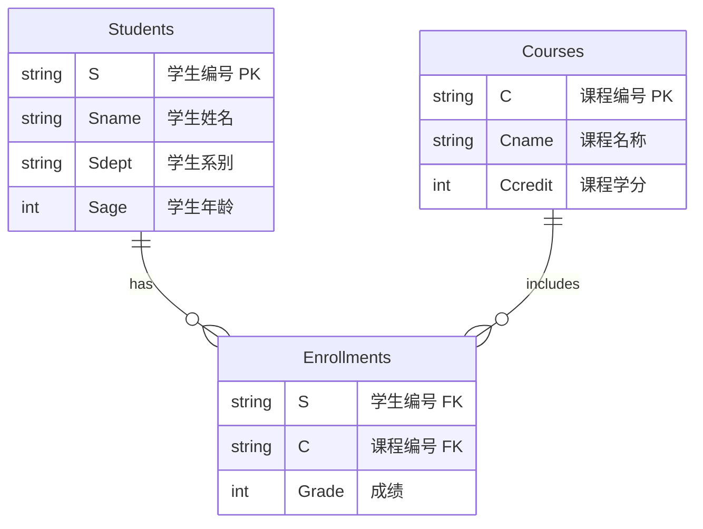
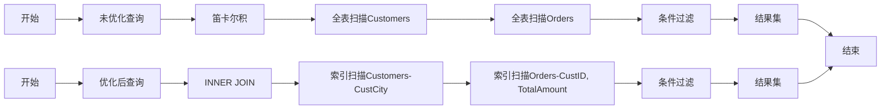
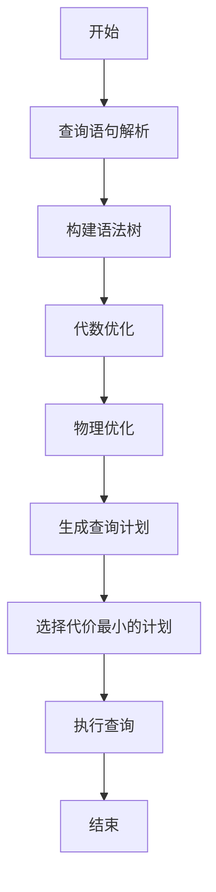

```table-of-contents
title: 
style: nestedList # TOC style (nestedList|nestedOrderedList|inlineFirstLevel)
minLevel: 0 # Include headings from the specified level
maxLevel: 0 # Include headings up to the specified level
includeLinks: true # Make headings clickable
debugInConsole: false # Print debug info in Obsidian console
```
## 关系数据模型
关系模型（Relational Model）是一种数据模型，它基于关系数据库理论，用于组织和管理结构化数据。这种模型将数据表示为一系列表（或称为关系），每个表由行（或称为元组）和列（或称为属性）组成。
关系模型是由E.F. Codd在1970年提出的，它基于集合论和逻辑学，为关系数据库管理系统（RDBMS）提供了理论基础。关系模型的主要优点包括数据结构简单、易于理解，以及强大的查询能力。它也是现代数据库系统中最广泛使用的数据模型之一。
**早期代表系统**
	- SystemR：由IBM研制
	- INGRES：由加州Berkeley分校研制
**目前主流的商业数据库系统**
1. **Oracle Database**
    
    - 由甲骨文公司开发的关系型数据库管理系统，以高性能、高可靠性和强大的功能而著称，广泛应用于企业级应用。
2. **Microsoft SQL Server**
    
    - 微软公司推出的关系型数据库管理系统，可扩展、高性能，为分布式客户机/服务器计算设计。
3. **IBM DB2**
    
    - IBM公司的数据库产品，主要应用于大型应用系统，具有良好的可伸缩性。
4. **Sybase**
    
    - 由Sybase公司推出的一种关系数据库系统，支持共享资源且在多台设备间平衡负载。
5. **MySQL**
    
    - 最受欢迎的开源SQL数据库管理系统，由MySQL AB开发、发布和支持，适用于关键任务、重负载生产系统。
6. **PostgreSQL**
    
    - 一个开源的对象关系型数据库管理系统（ORDBMS），支持大部分SQL标准并提供许多现代特性。
7. **阿里云PolarDB**
    
    - 阿里云旗下的自研云原生数据库，以突出表现在中国数据库流行度排行榜中夺冠，实现了“三层解耦”架构、多主多写、HTAP、Serverless等前沿技术。
8. **华为云GaussDB**
    
    - 华为云数据库，基于金融行业数据基础设施的建设痛点与挑战，发布了一系列AI创新解决方案。
9. **OceanBase**
    
    - 由蚂蚁集团独立研发的原生分布式关系数据库，以其在市场运营与技术创新两方面的出色表现，荣登中国数据库榜单榜首。
10. **GoldenDB**
    
    - 中兴通讯旗下的专业子公司金篆信科提供的数据库解决方案，在国家的重要行业和关键领域提供数据库服务。

关系理论是建立了在集合代数理论基础上的，有着坚实的数学基础关系模型的核心概念包括：

### 1. 关系（Relation）

关系是关系模型中的核心概念，它是一个无序的元组集合，每个元组包含一组属性值。关系通常用一个二维表来表示，其中：
- **行（Row）**：表中的每行代表一个元组，对应现实世界中的一个实体。
- **列（Column）**：表中的每列代表一个属性，对应实体的一个特征或数据字段。

### 2. 元组（Tuple）

元组是关系中的一个记录，它是关系表中的一行，包含一组属性值。元组的每个属性值都是有序的，对应于表中的一列。

### 3. 属性（Attribute）

属性是关系中的一个字段，它定义了关系表中的一列。属性具有以下特征：
- **名称（Name）**：属性的唯一标识符。
- **域（Domain）**：属性可能取值的集合。
- **数据类型（Data Type）**：属性值的类型，如整数、字符串等。

### 4. 域（Domain）

域是属性可能取值的范围。域可以是简单的数据类型，如整数（INT）、字符串（VARCHAR）等，也可以是更复杂的数据类型，如数组或结构体。

### 5. 主键（Primary Key）

主键是关系中用于唯一标识每个元组的属性或属性组合。主键的特征包括：
- **唯一性（Uniqueness）**：主键的值在关系中必须是唯一的。
- **非空性（Non-nullity）**：主键的值不能为NULL。

### 6. 外键（Foreign Key）

外键是关系中用于与另一个关系的主键建立联系的属性或属性组合。外键的作用是：
- **参照完整性（Referential Integrity）**：确保外键的值要么与另一个关系中的主键值相匹配，要么是NULL。

### 7. 关系操作（Relational Operations）

关系操作是用于操作和查询关系数据库的一组逻辑运算符，包括：
- **选择（Selection）**：从关系中选择满足特定条件的元组。
- **投影（Projection）**：从关系中选择特定的属性列。
- **连接（Join）**：根据公共属性将两个关系组合起来。

### 8. 关系代数（Relational Algebra）

关系代数是一种形式化的语言，用于表达关系数据库的查询和操作。它包括：
- **基本操作符**：如并、交、差、笛卡尔积等。
- **扩展操作符**：如除法、外连接等。

### 9. 关系演算（Relational Calculus）

关系演算是另一种表达关系数据库查询的语言，它分为：
- **元组关系演算（Tuple Relational Calculus）**：使用变量来表示元组。
- **域关系演算（Domain Relational Calculus）**：使用变量来表示属性值。

### 10. 完整性约束（Integrity Constraints）

完整性约束是数据库中用于确保数据准确性和一致性的规则，包括：
- **实体完整性（Entity Integrity）**：主键的非空性和唯一性。
- **参照完整性（Referential Integrity）**：外键与主键之间的关系。
- **用户定义的完整性（User-defined Integrity）**：根据业务规则定义的约束。

### 11. 规范化（Normalization）

规范化是数据库设计中的一个过程，旨在消除数据冗余和依赖，提高数据一致性。规范化的级别包括：
- **第一范式（1NF）**：每个属性都是不可分割的基本数据项。
- **第二范式（2NF）**：满足1NF，并且非主属性完全依赖于主键。
- **第三范式（3NF）**：满足2NF，并且非主属性不依赖于其他非主属性。

### 12. 事务（Transaction）

事务是数据库中的一个操作序列，它具有以下ACID特性：
- **原子性（Atomicity）**：事务中的所有操作要么全部完成，要么全部不完成。
- **一致性（Consistency）**：事务必须使数据库从一个一致的状态转换到另一个一致的状态。
- **隔离性（Isolation）**：事务的执行不会被其他事务干扰。
- **持久性（Durability）**：一旦事务完成，其结果就是永久性的。

### 13. 视图（View）

视图是基于数据库中一个或多个表的查询结果集，它具有以下特点：
- **虚拟表（Virtual Table）**：视图不存储数据，而是根据定义的查询动态生成结果。
- **简化操作（Simplification）**：视图可以简化复杂的查询，提供数据的逻辑表示。
- **数据安全（Data Security）**：视图可以限制对特定数据的访问，增强数据安全性。

### 14. 笛卡尔积（Cartesian Product）

笛卡尔积是数学中的一个概念，指的是在两个集合中，第一个集合的每一个元素与第二个集合的每一个元素配对，形成所有可能的有序对的集合。如果有两个集合A和B，它们的笛卡尔积表示为A×B，定义如下：

$$ A \times B = \{(a, b) | a \in A, b \in B\} $$

其中，\( a \) 是集合A中的元素，\( b \) 是集合B中的元素，而\( (a, b) \) 是一个有序对，表示A中的元素a与B中的元素b的配对。

#### 特点

- **有序性**：笛卡尔积中的元素是有序对，即顺序重要，\( (a, b) \) 和 \( (b, a) \) 被认为是不同的元素，除非 \( a = b \)。
- **无重复**：笛卡尔积中的元素是唯一的，即使集合A和B中有重复的元素，它们的笛卡尔积中每个有序对也是唯一的。
- **大小**：如果集合A有\( m \)个元素，集合B有\( n \)个元素，那么它们的笛卡尔积A×B将有\( m \times n \)个元素。

#### 应用

在不同的领域，笛卡尔积有着广泛的应用：

- **数据库**：在关系数据库中，两个表的笛卡尔积表示为两个表中每一行与另一个表中每一行的所有可能组合。
- **几何学**：在几何学中，笛卡尔积可以用来描述两个集合的组合，例如，平面上的点集可以看作是实数集合的笛卡尔积。
- **组合数学**：在组合数学中，笛卡尔积用于计算多个集合中元素的组合方式。
- **编程**：在编程中，特别是在处理数组或集合的嵌套循环时，经常涉及到笛卡尔积的概念。

#### 示例

假设有两个集合A和B：

 $$A = \{1, 2\} $$
$$B = \{'a', 'b'\} $$

它们的笛卡尔积A×B为：

 $$A \times B = \{(1, 'a'), (1, 'b'), (2, 'a'), (2, 'b')\} $$

这个例子中，集合A中的每个元素都与集合B中的每个元素配对，形成了四个有序对。

## 关系模式
关系模式（Relational Schema）是关系数据库中对关系的一个描述，它定义了关系的结构，包括关系的名字和组成关系的各个属性（即列）。关系模式不包含具体的数据（即不包含元组或行），而是描述了数据的组织形式。关系模式通常用以下形式表示：

关系名(属性名1,属性名2,…,属性名n)关系名(属性名1​,属性名2​,…,属性名n​)

其中，每个属性名代表关系中的一列，而属性名后的下标表示该属性在关系中的位置。关系模式定义了每个属性的数据类型和可能的约束条件，例如是否为主键、是否可以为NULL等。

### 关键组成部分

1. **关系名（Relation Name）**：
    
    - 这是关系模式的名称，用于在数据库中唯一标识这个关系。
2. **属性（Attributes）**：
    
    - 属性是关系模式中的列，每个属性都有确定的名称和数据类型。
3. **数据类型（Data Types）**：
    
    - 每个属性都有指定的数据类型，如整数（INT）、字符串（VARCHAR）、日期（DATE）等。
4. **主键（Primary Key）**：
    
    - 主键是用于唯一标识关系中每个元组的属性或属性组合。
5. **外键（Foreign Key）**：
    
    - 外键是关系模式中的一个或多个属性，它们在另一个关系模式中作为主键出现，用于建立两个关系之间的参照关系。
6. **约束（Constraints）**：
    
    - 约束是一组规则，用于限制可以存储在关系中的数据，确保数据的完整性和准确性。常见的约束包括非空（NOT NULL）、唯一性（UNIQUE）、检查（CHECK）等。

**示例**

假设我们有一个关系模式，用于存储图书馆中书籍的信息：

Books(BookID,Title,Author,ISBN,Price)Books(BookID,Title,Author,ISBN,Price)

在这个关系模式中：

- **Books** 是关系名。
- **BookID**、**Title**、**Author**、**ISBN** 和 **Price** 是属性名。
- 每个属性都有对应的数据类型，例如 **BookID** 可能是整数类型，**Title** 和 **Author** 可能是字符串类型，**ISBN** 可能是固定长度的字符串，**Price** 可能是浮点数类型。
- **BookID** 可能被定义为主键，以确保每本书都有一个唯一的标识符。

关系模式是数据库设计的基础，它为数据库中存储的数据提供了一个清晰的框架。

## 关系的完整性
## 关系数据库语言概述
关系数据库语言是用于与关系数据库进行交互的编程语言，它允许用户查询、更新、定义和操作数据库中的数据。关系数据库语言通常遵循关系模型，其中数据以表格（或关系）的形式存储，表之间的关系定义了数据如何相互关联。

### 关系运算体系

关系运算体系是关系数据库管理系统（DBMS）中用于定义数据如何存储、索引和查询优化查询的一套规则和数据结构。它包括数据的逻辑组织、存储方式、索引机制以及查询优化技术。关系运算体系的主要目标是确保数据的完整性、安全性和高效的数据访问。

### 关系数据库语言

关系数据库语言（RDL）是一种查询语言，它使用类似自然语言的语句来查询和操作数据。RDL允许用户执行以下操作：

1. **数据查询**：使用SELECT语句来检索数据。
   - 例如：`SELECT * FROM table_name;`

2. **数据修改**：使用INSERT、UPDATE和DELETE语句来修改数据。
   - 例如：`INSERT INTO table_name VALUES (value1, value2);`

3. **数据定义**：使用CREATE和ALTER语句来定义和修改数据库结构。
   - 例如：`CREATE TABLE table_name (column1, column2);`

4. **数据控制**：使用GRANT和REVOKE来控制用户对数据库对象的访问权限。
   - 例如：`GRANT SELECT ON table_name TO user_name;`

5. **事务控制**：使用BEGIN TRANSACTION、COMMIT和ROLLBACK等语句来管理事务。
   - 例如：`BEGIN TRANSACTION; UPDATE table_name SET column_name = value; COMMIT;`

关系数据库语言通常简单易学，但功能强大，能够支持复杂的查询和数据操作。它使得用户能够高效地与数据库进行交互，而无需深入了解底层数据存储和处理机制。
关系数据库语言的特点主要体现在其一体化、非过程化和面向集合的存取方式上，以下是这些特点的详细阐述：

#### 一体化（Integrated）

1. **数据和操作的一体化**：
   - 关系数据库语言将数据定义、数据操作和数据控制集成在一个语言中，允许用户在同一个语言中定义数据结构、查询和修改数据。
   - 这种一体化减少了应用程序与数据库交互的复杂性，使得开发和维护更加高效。

2. **数据和应用程序的一体化**：
   - 关系数据库语言提供了与应用程序的接口，使得应用程序可以无缝地与数据库交互。
   - 应用程序可以直接使用关系数据库语言来访问和操作数据，而无需编写复杂的数据存取代码。

#### 非过程化（Non-procedural）

1. **声明性语言**：
   - 关系数据库语言是非过程化的，它使用声明性语句来描述数据和查询，而不是通过过程性代码来指定操作步骤。
   - 这使得用户可以专注于“什么”（What）而不是“如何”（How），简化了编程任务。

2. **独立于实现**：
   - 关系数据库语言独立于特定的数据存取和存储实现，使得数据库设计和应用程序开发更加灵活。
   - 数据库设计者可以定义数据结构，而应用程序开发者可以使用这些结构来开发应用程序。

#### 面向集合的存取方式（Set-based）

1. **集合操作**：
   - 关系数据库语言支持集合操作，如并集（UNION）、差集（EXCEPT）、交集（INTERSECT）等，这些操作可以对多个数据集进行操作。
   - 集合操作使得用户可以同时处理多个数据集，提高了数据处理的效率。

2. **查询优化**：
   - 关系数据库管理系统（DBMS）通常针对集合操作进行了优化，使得查询和数据操作更加高效。
   - 面向集合的操作可以利用索引和查询优化技术，提高数据检索的速度。

3. **数据完整性**：
   - 集合操作有助于保持数据的完整性，因为它们可以确保数据操作的结果仍然是一个有效的数据集。
   - 在执行集合操作时，DBMS会检查操作前后数据的完整性，确保数据的准确性和一致性。

关系数据库语言的这些特点使其成为处理复杂数据集和构建数据应用程序的强大工具。一体化、非过程化和面向集合的存取方式，关系数据库语言简化了数据管理，使得用户可以专注于数据本身而不是数据存取的复杂性。这些特点也使得关系数据库语言在各种应用场景中得到广泛应用。

### 抽象的查询语言
关系数据库查询语言中的关系代数和关系演算元组是两种重要的概念，它们在抽象查询语言中用于描述数据的查询和操作。以下是这两种概念的详细阐述：

#### 关系代数（Relational Algebra）
关系代数是一种抽象的查询语言，用于描述对关系（即表）的运算。关系代数中的操作符包括并（∪）、交（∩）、差（−）和笛卡尔积（×）。关系代数允许用户通过组合这些操作符来表达复杂的查询需求。

- **并操作**：将两个关系合并，结果关系包含两个关系中的所有元组。
- **交操作**：找出两个关系中共有的元组。
- **差操作**：找出在一个关系中但不在另一个关系中的元组。
- **笛卡尔积**：两个关系的笛卡尔积，结果关系包含所有可能的元组对。

#### 关系演算元组关系演算（Tuple Relational Algebra）
元组关系演算以元组变量作为谓词变量的基本对象，通过谓词公式来描述查询条件。元组关系演算的谓词公式可以表示为：t|ψ(t)，其中t为元组变量，ψ为元组演算的谓词公式，即查询的条件。

- **原子公式**：可以是元组演算公式的三种基本形式之一，如t ∈ R（t是关系R中的一个元组）。
- **比较运算符**：用于元组变量之间的比较，如t[A] θ s[B]（s[A]与s[B]进行比较）。
- **元组变量**：作为谓词变量，其变化范围为某一个命名的关系。

#### 域关系演算（Domain Relational Algebra）
域关系演算使用属性域中的值的域变量来代替元组关系演算中的元组变量。域关系演算表达式的基本形式为：{x1, x2, …, xn} | P(x1, x2, …, xn)，其中xi代表域变量或常量，P为以xi为变量的公式。

- **原子公式**：可以是域关系演算公式的三种基本形式之一，如xi ∈ R。
- **比较运算符**：用于域变量之间的比较，如x1 θ c（xi与常量c之间满足比较关系θ）。
- **域变量**：作为谓词变量，其变化范围为某个域。

#### 应用场景
关系代数和关系演算元组演算在数据库查询语言中应用广泛，它们允许用户以声明性的方式描述数据和查询，而不是通过过程性代码来指定操作步骤。这使得用户可以专注于“什么”（What）而不是“如何”（How），简化了编程任务

关系代数和关系演算元组算提供了一种强大的工具，用于在关系数据库中描述和执行复杂的查询。关系代数关注于关系之间的运算，而关系演算元组算关注于元组之间的运算。域关系算则是关系演算元组算的扩展，它使用域变量来代替元组变量，使得查询可以更加具体到域的值。这些概念是数据库查询语言的基础，它们使得数据库查询更加灵活和强大。

### 具体系统中的实际语言

关系数据库语言的设计使得用户能够以声明性的方式描述数据和查询，而不是过程性的方式。这使得数据库应用程序的开发更加高效和灵活。关系数据库语言的声明性特点允许数据库管理员和开发者专注于数据模型的设计和优化，而不是数据存取的具体实现细节。

关系数据库语言的查询优化器负责将用户编写的声明性查询语句转换成高效的执行计划，以利用关系运算体系中定义的数据结构和索引来提高查询性能。

关系数据库语言广泛应用于商业、科学和工程领域，支持从简单的数据检索到复杂的数据分析和报告生成。随着数据库技术的发展，现代的关系数据库语言如SQL已经支持许多高级特性，如子查询、事务处理和多用户并发控制等。
#### 1.  SQL（Structured Query Language）：
•  SQL是一种用于管理和操作关系型数据库的标准编程语言。它被广泛用于访问和处理数据库中的数据，包括数据插入、查询、更新和删除等操作。SQL语言采用英语关键词，使其易读易写，并由国际标准化组织（ISO）和美国国家标准协会（ANSI）标准化。
•  SQL可以分为几个部分：数据定义语言（DDL），数据操纵语言（DML），数据控制语言（DCL）和数据查询语言（DQL）。DDL用于定义数据库结构，如创建和删除表；DML用于插入、更新和删除数据；DCL用于控制数据访问权限；DQL用于查询数据。
#### 2.  Quel：
•  Quel是Ingres数据库系统使用的查询语言，它是一种过程式查询语言。Quel主要用于Ingres数据库系统中，用于数据查询和操作。由于它是特定于Ingres的，所以不如SQL那样广泛使用。
#### 3.  QBE（Query By Example）：
•  QBE是一种用户友好的查询语言，它允许用户通过提供一个示例（或模板）来构建查询。用户通过填写或标记表格中的示例数据来指定他们想要查询的条件，系统根据这些示例自动生成相应的查询语句。QBE使得非技术用户也能轻松地执行数据库查询。
这些语言都是数据库查询和操作的工具，但SQL因其标准化和广泛的支持而成为最主流的选择。Quel和QBE则在特定的环境和应用中发挥作用。希望这些信息对您有所帮助。

## 关系代数
### 基本运算

#### 一元运算
1.  选择（Selection, σ）：
•  功能：从关系中选择满足特定条件的元组。
•  表达式：σ<sub>P</sub>(R)，其中P是一个谓词（条件），R是关系。
•  例如：σ<sub>Age > 30</sub>(Employees) 会选择所有年龄大于30的员工。
```sql
SELECT * FROM Orders WHERE OrderDate > '2023-01-01';
```

2.  投影（Projection, π）：
•  功能：从关系中选择特定的列（属性）。
•  表达式：π<sub>A1, A2, …, An</sub>(R)，其中A1, A2, …, An是要选择的属性，R是关系。
•  例如：π<sub>Name, Age</sub>(Employees) 会选择所有员工的姓名和年龄。
```sql
SELECT ProductName, Price FROM Products;
```
3.  更名（Renaming, ρ）：
•  功能：更改关系中的属性名。
•  表达式：ρ<sub>A1/B1, A2/B2, …, An/Bn</sub>(R)，其中A1, A2, …, An是原属性名，B1, B2, …, Bn是新属性名，R是关系。
•  例如：ρ<sub>EmpName/Name</sub>(Employees) 会将Employees关系中的EmpName属性更名为Name。
```sql
SELECT StudentID, FullName AS Name FROM Students;
```
#### 多元运算
1.  并（Union, ∪）：
•  功能：将两个关系中的元组合并，去除重复的元组。
•  表达式：R ∪ S，其中R和S是两个关系，它们必须具有相同的属性集。
•  例如：Employees ∪ Managers 会合并员工和经理的关系。
```sql
SELECT CustomerID, CustomerName FROM Customers
UNION
SELECT CustomerID, CustomerName FROM VIPCustomers;
```
2.  差（Difference, -）：
•  功能：返回存在于第一个关系中但不在第二个关系中的元组。
•  表达式：R - S，其中R和S是两个关系，它们必须具有相同的属性集。
•  例如：Employees - Managers 会选择所有不是经理的员工。
```sql
SELECT CustomerID, CustomerName FROM Customers
EXCEPT
SELECT CustomerID, CustomerName FROM VIPCustomers;
```
3.  笛卡尔积（Cartesian Product, ×）：
•  功能：返回两个关系中所有可能的元组对。
•  表达式：R × S，其中R和S是两个关系。
•  例如：Employees × Departments 会生成一个包含所有员工和部门组合的关系。
```sql
SELECT * FROM Employees, Departments;
```
4.  连接（Join）：
•  功能：基于两个关系之间的公共属性值将它们组合起来。
•  表达式：R ⨝<sub>θ</sub> S，其中R和S是两个关系，θ是一个条件表达式。
•  例如：Employees ⨝<sub>Name = ManagerName</sub> Departments 会选择所有员工及其直接上级所在的部门。
```sql
SELECT Employees.EmployeeID, Employees.Name, Departments.DepartmentName
FROM Employees
JOIN Departments ON Employees.DepartmentID = Departments.DepartmentID;
```
5.  自然连接（Natural Join）：
•  功能：自动找出两个关系中共有的属性，并基于这些属性进行连接。
•  表达式：R ⨝ S，其中R和S是两个关系，它们必须具有相同的属性名。
•  例如：Employees ⨝ Departments 会选择所有员工及其所在部门的信息。
```sql
SELECT Employees.*, Departments.*
FROM Employees
NATURAL JOIN Departments;
```
6.  除法（Division）：
•  功能：返回所有在第一个关系中但不在第二个关系与第一个关系笛卡尔积中匹配的元组。
•  表达式：R ÷ S，其中R和S是两个关系。
•  例如：Employees ÷ Departments 会选择所有至少在一个部门工作的员工。
```sql
SELECT Employees.*
FROM Employees
DIVIDE (SELECT OrderDetails.EmployeeID
        FROM OrderDetails);
```
7.  θ连接（Theta Join）：
•  功能：基于两个关系之间的属性值满足某个θ条件（如大于、小于等）进行连接。
•  表达式：R ⨝<sub>θ</sub> S，其中θ可以是任何比较运算符，如<、>、=等。
•  例如：Employees ⨝<sub>Age > 30</sub> Managers 会选择所有年龄大于其直接上级的员工。
这些运算符提供了一种强大的方法来表达和执行数据库查询，它们是关系数据库管理系统中查询优化和执行的基础。
```sql
SELECT Employees.*
FROM Employees
JOIN Managers ON Employees.ManagerID = Managers.ManagerID
WHERE Employees.Age > Managers.Age;
```

#### 扩展运算
##### 1. 消除重复（Distinct）
•  功能：从关系中去除重复的元组，只保留唯一的元组。
•  表达式：π<sub>A1, A2, …, An</sub>(σ<sub>A1=A1 ∧ A2=A2 ∧ … ∧ An=An</sub>(R))
•  实例：假设有一个关系R，包含员工的姓名和部门，要去除重复的姓名和部门组合。
•  表达式：π<sub>EmpName, Department</sub>(σ<sub>EmpName=EmpName ∧ Department=Department</sub>(R))
•  结果：返回一个新关系，其中每个员工的姓名和部门组合都是唯一的。
##### 2. 聚集和分组运算（Aggregation and Grouping）
•  功能：对一组元组的特定属性进行计算，如求和、平均、最大值、最小值等，通常与分组一起使用。
•  表达式：γ<sub>G.Attr1, agg(Attr2)</sub>(R)
•  其中G是分组属性，Attr1是分组后的属性名，Attr2是被聚集的属性，agg是聚集函数（如SUM, AVG, MAX, MIN等）。
•  实例：计算每个部门的员工平均工资。
•  表达式：γ<sub>Department.AvgSalary</sub>(π<sub>Department, SUM(Salary), COUNT(*)</sub>(σ<sub>GroupBy: Department</sub>(Employees)))
•  结果：返回一个新关系，包含每个部门及其平均工资。
##### 3. 排序运算（Sorting）
•  功能：根据一个或多个属性对关系中的元组进行排序。
•  表达式：Sort<sub>A1, A2, …, An</sub>(R)
•  其中A1, A2, …, An是排序的属性，可以指定升序或降序。
•  实例：按员工年龄降序排序所有员工。
•  表达式：Sort<sub>Age DESC</sub>(Employees)
•  结果：返回一个新关系，其中员工按年龄从大到小排序。
##### 4. 广义投影（Generalized Projection）
•  功能：允许在投影时对属性进行计算和选择，不仅限于选择现有属性。
•  表达式：π<sub>A1, A2, …, An</sub>(R)
•  其中A1, A2, …, An可以是原始属性，也可以是通过对原始属性进行计算得到的新属性。
•  实例：选择员工的姓名和年龄的平方。
•  表达式：π<sub>EmpName, Age^2</sub>(Employees)
•  结果：返回一个新关系，包含每个员工的姓名和年龄的平方。
#### 修改操作
##### 1. 插入（Insert）
•  功能：向关系中添加新的元组。
•  表达式：Insert(R, T)
•  其中R是目标关系，T是包含要插入元组的关系。
•  实例：向员工关系中插入一个新的员工元组。
•  表达式：Insert(Employees, {(EmpID=1001, EmpName=‘John Doe’, Age=30, DepartmentID=5)})
•  结果：在Employees关系中添加了一个新员工John Doe。
##### 2. 删除（Delete）
•  功能：从关系中移除满足特定条件的元组。
•  表达式：Delete(R, σ<sub>P</sub>(R))
•  其中R是目标关系，P是删除条件。
•  实例：删除所有年龄大于60岁的员工。
•  表达式：Delete(Employees, σ<sub>Age > 60</sub>(Employees))
•  结果：从Employees关系中删除了所有年龄大于60岁的员工。
##### 3. 更新（Update）
•  功能：修改关系中满足特定条件的元组的属性值。
•  表达式：Update(R, σ<sub>P</sub>(R), {A = V})
•  其中R是目标关系，P是更新条件，A是属性名，V是新的属性值。
•  实例：将所有IT部门的员工工资增加10%。
•  表达式：Update(Employees, σ<sub>DepartmentID = ‘IT’</sub>(Employees), {Salary = Salary * 1.1})
•  结果：所有在IT部门的员工的工资增加了10%。
这些扩展运算和修改操作在实际的数据库管理系统中通常通过SQL语言实现，它们提供了对数据库数据进行复杂操作的能力。


#### 关系代数综合查询实例

好的，让我们通过一个具体的例子来展示关系代数的综合查询。假设我们有一个大学数据库，包含以下两个关系表：
1.  Students(S)：学生表
•  属性：S#（学生编号），Sname（学生姓名），Sdept（学生系别），Sage（学生年龄）
2.  Courses(C)：课程表
•  属性：C#（课程编号），Cname（课程名称），Ccredit（课程学分）
3.  Enrollments(E)：选课表
•  属性：S#（学生编号），C#（课程编号），Grade（成绩）
查询实例
查询要求：找出所有选修了“数据库系统”课程并且成绩在80分以上的学生姓名和成绩。
##### 关系代数表达式
1.  选择“数据库系统”课程：
 \sigma_{Cname='数据库系统'}(C) 
2.  选择成绩在80分以上的学生：
 \sigma_{Grade > 80}(E) 
3.  连接课程表和选课表：
 \sigma_{Cname='数据库系统'}(C) \bowtie E 
4.  连接学生表和选课表：
 \sigma_{Grade > 80}(E) \bowtie S 
5.  合并以上两个连接结果：
 (\sigma_{Cname='数据库系统'}(C) \bowtie E) \bowtie S 
6.  投影学生姓名和成绩：
 \pi_{Sname, Grade}((\sigma_{Cname='数据库系统'}(C) \bowtie E) \bowtie S) 
图表表示
以下是这个查询的ER图和关系代数操作的流程图：
ER图

流程图


#### 关系代数要点分析
1.  选择、投影、连接查询:
•  对于只涉及到选择（σ）、投影（Π）和连接（×）的查询，可以使用以下表达式表示：
 \Pi(\sigma(R \times S)) \text{ 或者 } \Pi(\sigma(R, S)) 
•  这里， R  和  S  代表两个关系（表）， \sigma  表示选择操作， \Pi  表示投影操作， \times  表示连接操作。
2.  否定操作:
•  对于否定的操作，一般要用差集操作表示。例如，查询没有参加某个特定项目（如200901项目）的职工，可以用差集来表示。
3.  检索具有“全部”特征的操作:
•  对于检索具有“全部”特征的操作，一般要用除法操作表示。例如，查询参加了全部项目的职工。
4.  检索不学某课程的学生姓名:
•  检索不学C2课的学生姓名，不能使用以下表达式：
 \Pi_{SNAME, AGE}(\sigma_{C\# \neq 'C2'}(S)) 
•  应该使用差集的形式：
 \Pi_{SNAME, AGE}(S) - \Pi_{SNAME, AGE}(\sigma_{C\# = 'C2'}(S \bowtie SC)) 
•  这里， S  代表学生表， SC  代表学生课程关系表， \bowtie  表示自然连接。
5.  检索学习全部课程的学生学号:
•  检索学习全部课程的学生学号，应该使用除法操作表示：
 \pi_{S\#}(SC) \div \prod_{C\#}(C) 
•  这里， S\#  代表学生编号， C\#  代表课程编号， \prod  表示投影操作， \div  表示除法操作。
•  不能写成：
 \pi_{S\#}(SC) \div \Pi_{C\#}(C) 
•  这是因为一个学生学的课程的成绩可能是不一样的，除法操作在这里用于检查学生是否选修了所有课程
#### 包（Bag）
在关系代数中，包（Bag）是一种数据类型，它允许集合中的元素重复。与集合（Set）不同，集合中的元素是唯一的，而包中的元素可以出现多次。包通常用于表示多值属性或多重集合。
实例：使用包进行查询
假设我们有一个关系 Orders，其中包含属性 OrderID（订单编号）和 ProductID（产品编号）。我们想要找出每个订单中订购了多种产品的情况。
1.  查询要求：找出所有订购了多种产品的订单编号。
2.  关系代数表达式：
 \pi_{OrderID}(\sigma_{count(ProductID) > 1}(Orders)) 
这里，count(ProductID) 是一个扩展运算，用于计算每个订单中不同产品的数量。如果这个数量大于1，说明该订单订购了多种产品。
#### 扩展运算（Extended Operations）
扩展运算是关系代数中用于执行更复杂数据处理的操作，它们包括聚合函数、字符串函数、算术函数等。
##### 1. 聚合函数（Aggregate Functions）
聚合函数用于对一组值进行计算，如求和、平均、最大、最小等。
•  求和（Sum）：
 \sigma_{sum(Salary) > 50000}(Employees) 
这个表达式用于找出所有员工的薪水总和超过50000的记录。
•  平均（Avg）：
 \pi_{Avg(Salary)}(Employees) 
这个表达式用于计算所有员工的平均薪水。
•  最大（Max） 和 最小（Min）：
 \pi_{Max(Salary), Min(Salary)}(Employees) 
这个表达式用于找出员工薪水的最大值和最小值。
##### 2. 字符串函数（String Functions）
字符串函数用于对字符串类型的数据进行操作，如长度、子串、位置等。
•  长度（Length）：
 \sigma_{length(Sname) > 10}(Students) 
这个表达式用于找出所有学生姓名长度超过10个字符的记录。
•  子串（Substring）：
 \pi_{substring(Sname, 1, 5)}(Students) 
这个表达式用于提取所有学生姓名的前5个字符。
##### 3. 算术函数（Arithmetic Functions）
算术函数用于执行基本的数学运算，如加、减、乘、除等。
•  加法（+）：
 \pi_{Salary + 1000}(Employees) 
这个表达式用于给所有员工的薪水增加1000。
•  除法（/）：
 \pi_{Salary / 12}(Employees) 
这个表达式用于计算所有员工的月薪（假设薪水是按年支付的）。
综合实例
假设我们有一个关系 Sales，其中包含属性 SaleID（销售编号），ProductID（产品编号），Quantity（数量），Price（单价）。
查询要求：找出每种产品的平均售价。
关系代数表达式：
 \gamma_{ProductID}(\pi_{ProductID, avg(Price)}(Sales)) 
这里，avg(Price) 是一个扩展运算，用于计算每种产品的平均售价，γ 是分组操作符，用于按 ProductID 分组。
这些扩展运算和包的概念使得关系代数能够处理更复杂的查询，提供了更灵活的数据操作能力。


### 查询优化

什么是查询优化？
查询优化是数据库管理系统（DBMS）中的一个过程，它涉及改进查询的执行计划，以减少查询执行所需的时间和资源。这通常包括选择最有效的算法、减少数据访问量、利用索引、减少磁盘I/O操作等策略。
谁来做查询优化？
查询优化通常由数据库管理系统（DBMS）中的查询优化器来完成。查询优化器是一个组件，它接收SQL查询，并生成一个或多个可能的执行计划，然后选择一个成本最低的计划来执行。数据库管理员（DBA）和开发者也可以通过编写高效的SQL语句和调整数据库结构来辅助查询优化。
为什么要优化？
查询优化的目的是为了提高查询性能，减少响应时间，提高数据库的吞吐量，降低资源消耗（如CPU和内存），以及提高用户体验。在大型数据库中，查询优化尤其重要，因为不优化的查询可能会导致查询执行缓慢，甚至影响数据库的稳定性和可靠性。
实例
假设我们有一个电子商务数据库，其中包含以下两个表：
1.  Customers(C)：客户表
•  属性：CustID（客户ID），CustName（客户姓名），CustCity（客户城市）
2.  Orders(O)：订单表
•  属性：OrderID（订单ID），CustID（客户ID），OrderDate（订单日期），TotalAmount（订单总额）
查询要求：找出所有来自“北京”的客户及其订单总额超过1000元的订单。
未优化的查询：
SELECT C.CustName, O.TotalAmount
FROM Customers C, Orders O
WHERE C.CustCity = '北京' AND C.CustID = O.CustID AND O.TotalAmount > 1000;

优化后的查询：
SELECT C.CustName, O.TotalAmount
FROM Customers C
JOIN Orders O ON C.CustID = O.CustID
WHERE C.CustCity = '北京' AND O.TotalAmount > 1000;

在这个例子中，优化后的查询使用了INNER JOIN来代替笛卡尔积，这样可以减少不必要的比较，并且明确了表之间的关系。此外，WHERE子句中的条件被保留，以确保只选择符合条件的记录。
图表
以下是查询优化前后的流程图：



#### DBMS查询优化的步骤
##### Step 1: 把查询转换成一种计算机内部标识结构（语法树）
在这个阶段，查询语句被解析器解析，转换成内部表示形式，通常是语法树（Syntax Tree）。这个步骤确保了查询语句的语法正确性，并为后续的优化提供了基础结构。
##### Step 2: 代数优化
优化策略：
1.  一元选择优先做：一元选择条件（如单一列的过滤）可以尽早应用，以减少后续操作的数据量。
2.  投影，选择同时做：如果可能，投影（选择特定列）和选择（过滤行）可以同时进行，以减少数据的处理量。
3.  乘积选择合并做：连接（乘积）操作和选择操作可以合并，以减少不必要的数据组合。
4.  索引排序预先做：如果查询涉及到排序，并且可以使用索引来完成排序，那么应该优先使用索引排序，以减少全表扫描。
关系代数的等价变换规则：
•  使用等价规则：如结合律、交换律、分配律等，对关系代数表达式进行变换，以找到更优的执行计划。
###### Step 3: 物理优化
在物理优化阶段，查询优化器选择适当的底层存取路径，如决定使用全表扫描、索引扫描、还是其他访问方法。这个阶段会考虑数据的物理存储方式和可用的索引。
###### Step 4: 生成一组查询计划，从中选择一个代价最小的计划
查询优化器会生成多个可能的执行计划，并基于代价模型（如I/O代价、CPU代价等）选择代价最小的计划。这个步骤是查询优化的核心，目的是找到最有效的策略来执行查询。
图表说明
由于无法直接生成图表，以下是一个简化的流程图，描述了DBMS查询优化的步骤：



在这个流程图中，我们可以看到查询优化的四个主要步骤：解析查询语句并构建语法树、进行代数优化、物理优化、生成并选择代价最小的查询计划。这些步骤共同确保了查询可以以最有效的方式执行。


#### 改善用户查询计划
以下是针对改善用户查询计划的几种解决方法的详细说明和具体步骤，以及相关实例：
##### 1. 合理使用索引
索引是数据库中重要的数据结构，它的根本目的是为了提高查询效率。现在大多数的数据库产品都采用IBM最先提出的ISAM索引结构。索引的使用要恰到好处，其使用原则如下：
•  在经常进行连接，但是没有指定为外键的列上建立索引，而不经常连接的字段则由优化器自动生成索引。
•  在频繁进行排序或分组（即进行group by或order by操作）的列上建立索引。
•  在条件表达式中经常用到的不同值较多的列上建立索引，在不同值少的列上不要建立索引。比如在雇员表的“性别”列上只有“男”与“女”两个不同值，因此就无必要建立索引。如果建立索引不但不会提高查询效率，反而会严重降低更新速度。
•  如果待排序的列有多个，可以在这些列上建立复合索引（compound index）。
•  当数据库表更新大量数据后，删除并重建索引可以提高查询速度。
索引是提高数据库查询效率的重要工具。合理使用索引可以显著加快查询速度，减少数据访问时间。索引应建立在经常作为查询条件的列上，以及频繁进行排序或分组的列上。
具体步骤：
1.  确定哪些列经常作为查询条件。
2.  在这些列上创建索引。
3.  定期检查和维护索引，以保持其性能。
实例：
假设有一个员工表Employees，经常根据员工的部门ID进行查询，可以为部门ID列创建索引：
CREATE INDEX idx_department_id ON Employees(department_id);

##### 2. 避免或简化排序
应当简化或避免对大型表进行重复的排序。当能够利用索引自动以适当的次序产生输出时，优化器就避免了排序的步骤。以下是一些影响因素：
•  索引中不包括一个或几个待排序的列；
•  group by或order by子句中列的次序与索引的次序不一样；
•  排序的列来自不同的表。
为了避免不必要的排序，就要正确地增建索引，合理地合并数据库表（尽管有时可能影响表的规范化，但相对于效率的提高是值得的）。如果排序不可避免，那么应当试图简化它，如缩小排序的列的范围等。
尽量减少或避免对大型表的重复排序操作。利用索引自动产生所需排序顺序，从而避免执行显式的排序操作。
具体步骤：
1.  分析查询，识别不必要的排序操作。
2.  通过创建合适的索引来利用数据库的排序功能。
3.  重写查询，减少或消除显式排序。
实例：
如果经常根据zipcode进行查询，可以在zipcode列上创建索引，以利用索引的排序特性：
CREATE INDEX idx_zipcode ON Customers(zipcode);

##### 3. 消除对大型表行数据的顺序存取
在做套查询中，对表的顺序存取对查询效率可能产生致命的影响。比如采用顺序存取策略，一个嵌套3层的查询，如果每层都查询1000行，那么这个查询就要查询10亿行数据。
避免这种查询的主要方法就是对连接的进行索引。
例如，两个表：学生表（学号、姓名、年龄……）和选课表（学号、课程号、成绩）。
如果两个表要做连接，就要在“学号”这个连接字段上建立索引。
还可以使用并集来避免顺序存取。
详细说明：
对于嵌套查询，使用索引或并集(UNION)来代替顺序存取，尽量避免在WHERE子句中使用OR运算符，因为它们通常导致全表扫描。
具体步骤：
1.  识别查询中可能导致顺序存取的部分。
2.  通过使用索引或重写查询逻辑来避免顺序存取。
3.  使用UNION代替OR，以减少全表扫描的可能性。
实例：
将以下查询：
```sql
SELECT * FROM employees WHERE department = 'Sales' OR department = 'IT';

```

改写为：
```sql
SELECT * FROM employees WHERE department = 'Sales'
UNION
SELECT * FROM employees WHERE department = 'IT';

```

##### 4. 避免相关子查询
一个列的标签同时在主查询和where子句中的查询中出现，那么很可能当主查询中的列值改变之后，子查询必须重新查询一次。查询嵌套层次越多，效率越低，因此应当尽量避免子查询。如果子查询不可避免，那么要在子查询中过滤掉尽可能多的行
详细说明：
相关子查询通常对性能有负面影响，特别是在主查询的列值变化时。替代相关子查询以提高效率。
具体步骤：
1.  识别查询中的相关子查询。
2.  将子查询转换为JOIN操作或其他形式，以减少性能损耗。
实例：
将以下相关子查询：
```sql
SELECT * FROM customers WHERE customer_id IN (SELECT customer_id FROM orders WHERE total > 1000);
```


改写为JOIN操作：
```sql
SELECT customers.* FROM customers JOIN orders ON customers.customer_id = orders.customer_id WHERE orders.total > 1000;
```


##### 5. 避免困难的正规表达式
LIKE关键字支持通配符匹配，技术上叫正规表达式。但这种匹配特别耗费时间。
例如：`SELECT * FROM customer WHERE zipcode LIKE ‘98_’`
即便在zipcode字段上建立了索引，在这种情况下也还是采用顺序扫描的方式。
如果把语句改为SELECT * FROM customer WHERE zipcode >‘98000’，在执行查询时就会利用索引来查询，显然会大大提高速度。
另外，还要避免非开始的子串。
避免使用复杂的模式匹配，特别是使用LIKE运算符，因为它们通常耗时更多。
具体步骤：
1.  识别查询中使用复杂正则表达式的部分。
2.  简化正则表达式或改用其他查询逻辑。
实例：
避免使用：

`SELECT * FROM customers WHERE name LIKE '%John%';`

改用：
`SELECT * FROM customers WHERE name = 'John';`

##### 6. 使用临时表加速查询
把表的一个子集进行排序并创建临时表，有时能加速查询。它有助于避免多重排序操作，而且在其他方面还能优化优化器的工作。
例如：
```sql
SELECT cust.name, rcvbles.balance, ……other columns
FROM cust, rcvbles
WHERE cust.customer_id = rcvbles.customer_id
AND rcvbles.balance>0
AND cust postcode=“98000”
ORDER BY cust.name
```

如果这个查询要被执行多次而不止一次，可以把所有未付款的客户找出来放在一个临时文件中，并按客户的名字进行排序：
```sql
SELECT cust.name, rcvbles.balance, ……other columns
INTO temp_cust_with_balance
FROM cust, rcvbles
WHERE cust.customer_id = rcvbles.customer_id
AND rcvbles.balance>0
```

然后以下面的方式在临时表中查询：
```sql
SELECT * FROM cust_with_balance
WHERE postcode>“98000”
```

临时表中的行要比主表中的行少，而且物理顺序就是所要求的顺序，减少了磁盘I/O，所以查询工作量可以得到大幅减少。
注意：临时表创建后不会反映主表的修改。在主表中数据频繁修改的情况下，注意不要丢失数据。
详细说明：
对表的子集排序并创建临时表，可以加速查询过程。临时表在处理特定查询时更高效。
具体步骤：
1.  确定查询是否可以从临时表中受益。
2.  创建临时表并填充数据。
3.  在临时表上执行查询。
实例：
```sql
CREATE TEMPORARY TABLE temp_customers AS
SELECT * FROM customers WHERE balance > 0 ORDER BY name;
SELECT * FROM temp_customers WHERE postcode > '98000';
```


##### 7. 用排序来取代非顺序存取
非顺序磁盘存取是最慢的操作，表现在磁盘存取臂的来回移动。SQL语句隐藏了这一情况，使得我们在写应用程序时很容易写出要求存取大量非顺序页的查询
有些时候，用数据库的排序能力来代替非顺序的存取能改进查询
详细说明：
利用数据库排序而不是非顺序磁盘存取，以减少磁盘I/O操作。
具体步骤：
1.  识别查询中的非顺序存取操作。
2.  通过创建索引或修改查询逻辑来利用数据库的排序功能。
实例：
对于频繁访问的数据，可以创建索引以利用数据库的排序：
`CREATE INDEX idx_access_date ON log(access_date);`

这些方法和实例提供了改善用户查询计划的有效策略，有助于提高数据库查询的性能和效率。


