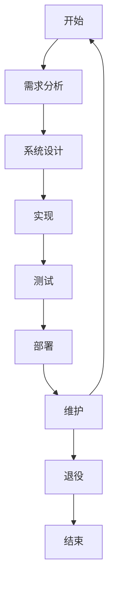
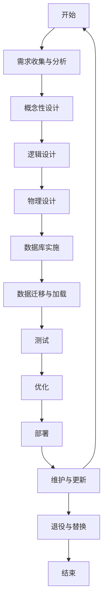

```table-of-contents
title: 
style: nestedList # TOC style (nestedList|nestedOrderedList|inlineFirstLevel)
minLevel: 0 # Include headings from the specified level
maxLevel: 0 # Include headings up to the specified level
includeLinks: true # Make headings clickable
debugInConsole: false # Print debug info in Obsidian console
```
## 数据库设计概述
### 软件工程
- 1. **提升数据库可行性研究**：软件工程技术能够结合计算机技术与人工控制技术，提升数据库的经济效益、实用性与操作性。它有助于加强数据库可行性的相关研究，以便更快地分析数据结果。
    
2. **制订数据库开发计划**：软件工程技术可以帮助确认客户的需求，并从美观度、实用性、便捷性以及操作性等方面细化数据库的设计。它还能简化数据库设计过程中的操作环节，如设计开发小组的划分、验收时间表格、划分项目内容以及制定人员工作计划等。
    
3. **分析数据库系统具体需求**：软件工程技术能有效收集整理用户的需求，设计出让客户满意的数据库结构。它还能分析数据库的运行环境，提高数据库设计的科学性。
    
4. **优化数据库物理结构**：软件工程技术在存取数据以及设计结构时，能够根据实际的工作情况，有进一步的发展创新，从而优化数据库的物理结构。
    
5. **提高数据库设计工作效率**：软件工程技术的应用性强且灵活性高，可以在优化升级数据库的同时，进一步保证数据库的运行安全。
    
6. **数据库设计的基本步骤**：包括需求分析、概念设计、逻辑设计和物理设计。需求分析阶段收集用户需求；概念设计阶段将需求转化为数据库概念结构；逻辑设计阶段将概念结构转化为关系模型；物理设计阶段确定数据的存储结构和访问方法。
    
7. **数据库设计的重要作用**：数据库设计是信息系统开发和建设中的核心技术，它影响到数据库的工作效率，甚至可能还会影响到数据库的实际操作。
### 软件生存期

1. **项目规划与需求分析**：
    - 在这个阶段，数据库设计团队需要明确项目的目标、功能和需求，并评估项目的可行性。这包括与数据的创造者和使用者进行访谈，整理和分析信息，并撰写正式的需求文档。需求文档中需包含需要处理的数据、数据的自然关系、数据库实现的硬件环境、软件平台等。
2. **系统设计**：
    - 根据需求分析的结果，设计团队会对整个数据库系统进行设计。这包括概念设计、DBMS的选择、逻辑设计和物理设计。在概念设计阶段，设计出实体关系模型（ERM），定义实体、关系和属性。逻辑设计阶段将概念模型转化为范式化的表结构，而物理设计阶段则涉及索引的选择、数据分区等内容。
3. **实现与部署**
    - 在这个阶段，数据库设计的结果被转换成实际的数据库结构，使用数据库管理系统（DBMS）中的数据定义语言（DDL）来创建数据结构。之后，应用程序或用户可以使用数据操作语言（DML）来操作数据库。
4. **运行管理与维护**：
    - 数据库创建完成后，需要对其性能进行监视，并在数据库性能无法满足要求或用户提出新的功能需求时，对数据库进行再设计与修改。这个阶段形成了一个循环：监视 -> 再设计 -> 修改 -> 监视…

### 数据库工程

**数据库设计是数据库工程的核心环节之一，它涉及到创建、优化和维护数据库的结构和内容，以满足特定的业务需求和性能要求。以下是数据库设计过程中的关键步骤和概念：**

1. **需求分析**：
    
    - 理解业务需求，包括数据需求和处理需求。
    - 确定数据的来源、使用方式和用户需求。
2. **概念性设计**：
    
    - 使用实体-关系模型（ER模型）等工具来创建概念模型。
    - 确定实体、属性和关系，以及它们的约束和规则。
3. **逻辑设计**：
    
    - 将概念模型转换为逻辑模型，通常使用关系模型。
    - 设计表结构、字段类型、键（主键、外键）和视图。
4. **物理设计**：
    
    - 考虑数据库在特定DBMS上的实现。
    - 设计索引、存储结构、访问路径和硬件要求。
    - 确定数据文件的存储位置和数据库的安全性、备份和恢复策略。
5. **实施**：
    
    - 创建数据库、表和索引等数据库对象。
    - 将设计转换为实际的数据库模式，并在DBMS中实现。
6. **测试**：
    
    - 验证数据库设计是否满足业务需求。
    - 测试数据库的完整性、性能和安全性。
7. **维护**：
    
    - 随着业务需求的变化，更新和优化数据库设计。
    - 监控数据库性能，并进行必要的调整。
8. **规范化**：
    
    - 应用规范化理论（如1NF、2NF、3NF、BCNF等）来减少数据冗余和提高数据完整性。
9. **反规范化**：
    
    - 在某些情况下，为了提高查询性能，可能需要对数据库进行反规范化，如添加冗余字段。
10. **数据迁移和转换**：
    
    - 如果数据库是从旧系统迁移而来，需要设计数据迁移和转换策略。
11. **文档化**：
    
    - 详细记录数据库设计，便于团队成员理解和后续的维护工作。
12. **团队协作**：
    
    - 数据库设计通常需要跨学科团队的合作，包括数据库管理员、开发者、业务分析师和项目经理。

数据库工程不仅仅是设计一个数据库模式，它还包括了整个生命周期的管理，从规划、设计、实施到维护和优化。数据库工程师需要具备广泛的技能，包括对业务领域的理解、数据库设计的最佳实践、数据库管理系统的深入知识以及项目管理能力。

### 数据库系统生存期

**数据库系统生存期（Database System Life Cycle）是指数据库系统从规划、创建到维护、更新，直至最终退役的整个过程。这个概念涵盖了数据库的整个生命周期，包括以下几个主要阶段：**

1. **需求分析（Requirements Analysis）**：
    
    - 确定数据库系统的目的、范围和业务需求。
    - 识别用户需求，包括数据需求和处理需求。
2. **概念性设计（Conceptual Design）**：
    
    - 构建数据库的高级模型，如实体-关系模型（ER模型）。
    - 定义数据的逻辑结构，而不涉及具体的技术实现。
3. **逻辑设计（Logical Design）**：
    
    - 将概念模型转换为逻辑模型，通常基于关系模型。
    - 设计数据库模式，包括表结构、数据类型、键和约束。
4. **物理设计（Physical Design）**：
    
    - 考虑数据库在特定硬件和数据库管理系统（DBMS）上的实现。
    - 设计数据库的存储结构、索引策略和访问方法。
5. **实施（Implementation）**：
    
    - 创建数据库、表、索引和其他数据库对象。
    - 将设计转换为实际的数据库实例，并在DBMS中实现。
6. **加载数据（Data Loading）**：
    
    - 将现有数据从旧系统迁移到新数据库。
    - 清洗、转换和加载数据以确保数据质量。
7. **测试（Testing）**：
    
    - 对数据库系统进行测试，包括功能测试、性能测试和安全测试。
    - 确保数据库满足业务需求和性能标准。
8. **部署（Deployment）**：
    
    - 将数据库系统投入生产环境。
    - 进行必要的用户培训和文档编制。
9. **维护和进化（Maintenance and Evolution）**：
    
    - 定期更新数据库系统以适应业务变化。
    - 修复错误、优化性能和更新数据。
10. **退役（Retirement）**：
    
    - 当数据库系统不再需要时，进行数据迁移和系统退役。
    - 确保数据的安全转移和系统资源的合理释放。

数据库系统生存期的管理是确保数据库系统成功实施和长期运行的关键。它要求数据库管理员、开发者和业务分析师之间的紧密合作，以确保数据库系统能够满足当前和未来的业务需求。在整个生存期中，数据库的质量和性能需要持续监控和优化，以适应不断变化的技术和业务环境。

## 数据库设计步骤


数据库设计概述中的数据库设计步骤通常包括以下几个阶段：

1. **需求收集与分析**：
   - 与业务分析师、系统用户和其他利益相关者合作，收集数据库设计的需求。
   - 分析业务流程，确定数据需求，包括数据的类型、结构和使用方式。

2. **概念性设计**：
   - 构建概念模型，通常使用实体-关系模型（ER模型）来表示实体、属性和关系。
   - 确定数据的逻辑结构，定义数据的抽象表示。

3. **逻辑设计**：
   - 将概念模型转换为逻辑模型，通常基于关系模型。
   - 设计规范化的数据库模式，包括表结构、数据类型、键（主键、外键）、视图和约束。

4. **物理设计**：
   - 考虑数据库在特定数据库管理系统（DBMS）和硬件平台上的实现。
   - 设计数据库的存储结构，包括索引、聚簇和分区策略。
   - 确定数据文件的存储位置、访问方法和安全性要求。

5. **数据库实施**：
   - 创建数据库、表、索引和其他数据库对象。
   - 实施视图、触发器、存储过程和用户定义的数据类型等数据库功能。

6. **数据迁移与加载**：
   - 如果需要，从旧系统迁移数据到新数据库。
   - 清洗、转换和加载数据，确保数据的一致性和完整性。

7. **测试**：
   - 对数据库设计进行测试，包括单元测试、集成测试和性能测试。
   - 验证数据库是否满足业务需求，确保数据的完整性和安全性。

8. **优化**：
   - 根据测试结果和性能监控，对数据库进行优化。
   - 调整索引、查询和存储结构，以提高查询性能和响应时间。

9. **部署**：
   - 将数据库系统部署到生产环境中。
   - 确保数据库的高可用性和灾难恢复能力。

10. **维护与更新**：
    - 定期维护数据库，包括备份、恢复和监控。
    - 根据业务发展更新数据库模式和数据。

11. **退役与替换**：
    - 当数据库系统需要被替换或退役时，确保数据的安全转移和系统的平滑过渡。

数据库设计是一个迭代和协作的过程，需要不断地调整和优化以适应业务需求的变化。在整个设计过程中，良好的沟通、精确的需求分析和严格的测试是确保数据库系统成功实施的关键。


在这个流程图中：

- **开始**：标志着软件生存期的起点。
- **需求分析**：收集和分析用户需求，确定软件的目标和功能。
- **系统设计**：设计软件的架构和组件，包括数据结构和接口设计。
- **实现**：编码阶段，将设计转化为实际的软件产品。
- **测试**：验证软件的功能和性能，确保软件满足需求和质量标准。
- **部署**：将软件发布到生产环境，供用户使用。
- **维护**：在软件的使用寿命期间，进行错误修复、性能优化和功能升级。
- **退役**：当软件不再适用或被新的软件替代时，进行退役处理。
- **结束**：软件生存期的终点。



在这个流程图中：

- **开始**：数据库设计的起点。
- **需求收集与分析**：与利益相关者沟通，确定数据需求。
- **概念设计**：使用ER模型等工具进行高层次设计。
- **逻辑设计**：将概念模型转化为逻辑模型，设计表结构。
- **物理设计**：考虑数据库在特定DBMS上的实现细节。
- **实施**：创建数据库对象，如表和索引。
- **数据迁移与加载**：将数据从旧系统迁移到新数据库。
- **测试**：验证数据库是否满足需求。
- **优化**：根据测试结果进行性能优化。
- **部署**：将数据库系统投入生产环境。
- **维护与更新**：定期维护和更新数据库。
- **退役与替换**：当数据库不再需要时进行安全转移和退役。
- **结束**：数据库生存期的终点。
### 数据流法
#### 数据流程图（Data Flow Diagram, DFD）

数据流程图是一种用于表示系统中数据流动的图形化工具，通常用于分析系统的功能和数据处理。DFD帮助可视化信息流动以及信息如何在各个系统组件之间传递。

##### DFD的基本组成部分

1. **外部实体（External Entities）**:
   - 表示与系统交互的外部元素，如用户、其他系统或组织。
   - 通常用矩形表示。

2. **过程（Processes）**:
   - 表示系统执行的操作或活动。
   - 通常用圆形或椭圆形表示，名称描述了过程的功能。

3. **数据存储（Data Stores）**:
   - 表示系统中存储的数据或信息。
   - 通常用开口矩形或平行线表示，名称描述了存储的数据类型。

4. **数据流（Data Flows）**:
   - 表示数据在外部实体、过程和数据存储之间的流动。
   - 通常用带箭头的线段表示，箭头指向数据流动的方向。

##### DFD的层次结构

DFD可以分为不同的层次，从高层到低层逐步细化：

1. **上下文图（Context Diagram）**:
   - DFD的顶部级别，仅表示系统和外部实体之间的关系。
   - 显示整个系统的输入和输出，强调系统边界。

2. **层次1 DFD**:
   - 详细描述系统的主要功能。
   - 显示过程内部数据流和各个子过程之间的关系。

3. **更低层次 DFD**:
   - 进一步细化层次1中的某个过程，展示该过程的内部操作。
   - 重点在于详细的过程和数据流。

##### 创建DFD的步骤

1. **确定系统范围**:
   - 确定系统的边界和外部实体。

2. **识别主要过程**:
   - 列出系统中涉及的主要活动或过程。

3. **确定数据流动**:
   - 识别进入和离开各个过程的数据流。

4. **定义数据存储**
   - 确定系统中存储的数据类型和位置。

5. **绘制DFD**:
   - 使用合适的符号绘制DFD，并标明各个元素及其之间的关系。

##### DFD示例

例如，考虑一个图书馆管理系统的DFD：

- **外部实体**:
  - 读者、图书馆工作人员

- **过程**:
  - 处理借书请求、更新库存、管理归还书籍等。

- **数据存储**:
  - 书籍信息存储、用户信息存储、借阅记录存储等。

- **数据流**:
  - 读者借书请求流入“处理借书请求”过程，处理结果更新流向“借阅记录存储”。
  
通过DFD，可以清晰地了解图书馆管理系统中数据的流动、处理和存储方式，从而为进一步的系统分析、设计和开发提供基础。
##### DFD的具体应用

数据流程图（DFD）在多个领域和场景中有广泛的应用，主要包括：

1. **系统分析与设计**：
    
    - DFD用于系统开发的早期阶段，帮助分析需求，确定系统的功能结构以及数据流动路径，从而指导系统设计。
2. **业务流程建模**：
    
    - 企业可以使用DFD来描绘和分析其业务流程，包括订单处理、客户服务和库存管理。这有助于识别流程中的瓶颈和优化机会。
3. **文档编制**：
    
    - DFD可以作为用户手册、系统文档或技术文档的一部分，帮助用户和开发人员理解系统的工作方式。
4. **教育和培训**：
    
    - DFD是一种有效的教学工具，能够帮助学生和新员工理解复杂系统的操作与数据流。
5. **系统集成**：
    
    - 在整合不同系统时，DFD用于展示数据交互和流程，帮助确定如何更有效地连接和优化不同系统之间的数据流。
6. **合规性和审计**：
    
    - 在合规审计中，DFD可以帮助审计人员理解数据的处理方式和流动路径，以便确保符合规定和标准。

##### 如何简化DFD

DFD的简化有助于提升图表的可读性和理解度。以下是一些简化DFD的技巧：

1. **聚合相似过程**：
    
    - 将功能相似或相关的多个过程聚合为一个更高层次的过程，从而减少图表的复杂性。例如，将多个数据处理步骤合并为一个“处理数据”过程。
2. **避免过度细化**：
    
    - 在初始设计中，避免将每一个细节都绘制出来。可以从上下文图或层次1 DFD开始，逐步添加细节。可以在后续阶段中更详细地展开特定的过程。
3. **使用标准符号和命名**：
    
    - 确保在整个DFD中使用一致的符号、样式和命名规范。这有助于减少混淆，使图表更加清晰。
4. **利用注释和说明**：
    
    - 对于复杂的过程，可以使用注释来解释过程的功能，而不是在图中显示所有细节。这样有助于保留图表的整洁。
5. **删除冗余数据流**：
    
    - 确保每条数据流都是必要的，避免重复的流出或流入。可以考虑合并某些数据流，以减少复杂性。
6. **创建层次化DFD**：
    
    - 使用多层DFD逐步细化复杂过程。首先绘制高层次的DFD，然后在必要时进行分解。层次化显示可以帮助用户轻松掌握整体结构。
7. **集成反馈机制**：
    
    - 考虑设计反馈过程，帮助识别并消除不必要的步骤或信息流，使DFD更加简洁。
#### 数据字典（Data Dictionary，DD）
数据字典是关于数据的信息集合，即对数据流图中包含的所有元素定义的集合。它是一种对数据的名称、类型、长度、取值范围、业务含义、数据来源等详细信息的定义和描述的集合。数据字典的主要作用包括为数据开发人员提供数据结构和内容的清晰指南，帮助业务人员理解数据的业务含义，以及作为数据管理和治理的重要工具
##### 关键特性

1. **集中化管理**：数据字典作为集中存储数据定义和属性的地方，便于统一管理和更新。
2. **数据一致性**：确保数据库中数据的一致性和准确性，减少数据冗余和错误。
3. **易于维护**：当数据结构或业务规则发生变化时，可以在数据字典中快速更新，减少维护工作量。
4. **提高效率**：帮助数据库管理员和开发人员快速理解数据结构和业务逻辑，提高开发和维护效率。
5. **支持数据治理**：作为数据治理的一部分，帮助组织遵守数据相关的法律、法规和标准。

##### 组成部分

1. **元数据（Metadata）**：描述数据的数据，包括数据的属性、结构、关系和约束。
2. **数据元素**：数据库中的基本数据单位，如字段或列。
3. **数据结构**：数据元素的组织方式，如表、视图、索引等。
4. **数据类型**：定义数据元素可以取值的范围和格式，如整数、字符串、日期等。
5. **数据长度和精度**：指定数据元素的长度和精度，如字符长度、数字的精度和小数位数。
6. **数据来源**：数据的来源信息，包括数据的生成、收集和输入过程。
7. **数据用途**：数据的使用目的和业务逻辑。
8. **数据关系**：数据元素之间的关系，如外键和主键关系。
9. **数据约束**：定义数据的规则和限制，如唯一性、非空、默认值、检查约束等。
10. **数据安全和权限**：定义数据的访问控制和安全级别。

##### 应用场景

1. **数据库设计**：在数据库设计阶段，数据字典帮助设计者定义和理解数据结构。
2. **数据迁移和转换**：在数据迁移过程中，数据字典提供了详细的数据映射和转换规则。
3. **数据质量控制**：用于监控和提高数据质量，确保数据的准确性和一致性。
4. **数据审计和合规**：帮助组织遵守数据保护法规，如GDPR，通过记录数据处理活动。
5. **系统文档化**：作为系统文档的一部分，帮助新用户和开发人员理解现有系统。

数据字典是数据库管理中不可或缺的工具，它不仅提高了数据管理的效率和质量，还增强了数据的透明度和可访问性。

##### 数据字典相关实例和说明

###### 实例1：银行客户数据建模

在银行业务中，可以对客户银行业涉及的数据对象进行建模。数据字典会描述客户银行业中的数据模型每一个数据项（例如，“账户持有人”和“可用信用”）。这样的数据字典有助于银行程序员理解数据项的业务含义和使用方式。

###### 实例2：电话号码数据条目定义

某宾馆的电话服务可以拨分机号和外线号。分机号从7201到7209；拨外线需要先按9，然后是市话号码或长话号码；长话号码是由区号和市话号码组成的；区号是44、55中任意一个号码；市话号码是由局号和分局号组成的；局号可以是455、466、888、552中任意一个号码；分局号是长度为4的数字串。在数据字典中，电话号码的数据条目可以定义如下：

- 电话号码 = [分机号|外线号]
- 分机号 = [7201|7202|7203|7204|7205|7206|7207|7208|7209]
- 外线号 = 9+[市话号码|长话号码]
- 长话号码 = 区号 + 市话号码
- 区号 = [44|55]
- 市话号码 = 局号 + 分局号
- 局号 = [455|466|888|552]
- 分局号 = 4{数字}4
- 数字 = [0|1|2|3|4|5|6|7|8|9] 

###### 实例3：教务管理系统数据字典

假设教务管理系统中有一个“学生”实体，学生实体和“学生属于系别”的联系可以通过数据字典来优化数据库设计。通过引入系别表，学生表中只需存储系别ID，而不是系别名称，这样当系别名称发生变更时，只需在系别表中修改，而无需更新学生表中的大量数据。这种设计提高了数据的一致性和维护效率。

###### 实例4：数据字典在数据库设计中的应用

在数据库设计过程中，数据字典用于定义数据表的字段、约束、数据类型等，帮助数据库管理员和开发人员明确数据库结构。例如，对于一个订单明细表，数据字典可以包含以下信息：

- 数据文件：订单明细表
- 文件组成：订单序号Id, 订单编号, 菜名, 价格, 数量, 下单时间
- 数据项：订单序号Id
    - 数据类型：整型
    - 数据长度：4
- 数据项：订单编号
    - 数据类型：可变字符类型
    - 数据长度：50
    - 数据组成：A+日期时间

以上实例展示了数据字典在不同场景下的应用，说明了数据字典在数据管理和系统设计中的重要性和实用性。通过这些实例，我们可以看到数据字典如何帮助组织和维护数据，以及如何提高数据的可访问性和一致性。
### 数据库设计步骤中设计阶段
![[The design phase in database design steps.png]]
### 数据库设计的任务
数据库设计的任务确实涉及一系列复杂的活动，每个步骤都需要细致的工作以确保最终的数据库系统能够高效、可靠地支持业务运作。以下是数据库设计中主要任务的进一步详细说明：

#### 需求分析

**据一个单位的信息需求、处理需求和数据库的支撑环境，设计出数据模式(包括外模式、逻辑（概念）模式和内模式)以及典型的应用程序。其中**

- **用户和业务需求收集**：与最终用户、业务分析师和利益相关者会面，了解他们的需求和期望。
- **数据使用分析**：确定数据如何被存储、处理和报告，以及数据的使用频率和访问模式。
	- **信息需求表示一个单位所需要的数据及其结构。**
	- **处理需求表示一个单位需要经常进行的数据处理。**
	- **前者表达了对数据库的内容及结构的要求，也就是静态要求；后者表达了基于数据库的数据处理要求，也就是动态要求。**
- **信息需求定义所设计的数据库将要用到的所有信息，描述实体、属性、联系的性质,描述数据之间的联系。
- **处理需求定义所设计的数据库将要进行的数据处理，描述操作的优先次序、操作执行的频率和场合，描述操作与数据之间的联系。**

- **需求规格说明书**：详细记录收集到的需求，包括业务需求、数据需求和系统需求。
- **数据字典**：包含所有数据元素的定义和属性。
- **ER模型草图**：基于初步的数据理解，创建ER模型的初步草图。


#### 概念结构设计

 **用概念数据模型，表示数据及其相互间的联系，产生反映用户信息需求和处理需求的数据库概念模式。应用最广泛的是实体联系ER模型。**
 
- **数据库概念模型是独立于任何数据库管理系统、面向现实世界的数据模型。**
- **概念设计的任务包括两个方面：**
	- 数据库概念模式设计：以需求分析阶段所识别的数据项为基础，使用高级数据模型建立数据库概念模式
	- 事务设计：考察需求分析阶段提出的数据库操作任务，形成数据库事务的高级说明 
- **概念设计的主要步骤**
- 进行数据抽象，设计局部概念模式
- 将局部概念模式综合成全局概念模式
- **ER模型构建**：创建实体-关系图，展示实体之间的关系和属性，为数据库提供一个结构框架。
- **数据字典创建**：记录每个实体和属性的详细信息，包括数据类型、大小和约束。

#### 逻辑设计

- **关系模型转换**：将ER模型转换为关系模型，定义表、列和关系。
- **规范化**：应用规范化理论（1NF、2NF、3NF、BCNF）来消除数据冗余和依赖问题。

#### 物理设计

- **存储结构设计**：决定数据如何在磁盘上存储，包括数据分块、记录格式和索引策略。
- **性能调优**：根据查询模式和数据访问路径，优化数据库性能。
- **安全性规划**：设计用户认证、授权和审计机制，确保数据安全。

#### 数据模型规范化

- **冗余消除**：通过规范化减少数据冗余，提高数据一致性。
- **依赖问题解决**：解决数据依赖问题，如传递依赖和部分依赖。

#### 性能优化

- **索引优化**：创建和维护索引以提高查询性能。
- **查询优化**：分析和优化SQL查询，减少响应时间。

#### 安全性和完整性约束

- **完整性约束实施**：实施主键、外键和唯一性约束，确保数据的完整性。
- **访问控制**：设置用户权限，控制对敏感数据的访问。

#### 数据迁移和转换

- **数据迁移计划**：制定详细的数据迁移计划，包括数据备份和恢复策略。
- **数据清洗和转换**：在迁移过程中清洗和转换数据，确保数据质量。

#### 测试

- **功能测试**：验证数据库的每个功能是否按预期工作。
- **性能测试**：在不同的负载下测试数据库，确保性能符合要求。

#### 文档化

- **设计文档**：记录数据库设计的所有方面，包括架构、表结构和业务规则。
- **操作手册**：为数据库管理员和最终用户提供操作指南。

#### 实施计划

- **项目规划**：制定详细的项目计划，包括时间线、里程碑和资源分配。

#### 用户培训和支持

- **培训材料开发**：创建培训材料，帮助用户理解和使用数据库。
- **技术支持**：提供持续的技术支持，解决用户在使用数据库时遇到的问题。

#### 维护和更新

- **定期维护**：执行定期维护任务，如索引重建、统计信息更新和数据备份。
- **数据库更新**：根据业务发展更新数据库结构和数据。

#### 退役计划

- **数据迁移策略**：当数据库需要退役时，制定数据迁移策略，确保数据不会丢失。

数据库设计是一个动态的过程，需要不断地根据业务需求和技术变化进行调整。良好的沟通、精确的需求分析和严格的测试是确保数据库系统成功实施的关键。

### 数据库设计的方法
#### 面向数据的设计方法（Data-Centric Approach）

1. **关注点**：
    
    - 以数据结构和数据关系为核心。
    - 强调数据的组织、存储和管理。
2. **设计过程**：
    
    - 从数据的角度出发，首先确定需要存储哪些数据，以及这些数据之间的关系。
    - 通过实体-关系模型（ER模型）等工具来构建数据模型。
    - 重点在于设计一个能够高效存储和检索数据的数据库结构。
3. **优势**：
    
    - 适合于数据密集型的应用，如数据仓库和OLAP系统。
    - 能够提供数据的一致性和完整性保证。
4. **挑战**：
    
    - 可能需要更多的时间和努力来理解复杂的数据关系。
    - 对于处理复杂的业务逻辑和工作流程可能不够灵活。

#### 面向过程的设计方法（Process-Centric Approach）

1. **关注点**：
    
    - 以业务流程和操作为核心。
    - 强调数据在业务流程中的应用和流转。
2. **设计过程**：
    
    - 从业务流程的角度出发，首先确定业务操作和处理步骤。
    - 根据业务流程来确定需要哪些数据支持，以及数据如何在流程中被使用和更新。
    - 重点在于设计一个能够支持业务操作和提高业务效率的数据库系统。
3. **优势**：
    
    - 适合于流程驱动的应用，如事务处理系统和OLTP系统。
    - 能够更好地支持复杂的业务逻辑和工作流程。
4. **挑战**：
    
    - 可能需要更多的时间和努力来分析和建模业务流程。
    - 数据结构可能变得复杂，导致数据维护和优化的难度增加。

### 数据库设计的全过程
数据库设计的全过程包含多个阶段，每个阶段都有其特定的目的和活动。以下是数据库设计全过程的各个阶段及其详细解释：

#### 1. 需求分析（Requirements Analysis）

**定义**

数据库设计中的需求分析是指在创建或修改数据库系统之前，对用户和业务的需求进行系统的收集、分析和记录的过程。这一步骤是确保数据库设计能够满足实际业务需求和用户期望的关键环节。

**目的**：
1. **理解业务需求**：明确业务目标和数据库如何支持这些目标。
2. **识别数据需求**：确定需要收集、存储和处理哪些数据。
3. **定义系统功能**：明确数据库系统必须执行的功能和操作。
4. **识别数据使用方式**：了解数据将如何被访问和使用。
5. **确定性能要求**：识别系统的性能、安全性和可靠性要求。
6. **促进沟通**：作为开发团队和业务用户之间沟通的桥梁。
7. **避免成本超支**：通过明确需求减少返工和额外开发的成本。
8. **指导设计和实施**：为数据库的详细设计和实施提供基础。

需求分析是数据库设计过程中的首要步骤，其核心目的是确认数据库的用户和用途。由于数据库是为企业模拟的，设计者需要对企业的基本情况有所了解。这一阶段包括收集和分析相关资料的过程。

##### 需求分析方法

1. **系统调查**：
    
    - 对企业组织进行全面调查，并绘制组织层次图，以了解企业的组织结构。
2. **可行性分析**：
    
    - 从技术、经济、效益、法律等多个方面对建立数据库的可行性进行分析。
    - 编写可行性分析报告，并组织专家讨论其可行性。
3. **确定总目标和项目计划**：
    
    - 确定数据库系统的总目标，并制定项目开发计划。

##### 需求分析工作

1. **业务流程图**：
    
    - 分析用户活动产生的业务流程，并绘制业务流程图。
2. **系统范围图**：
    
    - 确定系统的范围，并产生系统范围图。
3. **数据流图**：
    
    - 分析用户活动涉及的数据，并产生数据流图。
4. **数据字典**：
    
    - 分析系统数据，并产生数据字典。
#### 2. 概念性设计（Conceptual Design）

**目的**：创建一个独立于任何DBMS的数据库模型。

- - **用概念数据模型表示数据及其相互间的联系，产生反映用户信息需求和处理需求的数据库概念模式。应用最广泛的是实体联系ER模型。**
- **数据库概念模型是独立于任何数据库管理系统、面向现实世界的数据模型。**
- **概念设计的任务包括两个方面：**
    1. 数据库概念模式设计：以需求分析阶段所识别的数据项为基础，使用高级数据模型建立数据库概念模式。
    2. 事务设计：考察需求分析阶段提出的数据库操作任务，形成数据库事务的高级说明。
- **概念设计的主要步骤：**
    1. 进行数据抽象，设计局部概念模式。
    2. 将局部概念模式综合成全局概念模式。
- **数据库概念设计方法主要有两种，一种是集中式设计方法，另一种是视图综合设计方法。**
- **集中式设计方法**： 集中式设计方法是一种自顶向下的设计方法，它从整个组织或系统的角度出发，首先定义一个全局的数据模型，然后逐步细化和分解这个全局模型以满足各个子系统的需求。这种方法强调全局数据模型的统一性和一致性，适合于那些需要全局视角和高度集成的系统设计。集中式设计方法通常需要一个全局的数据字典来维护整个组织的数据定义和结构。
- **视图综合设计方法**： 视图综合设计方法是一种自底向上的设计方法，它首先设计各个子系统的局部视图，然后通过视图集成的方式将各子系统有机地融合起来，综合成一个系统的总视图。这种方法从局部应用出发，逐步构建起整个系统的视图，适合于那些需要考虑多个独立子系统或部门需求的复杂系统设计。视图综合设计方法允许每个子系统独立地定义自己的数据视图，然后通过合并和协调这些视图来构建全局的数据模型。
- **策略**
	- **自顶向下、自底向上、逐步扩张、混合策略** 
- **区别**：
	1. 设计起点不同：集中式设计方法从全局开始，而视图综合设计方法从局部开始。
	2. 设计过程不同：集中式设计方法是自顶向下的，强调全局的统一性；视图综合设计方法是自底向上的，强调局部的独立性和灵活性。
	3. 适用场景不同：集中式设计方法适用于需要全局视角和高度集成的系统；视图综合设计方法适用于需要考虑多个独立子系统或部门需求的系统。
	4. 数据模型的构建方式不同：集中式设计方法通过全局数据模型的细化和分解来构建数据模型；视图综合设计方法通过合并和协调局部视图来构建全局数据模型。

#### 3. 逻辑设计（Logical Design）

**目的**：将概念模型转换为一个特定的数据库模型，通常是关系模型。
- **数据库逻辑设计的任务是把数据库概念设计阶段产生的数据库概念模式转换成以DBMS的逻辑数据模型表示的逻辑模式。**
- **数据库逻辑设计依赖于逻辑数据模型和数据库管理系统。**
- **从E-R图转换而来的关系模式还只是逻辑模式的雏形，要成为逻辑模式，还需要进行下列几步的处理：**
	1. 规范化；
	2. 适应DBMS限制条件的修改；
	3. 对性能、存储空间等的优化；
	    - 减少连接运算：连接是开销较大的运算，参与连接的关系越多开销也就越大。
	    - 减小关系的大小和数据量：关系的大小对查询的速度影响很大。
	4. 用DBMS提供的DDL定义逻辑模式。
![[Logic design Steps.png]]

#### 4. 物理设计（Physical Design）

**目的**：确定数据库在特定DBMS和硬件上的实际存储方式。

- **根据数据库的逻辑和概念模式、DBMS及计算机系统所提供的功能和施加的限制，设计数据库文件的物理存储结构、各种存取路径。**
- **数据库物理设计的任务是，为每个关系模式选择合适的存储结构和存取路径。**
- **数据库的物理设计分为如下三个步骤：**
	1. 分析影响数据库物理设计的因素；
	2. 为关系模式选择存取方法；
	3. 设计关系、索引等数据库文件的物理存储结构。


#### 5. 实现（Implementation）

**目的**：在数据库系统中实际创建数据库。

 **根据数据库的逻辑设计和物理设计的结果，建立实际的数据库结构、装入数据、进行测试和试运行的过程称为数据库的实施。**
	- 建立实际数据库结构
	- 装入试验数据，调试应用程序
	- 装入实际数据
	- 进入试运行 

#### 6. 运行和维护（Operation & Maintenance）

**数据库的运行和维护**

- **数据库的转储和恢复**
- **维持数据库的安全性与完整性**
- **监测并改善数据库性能**
- **数据库的重组和重构**
	- **重组与重构的差别在于：重组并不修改原有的逻辑模式和内模式；而重构则会部分修改原有的逻辑模式和内模式。**


#### 小结

**数据库设计的基本任务：根据一个单位的信息需求、处理需求和数据库的支撑环境（包括DBMS、操作系统和硬件），设计出数据模式（包括外模式、逻辑（概念）模式和内模式）以及典型的应用程序。**

在不同的设计阶段将形成数据库的三层模式。

- 需求分析阶段，综合用户应用需求；
- 概念设计阶段，形成独立于数据库管理系统DBMS的概念模式；
- 逻辑设计阶段，将概念模式（可用E-R图描述）转换成DBMS支持的数据模型（如关系模型），形成数据库的逻辑模式；根据用户处理的要求和安全性的考虑，在基本表的基础上建立必要的视图，形成数据库的外模式；
- 物理设计阶段，根据DBMS的特点和处理的需要，选择存储结构，建立索引，形成数据库的内模式。

![[Relationships at all levels of the database.png]]